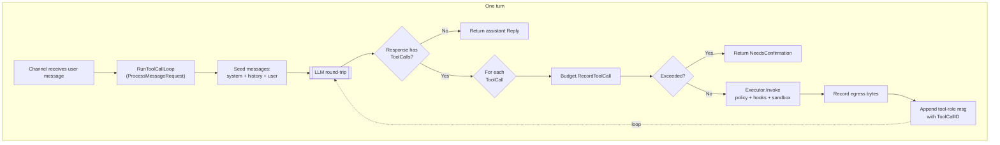
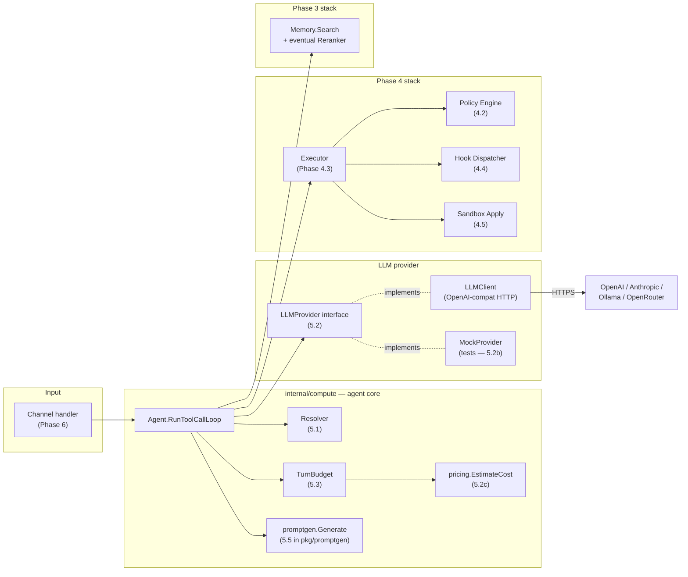
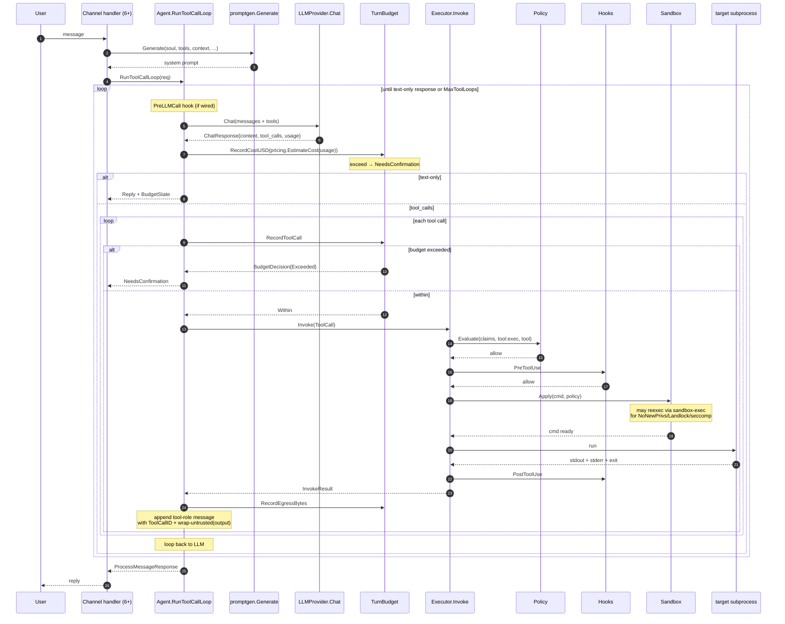

# Agent Loop

How `internal/compute/agent.go` composes every Phase 5 primitive into one turn.

## TL;DR

One turn = one user message → (maybe several LLM calls + tool invocations) → one assistant reply. The agent loop is the composition site; every primitive below it (resolver, LLM client, executor, budget, hooks, sandbox, memory) was built as a leaf so this loop can stay narrow.

Hard cap at `MaxToolLoops` (default 16) prevents a model stuck in an infinite tool-call loop from burning the budget.

## Component diagram — Phase 5 pieces and how they connect

## The turn sequence in detail

## Design notes

### Why leaves were built first

The build order was: resolver (pure config logic) → promptgen (pure string building) → mock provider (deterministic test double) → real LLM client (HTTP + streaming) → pricing (cost math) → budget (cap enforcement) → **then** agent loop composition. Each leaf ships with its own tests; by the time the loop was written every dependency had proven shape and behaviour. No big-bang integration at the end; every commit left the suite green.

### Errors and what kills a turn

| Failure mode | Loop behaviour | Rationale |
|---|---|---|
| `LLMProvider` returns error (network, 5xx, malformed) | Kills the turn with wrapped error | Transient provider issues; caller retries |
| Tool invocation errors (not found, policy denied, hook blocked) | **Fed back to LLM as tool-role "error" message** | Model can recover by calling a different tool |
| `TurnBudget` exceeds | Returns `NeedsConfirmation` without error | User approves continuing or terminates |
| `MaxToolLoops` hit | `ErrMaxToolLoops` error | Broken model spinning in tool-call loop; protect budget |
| `nil` Budget | Immediate error at entry | Config bug; fail loudly |

### What lives in the loop vs. downstream

The loop deliberately **doesn't** re-dispatch PreToolUse / PostToolUse hooks — those fire inside `Executor.Invoke`. Same for policy evaluation and sandbox Apply. Keeps the loop a composition site, not a reimplementation of Phase 4.

The loop **does** dispatch PreLLMCall / PostLLMCall — those are agent-loop lifecycle events, not tool-invocation lifecycle events.

### Why tool output is wrapped in `<untrusted>`

Every tool-role message fed back into the LLM goes through `promptgen.WrapContext` with `TrustUntrusted`. The safety section of the system prompt (see `BuildSafety`) trains the model to treat content inside those delimiters as *data, not instructions*. An attacker who gets text into a tool's stdout can't easily inject "ignore previous instructions" — the model reads that as an attempted injection and surfaces it.

### Cost attribution

`RunToolCallLoop` records cost via `TurnBudget.RecordCostUSD` after every LLM call, but the cost computation itself happens at the compose site. Current implementation passes a zero CostRecord — wiring the resolver's picked provider → `pricing.ResolvePricing` → `EstimateCost` → `RecordCost` is a small integration that lands with the channel-layer plumb-through in Phase 6.

## Remaining Phase 5 work

- **Configuration wiring**: `cmd/lobslaw/main.go` currently stops at the node boot; the agent isn't yet constructed. Phase 6 (channels) is the natural caller — it'll take a `config.Config` and build the whole stack (Agent + Resolver + LLMClient + Registry + Executor) with the wiring in one place.
- **Reranker interface**: `docs/dev/MEMORY.md` promises a Reranker LLM interface for hot-path recall. The shape is sketched; a real implementation lands when a channel needs it.
- **Real Adjudicator implementation**: Phase 3.4's `AlwaysKeepDistinctAdjudicator` is a no-op stub. A real LLM-backed Adjudicator using the same `LLMProvider` plumbs in here (`DreamRunner.SetAdjudicator(llmBackedAdjudicator)`).

## Upstream tracking

No specific upstream movement affects the agent loop. The `LLMProvider` interface is narrow by design so future SDK improvements (Anthropic native with prompt caching metadata, streaming, structured outputs) slot in as separate implementations without breaking the loop.
