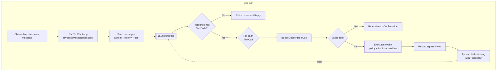
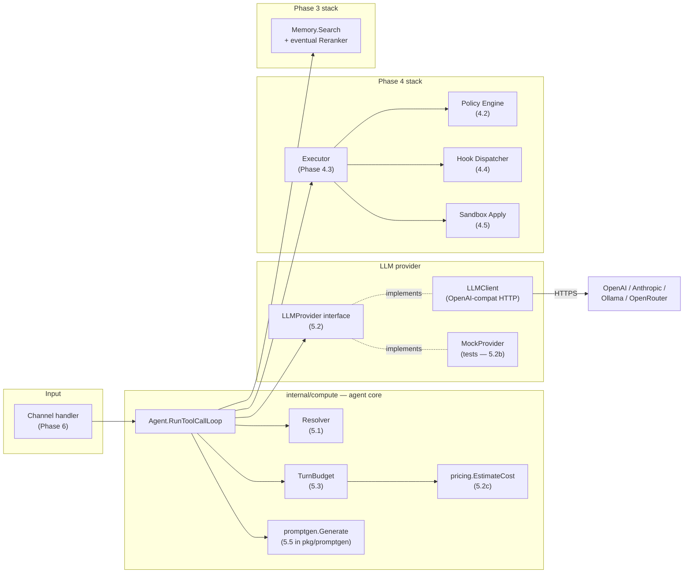
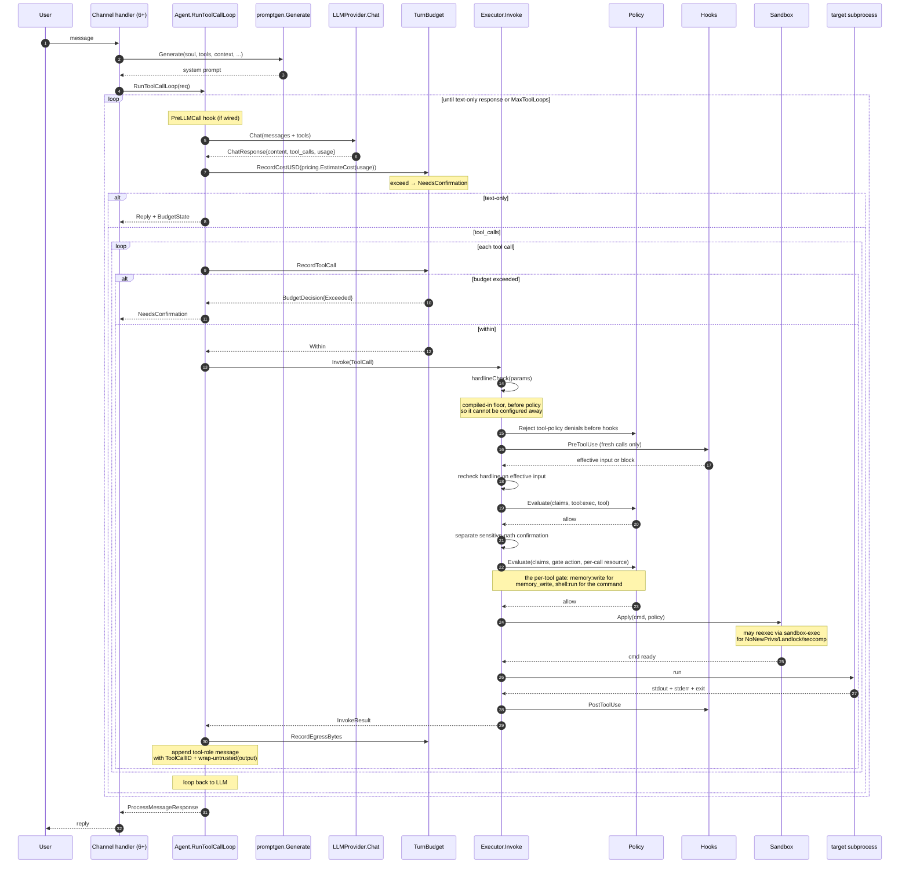

# Agent Loop

How `internal/compute/agent.go` composes every Phase 5 primitive into one turn.

## TL;DR

One turn = one user message → (maybe several LLM calls + tool invocations) → one assistant reply. The agent loop is the composition site; every primitive below it (resolver, LLM client, executor, budget, hooks, sandbox, memory) was built as a leaf so this loop can stay narrow.


```mermaid
flowchart TB
  subgraph Turn["One turn"]
    A[Channel receives user message] --> B["RunToolCallLoop<br/>(ProcessMessageRequest)"]
    B --> C[Seed messages:<br/>system + history + user]
    C --> D[["LLM round-trip"]]
    D --> E{Response has<br/>ToolCalls?}
    E -- No --> F[Return assistant Reply]
    E -- Yes --> G{For each<br/>ToolCall}
    G --> H[Budget.RecordToolCall]
    H --> I{Exceeded?}
    I -- Yes --> J[Return NeedsConfirmation]
    I -- No --> K[Executor.Invoke<br/>policy + hooks + sandbox]
    K --> L[Record egress bytes]
    L --> M[Append tool-role msg<br/>with ToolCallID]
    M -.loop.-> D
  end
```

Hard cap at `MaxToolLoops` (default 16) prevents a model stuck in an infinite tool-call loop from burning the budget.

## Component diagram — Phase 5 pieces and how they connect


```mermaid
flowchart LR
  subgraph Input
    Channel["Channel handler<br/>(Phase 6)"]
  end

  subgraph AgentCore["internal/compute — agent core"]
    Loop["Agent.RunToolCallLoop"]
    Resolver["Resolver<br/>(5.1)"]
    Budget["TurnBudget<br/>(5.3)"]
    Promptgen["promptgen.Generate<br/>(5.5 in pkg/promptgen)"]
    Pricing["pricing.EstimateCost<br/>(5.2c)"]
  end

  subgraph Provider["LLM provider"]
    ProviderIface["LLMProvider interface<br/>(5.2)"]
    ClientReal["LLMClient<br/>(OpenAI-compat HTTP)"]
    ClientMock["MockProvider<br/>(tests — 5.2b)"]
    ProviderIface -.implements.- ClientReal
    ProviderIface -.implements.- ClientMock
  end

  subgraph Downstream["Phase 4 stack"]
    Exec["Executor<br/>(Phase 4.3)"]
    Policy["Policy Engine<br/>(4.2)"]
    Hooks["Hook Dispatcher<br/>(4.4)"]
    Sandbox["Sandbox Apply<br/>(4.5)"]
  end

  subgraph Persistence["Phase 3 stack"]
    Memory["Memory.Search<br/>+ eventual Reranker"]
  end

  Channel --> Loop
  Loop --> Promptgen
  Loop --> Resolver
  Loop --> Budget
  Budget --> Pricing
  Loop --> ProviderIface
  ClientReal -- HTTPS --> External["OpenAI / Anthropic /<br/>Ollama / OpenRouter"]
  Loop --> Exec
  Exec --> Policy
  Exec --> Hooks
  Exec --> Sandbox
  Loop --> Memory
```

## The turn sequence in detail


```mermaid
sequenceDiagram
  autonumber
  participant User
  participant Channel as Channel handler (6+)
  participant Agent as Agent.RunToolCallLoop
  participant PG as promptgen.Generate
  participant LLM as LLMProvider.Chat
  participant Budget as TurnBudget
  participant Exec as Executor.Invoke
  participant Policy
  participant Hooks
  participant Sandbox
  participant Tool as target subprocess

  User->>Channel: message
  Channel->>PG: Generate(soul, tools, context, ...)
  PG-->>Channel: system prompt
  Channel->>Agent: RunToolCallLoop(req)

  loop until text-only response or MaxToolLoops
    Note over Agent: PreLLMCall hook (if wired)
    Agent->>LLM: Chat(messages + tools)
    LLM-->>Agent: ChatResponse{content, tool_calls, usage}
    Agent->>Budget: RecordCostUSD(pricing.EstimateCost(usage))
    Note over Budget: exceed → NeedsConfirmation

    alt text-only
      Agent-->>Channel: Reply + BudgetState
    else tool_calls
      loop each tool call
        Agent->>Budget: RecordToolCall
        alt budget exceeded
          Budget-->>Agent: BudgetDecision{Exceeded}
          Agent-->>Channel: NeedsConfirmation
        else within
          Budget-->>Agent: Within
          Agent->>Exec: Invoke(ToolCall)
          Exec->>Exec: hardlineCheck(params)
          Note over Exec: compiled-in floor, before policy<br/>so it cannot be configured away
          Exec->>Policy: Reject tool-policy denials before hooks
          Exec->>Hooks: PreToolUse (fresh calls only)
          Hooks-->>Exec: effective input or block
          Exec->>Exec: recheck hardline on effective input
          Exec->>Policy: Evaluate(claims, tool:exec, tool)
          Policy-->>Exec: allow
          Exec->>Exec: separate sensitive-path confirmation
          Exec->>Policy: Evaluate(claims, gate action, per-call resource)
          Note over Exec,Policy: the per-tool gate: memory:write for<br/>memory_write, shell:run for the command
          Policy-->>Exec: allow
          Exec->>Sandbox: Apply(cmd, policy)
          Note over Sandbox: may reexec via sandbox-exec<br/>for NoNewPrivs/Landlock/seccomp
          Sandbox-->>Exec: cmd ready
          Exec->>Tool: run
          Tool-->>Exec: stdout + stderr + exit
          Exec->>Hooks: PostToolUse
          Exec-->>Agent: InvokeResult
          Agent->>Budget: RecordEgressBytes
          Note over Agent: append tool-role message<br/>with ToolCallID + wrap-untrusted(output)
        end
      end
      Note over Agent: loop back to LLM
    end
  end

  Agent-->>Channel: ProcessMessageResponse
  Channel-->>User: reply
```

## Context budget

Replayed history is bounded before it reaches the wire, by
`compute.ContextBudget` in `seedMessages`. It lives on the agent rather than the
channel so REST, Telegram, and scheduler-originated turns all inherit one policy.

Without it, conversation cost is **quadratic in conversation length** — every
turn re-sends every previous turn — and a single replayed tool result can be as
large as `Executor.MaxOutputBytes` (10 MB).

Two knobs, both on by default:

| Knob | Default | Effect |
|---|---|---|
| `tail_tokens` | 4000 | Estimated-token cap on replayed history; oldest messages drop first |
| `history_tool_result_bytes` | 512 | Truncates *replayed* tool results; the turn that produced one always sees it whole |

```toml
[compute.context]
tail_tokens               = 4000
history_tool_result_bytes = 512   # explicit 0 disables either bound
```

Order matters: elision runs before trimming, because shrinking one 4 KB tool
result often saves enough that no message has to be dropped at all — keeping the
shape of the conversation is worth more than the bytes it lost.

Token counts are estimated at 4 bytes/token, no tokenizer. It's a budget, not a
limit; the provider enforces the real window, and vendoring a tokenizer per model
family would be false precision.

### Rolling summary

The budget above *drops* old messages. Compaction is what stops that being
amnesia: material aging past the verbatim window is folded into a running
summary stored on the `SessionRecord`, and injected as its own system message.

Every knob is in `[compute.context]` — see the
[configuration reference](../docs/configuration/reference.md#compute) for the
full list and sizing guidance. The compaction ones:

| Knob | Default | Effect |
|---|---|---|
| `compact_enabled` | on | Off disables compaction without unsetting the summariser role |
| `compact_keep_messages` | 40 | Never summarise the recent exchange |
| `compact_trigger_tokens` | 1500 | How much must age out to justify a call |
| `compact_max_summary_tokens` | 600 | Cap on the stored summary — it rides on every later turn |
| `compact_tool_result_bytes` | 400 | How much tool output the summariser reads |
| `compact_instructions` | — | Appended to the built-in prompt, not replacing it |

`compact_instructions` appends rather than overrides on purpose: the built-in
prompt encodes the difference between a summary that records decisions and one
that narrates topics, and losing that silently degrades every future turn.

Config validation rejects a `compact_max_summary_tokens` larger than
`tail_tokens` — a summary bigger than the whole verbatim budget crowds out the
conversation it was meant to make room for.

Three properties worth preserving if this is ever rewritten:

- **Incremental.** Each compaction folds only the newly-aged-out span into the
  previous summary. A message is summarised roughly once, not once per turn —
  otherwise compaction costs grow with conversation length, which is the thing
  it exists to prevent.
- **Off the reply path.** The user has already been answered when a turn is
  appended, so compaction runs in a goroutine under `context.WithoutCancel`.
  Making them wait for a summariser round-trip would trade tokens for latency
  they can feel.
- **Summarised messages are not replayed.** `LoadTranscript` returns the
  summary plus only what follows it. Replaying both pays twice for the same
  content and invites the model to treat one as a correction of the other.

The summariser runs on `RoleSummariser`, so operators can point compaction at a
cheap model while turns run on a better one. No summariser role resolved → no
compactor → long conversations lose their head to the budget, as before.

`SessionService.PutSummary` refuses to move `summary_through_seq` backwards: a
stale compaction landing after a newer one would resurrect messages the newer
summary already folded in. `Append` and `PutSummary` are serialised for the same
reason — both are read-modify-write on the same record.

### Two traps this code exists to avoid

**Orphaned tool results.** Trimming from the oldest end routinely cuts an
assistant message while keeping the tool results that answered it.
OpenAI-compatible providers reject a `tool_call_id` no preceding message claims,
so every later turn in that conversation becomes a 400. `dropOrphanedToolResults`
sweeps them after trimming.

**The turn boundary.** Once the agent can drop history, a channel can no longer
compute where a turn starts — "system + the history I passed in" lands past the
end of the list, and the channel silently persists nothing. The agent reports
`ProcessMessageResponse.TurnStartIndex`; channels slice from it and never
recompute it.

## Design notes

### Why leaves were built first

The build order was: resolver (pure config logic) → promptgen (pure string building) → mock provider (deterministic test double) → real LLM client (HTTP + streaming) → pricing (cost math) → budget (cap enforcement) → **then** agent loop composition. Each leaf ships with its own tests; by the time the loop was written every dependency had proven shape and behaviour. No big-bang integration at the end; every commit left the suite green.

### Errors and what kills a turn

| Failure mode | Loop behaviour | Rationale |
|---|---|---|
| `LLMProvider` returns error (network, 5xx, malformed) | Kills the turn with wrapped error | Transient provider issues; caller retries |
| Tool invocation errors (not found, policy denied, hook blocked) | **Fed back to LLM as tool-role "error" message** | Model can recover by calling a different tool |
| `TurnBudget` exceeds | Returns `NeedsConfirmation` without error | User approves continuing or terminates |
| `MaxToolLoops` hit | `ErrMaxToolLoops` error | Broken model spinning in tool-call loop; protect budget |
| `nil` Budget | Immediate error at entry | Config bug; fail loudly |

### What lives in the loop vs. downstream

The loop deliberately **doesn't** re-dispatch PreToolUse / PostToolUse hooks — those fire inside `Executor.Invoke`. Same for policy evaluation and sandbox Apply. Keeps the loop a composition site, not a reimplementation of Phase 4.

The loop **does** dispatch PreLLMCall / PostLLMCall — those are agent-loop lifecycle events, not tool-invocation lifecycle events.

### Why tool output is wrapped in `<untrusted>`

Every tool-role message fed back into the LLM goes through `promptgen.WrapContext` with `TrustUntrusted`. The safety section of the system prompt (see `BuildSafety`) trains the model to treat content inside those delimiters as *data, not instructions*. An attacker who gets text into a tool's stdout can't easily inject "ignore previous instructions" — the model reads that as an attempted injection and surfaces it.

### Cost attribution

`RunToolCallLoop` records cost via `TurnBudget.RecordCostUSD` after every LLM call, but the cost computation itself happens at the compose site. Current implementation passes a zero CostRecord — wiring the resolver's picked provider → `pricing.ResolvePricing` → `EstimateCost` → `RecordCost` is a small integration that lands with the channel-layer plumb-through in Phase 6.

## Remaining Phase 5 work

- **Configuration wiring**: `cmd/lobslaw/main.go` currently stops at the node boot; the agent isn't yet constructed. Phase 6 (channels) is the natural caller — it'll take a `config.Config` and build the whole stack (Agent + Resolver + LLMClient + Registry + Executor) with the wiring in one place.
- **Reranker interface**: `docs/dev/MEMORY.md` promises a Reranker LLM interface for hot-path recall. The shape is sketched; a real implementation lands when a channel needs it.
- **Real Adjudicator implementation**: Phase 3.4's `AlwaysKeepDistinctAdjudicator` is a no-op stub. A real LLM-backed Adjudicator using the same `LLMProvider` plumbs in here (`DreamRunner.SetAdjudicator(llmBackedAdjudicator)`).

## Upstream tracking

No specific upstream movement affects the agent loop. The `LLMProvider` interface is narrow by design so future SDK improvements (Anthropic native with prompt caching metadata, streaming, structured outputs) slot in as separate implementations without breaking the loop.

---

## The post-turn review fork

After the reply has gone out, the fork replays the turn and asks
whether anything is worth keeping. Everything about it is behind the
reply, on a bounded background context, failures logged and swallowed —
the pattern `maybeIngestTurn` already established. A learning side
effect must never cost somebody their answer.

### Asymmetric triggers

| Axis | Interval | Unit |
|---|---|---|
| Skills | 10 | tool iterations **in one turn** |
| Memory | 10 | conversation **turns** |

Different axes on purpose. A skill answers *"was there enough work here
to be worth encoding"*, which is a property of one turn — forty tool
calls in a debugging session is a procedure waiting to be written down.
Memory answers *"have we learned who this person is"*, which only
accumulates. Measuring both the same way gets one of them wrong: forty
turns of chat produce no procedure, and one enormous turn teaches
nothing about the user.

Configurable as `self_learning.review_skill_tool_iterations` /
`review_memory_turn_interval`. Negative disables that axis.

### When it does not run

- **A fork cannot spawn a fork** (`IsReviewFork`). Without the guard
  the first review triggers the second, and a review of a review is
  meaningless and unbounded.
- **Scheduler-originated turns spawn none.** No channel means no human
  in the loop, so there is nothing to learn about the user — and the
  fork is expensive enough that spending it on a cron tick is the wrong
  trade twice over.
- **Self-learning off** means no fork exists at all, because there is
  nowhere for it to write.

### Replay cost

The instinct to route background work to a cheap model is wrong here:

> Same model → full replay. Different model → compact digest.

On the main model the fork reads a **warm prefix cache**, so replaying
the whole conversation is mostly cache reads. A different model cannot
reuse that cache, so a full replay would cold-write the entire
transcript to learn at most one skill. The mode is derived from
`RoleMap.IsMain(RoleReview)` rather than configured separately, so the
two cannot disagree.

The system prompt is excluded from the replay either way — reviewing it
would have the fork learning from its own configuration rather than
from the exchange. Tool-call turns with no prose survive it, because
for the skill axis the tools *are* the procedure.

### What the prompt does

Three things carry the weight:

- **Preference order** — refine an existing skill, then extend one,
  then and only then add a new one. Left to itself a model writes a new
  skill per session.
- **Naming rule** — no skill named after an issue number, an error
  string, or a session (`fix-issue-4021`, `debug-telegram-timeout`).
  Those never match another task and sit in the index forever.
- **The axis split**, which is the conceptual payload:

  > Memory is state. Skills are procedure. Soul is disposition.

  Frustration and style corrections are **first-class skill signals**.
  "Stop giving me essays" recorded as a memory changes nothing next
  time, because nothing retrieves it at the moment it matters. Encoded
  into the procedure that governs the task, it does.

The fork is shown the **complete** list of existing skills, so it can
name a refinement target. A filtered view produces duplicates of
whatever the filter missed.

### Deliberately conservative

hermes's action bias — *"a pass that does nothing is a missed learning
opportunity, not a neutral outcome"* — is **not** adopted. That
pressure is what forced them to build a curator, usage telemetry, a
stale/archive lifecycle and protected-skill rules. lobslaw has Dream to
catch what a quiet pass missed, and `propose` mode means every marginal
artefact costs somebody an approval. The prompt says plainly that
learning nothing is a correct and common outcome.

An unparseable decision is treated as "nothing learned" rather than
retried — a badly-shaped response is not a good basis for writing an
instruction the agent will follow. A refused proposal (a near-duplicate
the fork was given the index to avoid) is logged and dropped, never
retried.

### Authority

`ArtefactStore` is the fork's entire write surface, and it can only
reach the self-taught store. The restriction is structural rather than
a policy rule evaluated per call — there is no broader handle to
misuse. The trade: it does not appear in the audit log as a decision,
because no decision is made.

