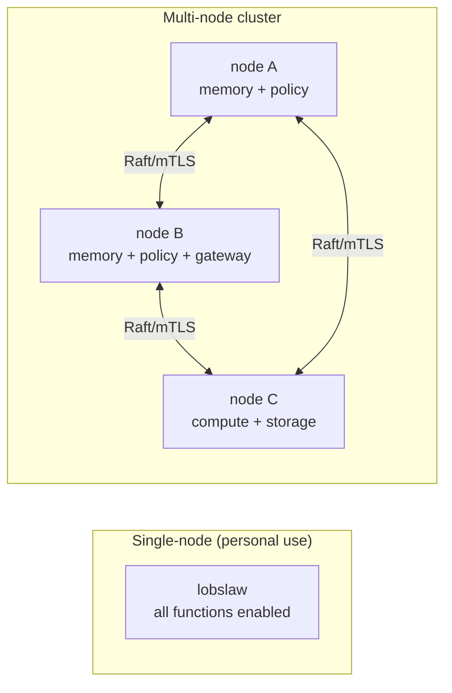
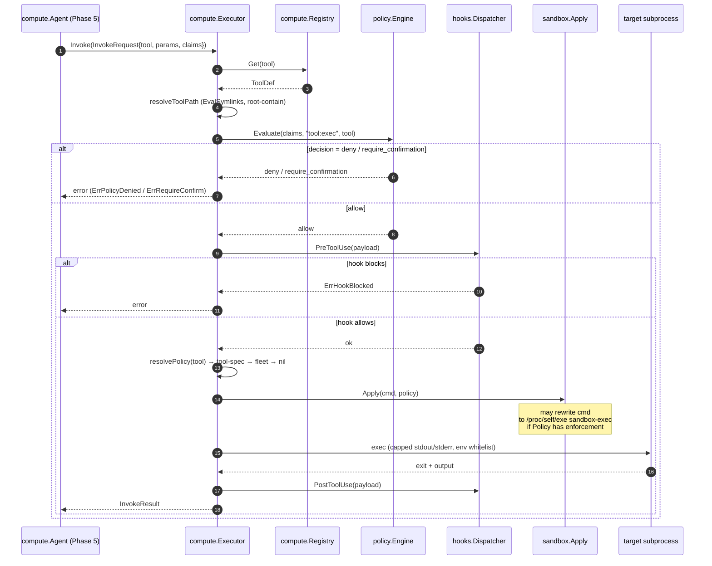
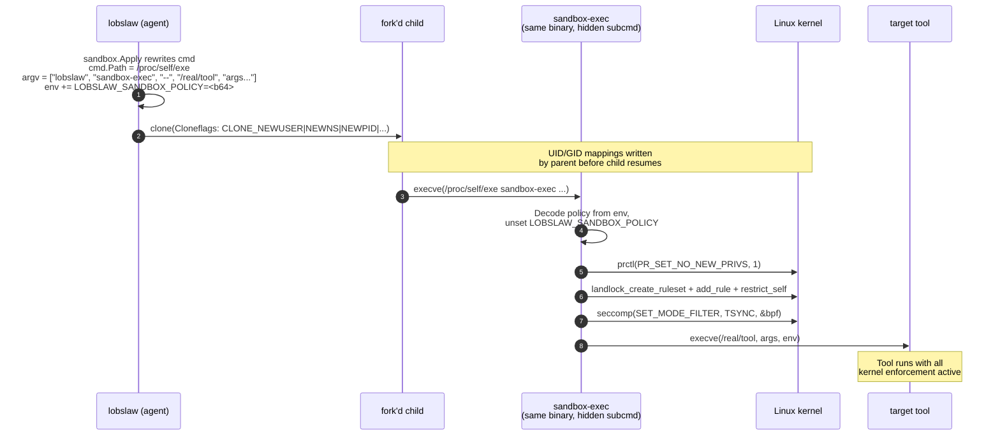
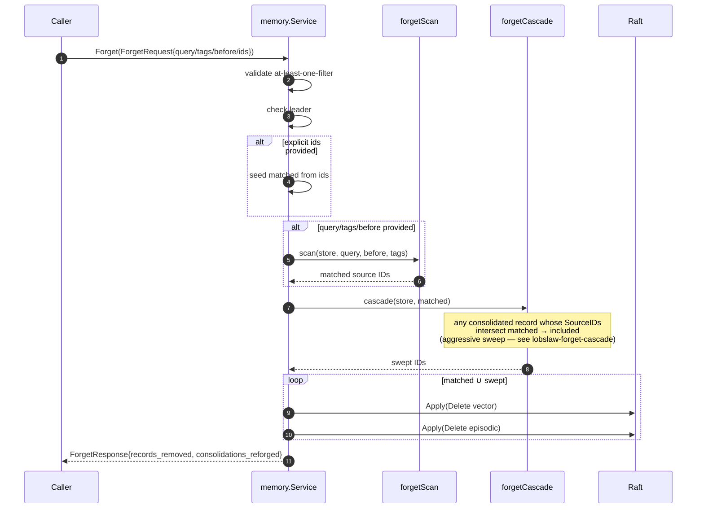
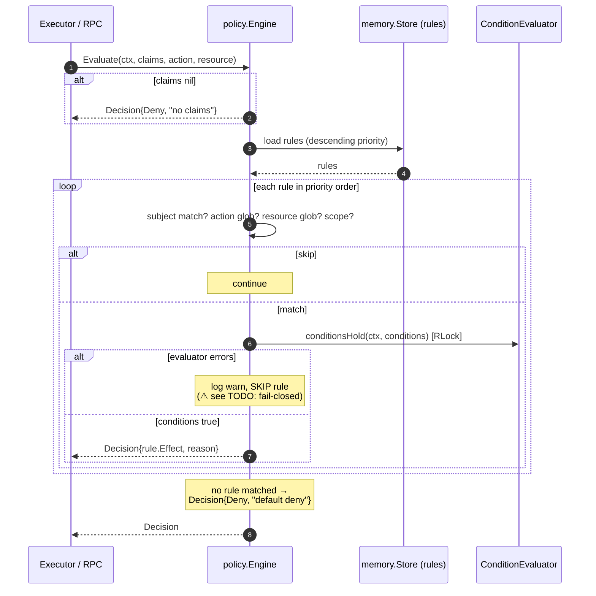
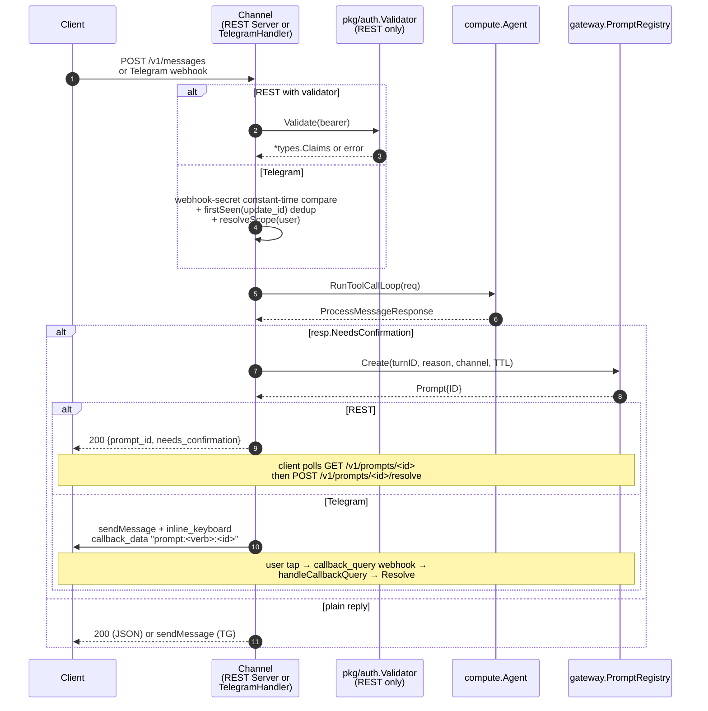

# lobslaw — Architecture

High-level shape of the system. Start here, then dive into a subsystem doc.

## Component diagram (C4 container level)

```mermaid
flowchart TB
  subgraph UserFacing["User-Facing (Phase 6)"]
    REST["gateway.Server<br/>/v1/messages /healthz /readyz<br/>/v1/prompts/{id} /v1/prompts/{id}/resolve"]
    TG["gateway.TelegramHandler<br/>webhook + inline keyboard"]
    Prompts["gateway.PromptRegistry<br/>confirmation state<br/>(in-memory, TTL auto-deny)"]
    JWT["pkg/auth.Validator<br/>HS256 (RS256/EdDSA=TBD)"]
    REST --> JWT
    REST --> Prompts
    TG --> Prompts
  end

  subgraph Agent["Agent loop (Phase 5)"]
    AgentLoop["compute.Agent<br/>RunToolCallLoop"]
    Resolver["compute.Resolver<br/>pick provider chain"]
    Promptgen["promptgen<br/>build system prompt"]
    Budget["compute.Budget<br/>turn spend/tools"]
    LLMClient["compute.LLMClient<br/>OpenAI-compat /chat/completions"]
  end

  subgraph Compute["Tool execution (Phase 4)"]
    Registry["compute.Registry<br/>tools + per-tool policy"]
    Executor["compute.Executor<br/>invoke pipeline"]
    Policy["policy.Engine<br/>rule walk + conditions"]
    Hooks["hooks.Dispatcher<br/>PreToolUse / PostToolUse / etc"]
    Sandbox["sandbox<br/>Apply → reexec helper"]
  end

  subgraph LLMLayer["LLM interpretation (Phase 5+)"]
    Summarizer["Summarizer iface<br/>(Dream consolidation)"]
    Adjudicator["Adjudicator iface<br/>(merge verdict)"]
    Reranker["Reranker iface<br/>(hot-path recall filter)"]
  end

  subgraph Memory["Memory service (Phase 3)"]
    Store["memory.Store<br/>bbolt + Raft FSM"]
    MemSvc["memory.Service<br/>Store/Recall/Search/Forget/FindClusters"]
    Dream["memory.DreamRunner<br/>score + consolidate + merge phase"]
    Raft["etcd/raft/v3<br/>+ custom gRPC transport"]
  end

  subgraph Cluster["Cluster core (Phase 1-2)"]
    Discovery["discovery.Service<br/>seed + DNS + UDP broadcast"]
    MTLS["pkg/mtls<br/>per-node certs"]
    NodeSvc["node.Node<br/>lifecycle + gRPC server"]
  end

  REST --> AgentLoop
  TG --> AgentLoop
  AgentLoop --> Promptgen
  AgentLoop --> Resolver
  AgentLoop --> LLMClient
  AgentLoop --> Executor
  AgentLoop --> Budget
  AgentLoop --> MemSvc

  Resolver -.reads config.toml.-> Resolver
  LLMClient -- HTTPS --> ExternalLLM["External LLM<br/>(OpenAI, Anthropic, Ollama)"]

  Executor --> Registry
  Executor --> Policy
  Executor --> Hooks
  Executor --> Sandbox

  Sandbox -. reexec .-> SandboxExec["lobslaw sandbox-exec<br/>(helper subcommand)"]
  SandboxExec -- prctl + landlock + seccomp --> Tool["target tool subprocess"]

  Dream --> MemSvc
  Dream --> Summarizer
  Dream --> Adjudicator
  AgentLoop --> Reranker

  MemSvc --> Store
  Store --> Raft

  NodeSvc --> MemSvc
  NodeSvc --> Executor
  NodeSvc --> Policy
  NodeSvc --> Discovery
  NodeSvc --> MTLS

  Discovery -. peer list .-> NodeSvc
  MTLS -. creds .-> NodeSvc
  Raft -. consensus over mTLS gRPC .-> Raft
```

### Reading the diagram

- **Solid arrows** = runtime data/control flow.
- **Dashed arrows** = config read, reexec, inter-peer consensus — flows that don't fit the simple caller→callee model.
- **Boxes with a light-gray area** group components that ship together in a phase and share a natural API boundary.

### What's not shown

- **Per-request details** (request IDs, OpenTelemetry spans, logging) — cross-cutting, documented per subsystem.
- **Configuration flow** — `config.toml` is read once at boot and watched for reload; each component consumes its own section.
- **Skill + plugin system** (Phase 8) — will slot between the Channel layer and the Executor's Registry; not yet wired.

---

## Deployment topology



Any subset of functions (`memory`, `policy`, `compute`, `gateway`, `storage`) can run on each node. The Raft quorum is the subset of nodes running `memory` or `policy`.

---

## Phase status

| Phase | Components shipped | See |
|---|---|---|
| 1 | Foundation (config, logging, mTLS, crypto, types) | — |
| 2 | Cluster core (node.Node, Raft, discovery, gRPC) | [DISCOVERY.md](DISCOVERY.md) |
| 3 | Memory service (Store/Recall/Search/Forget, Dream, consolidation merge) | [MEMORY.md](MEMORY.md) |
| 4 | Tool execution (Registry, Policy, Hooks, Executor, Sandbox) | [SANDBOX.md](SANDBOX.md) |
| 5 | Agent Core + Provider Resolver + promptgen + LLM client + budget | [AGENT.md](AGENT.md) |
| 6 | REST + Telegram channels + confirmation prompts + JWT (HS256 + JWKS RS256/EdDSA) | [GATEWAY.md](GATEWAY.md) |
| 7 | Scheduler + PlanService + CAS-claim cluster coordination + built-in agent:turn handler | [SCHEDULER.md](SCHEDULER.md) |
| 8+ | Skills, Storage, SOUL, Audit, Polish | see PLAN.md |

---

## Inter-subsystem flows

The diagrams below are **retroactively added** per aide decision `lobslaw-documentation-diagrams` to bring shipped components into compliance. New flows land with their diagrams from day one.

### Tool invocation pipeline (Phase 4)

Agent loop → Executor → Registry → Policy → PreToolUse hook → Sandbox → subprocess → PostToolUse hook.



### Sandbox enforcement via reexec helper (Phase 4.5.5)



See [SANDBOX.md](SANDBOX.md) for the library choices (go-landlock, elastic/go-seccomp-bpf), the rationale for the reexec pattern over alternatives, and the upstream Go proposal that may collapse this into stdlib.

### Memory dream cycle with merge phase (Phase 3.3 + 3.4)

```mermaid
sequenceDiagram
  autonumber
  participant Scheduler
  participant Dream as memory.DreamRunner
  participant Store as memory.Store
  participant Sum as Summarizer iface<br/>(Phase 5 LLM)
  participant Adj as Adjudicator iface<br/>(Phase 5 LLM; default stub)
  participant Raft

  Scheduler->>Dream: Run(ctx)
  Note over Dream: Skip if not Raft leader
  Dream->>Store: ForEach(episodic)
  Store-->>Dream: candidates
  Dream->>Dream: score (recency × importance)
  Dream->>Dream: selectTopN

  alt Summarizer wired (Phase 5+)
    Dream->>Sum: Summarize(candidates)
    Sum-->>Dream: summary + embedding
    Dream->>Raft: Apply(Put consolidated VectorRecord)
  end

  Dream->>Store: prune (score < threshold, non-long-term)
  Dream->>Raft: Apply(Delete low-score episodics)

  Note over Dream: Phase 2 — merge flow
  Dream->>Store: FindClusters(retention=long-term)
  Store-->>Dream: []Cluster

  loop each cluster
    Dream->>Adj: AdjudicateMerge(cluster)
    Adj-->>Dream: MergeDecision{verdict, text, reason}

    alt verdict = Merge
      Dream->>Raft: Apply(Put consolidated from MergedText)
      Dream->>Raft: Apply(Delete each source id)
    else verdict = Conflict
      Dream->>Raft: Apply(Put each record with metadata[conflict-cluster]=id)
    else verdict = Supersedes
      Dream->>Raft: Apply(Put each record with metadata[supersedes-chain]=id)
    else verdict = KeepDistinct (default / LLM error)
      Note over Dream: no action — conservative
    end
  end

  Dream->>Raft: Apply(Put dream-session episodic record)
  Dream-->>Scheduler: DreamResult{Consolidated, Pruned, Merge{...}}
```

### Forget cascade (Phase 3.2)



### Policy evaluation (Phase 4.2)



### Channel request flow (Phase 6)

Inbound user message → channel → agent → back. Confirmations branch through the shared `PromptRegistry`.



See [GATEWAY.md](GATEWAY.md) for route tables, auth modes, dedup behaviour, and the PromptRegistry's atomic-resolve contract.

### Node startup and cluster join (Phase 2)

```mermaid
sequenceDiagram
  autonumber
  participant Op as Operator
  participant Node as node.Node
  participant MTLS as pkg/mtls
  participant Disc as discovery.Service
  participant Seed as Seed peer
  participant Raft

  Op->>Node: New(cfg) + Start(ctx)
  Node->>MTLS: LoadNodeCreds(ca, cert, key)
  MTLS-->>Node: NodeCreds
  Node->>Node: grpc.NewServer with mTLS
  Node->>Raft: NewRaft(transport using mTLS)
  Node->>Disc: start (seed + DNS + UDP broadcast)

  par Seed dial
    Disc->>Seed: dial over mTLS
    Seed-->>Disc: NodeInfo list
  and UDP broadcast (optional)
    Disc->>Disc: send announce
    Disc-->>Disc: receive announces from L2 peers
  end

  alt initial bootstrap
    Node->>Raft: Bootstrap(self-only)
  else join existing
    Node->>Seed: NodeService.AddMember(me)
    Seed->>Raft: ProposeConfChange(add voter)
    Raft-->>Seed: committed
    Seed-->>Node: ok; Raft streams replicate
  end

  Node-->>Op: Serving (SIGTERM → graceful Shutdown)
```

---

## Diagram maintenance

Per aide decision `lobslaw-documentation-diagrams`:

1. These diagrams MUST stay accurate. A PR that changes an underlying flow without updating its diagram is incomplete.
2. New flows ship with diagrams from day one.
3. Co-located with prose. Each subsystem doc owns its sequence diagrams; the architectural overview lives here.

The diagrams above are **retro-fitted** to bring Phases 1–4 into compliance. Any drift you spot → patch in the same commit as whatever caused it.
