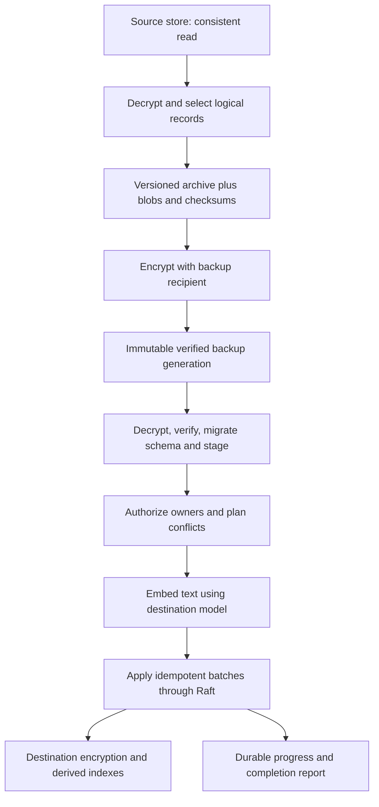

# Design: portable archives and versioned backups

Status: implementation in progress on `feat/portable-backups`.

Implemented: encrypted offline/live export, verification, explicit owner mapping,
conflict previews, destination embedding, resumable Raft batches, paused execution
state, and local backup generations with pinning and count/age retention. The CLI
re-sends the original archive to resume; receipts survive in encrypted Raft state.
A transcript and its index form one batch; each batch is limited to 8 MiB. The
archive remains bounded to 256 MiB and is assembled in memory.

The private 355-record local-stack fixture has round-tripped through an isolated
Raft destination using a fresh memory key and the actual cached MiniLM model.
The same 355 records also restored through the production binary in an isolated
Kubernetes pod: repeat apply wrote zero records and live encrypted export
preserved the full inventory. Production migration remains pending. Filesystem attachments,
automatic schedule activation, retained incomplete upload jobs and remote backup
repositories remain outside this implementation. The sections below retain the
broader design; see docs/user/ARCHIVE.md for the implemented commands.

## Overview

Add one logical archive format for moving Lobslaw knowledge between deployments
and retaining independent, versioned backups. Import regenerates embeddings with
the destination model and encrypts records with the destination memory key.
The source database, Raft membership, and encryption key never become destination
state. This supports the local Podman-to-Kubernetes migration directly.

This is a knowledge backup. Infrastructure configuration and credentials remain
in deployment backups; the manifest explicitly lists included and omitted data.

## Interfaces

Proposed CLI:

```sh
# Live export by default; offline export requires a stopped source or snapshot.
lobslaw archive export --context local --out local.lobarchive.age --recipient age1...
lobslaw archive export --offline --state-db ./state.db \
  --memory-key-ref env:LOBSLAW_MEMORY_KEY --out local.lobarchive.age --recipient age1...
lobslaw archive inspect local.lobarchive.age --identity ./backup-identity
lobslaw archive verify local.lobarchive.age --identity ./backup-identity

# No mutations without --apply. Plan includes ownership, conflicts and embeddings.
lobslaw archive import local.lobarchive.age --context homelab --identity ./backup-identity
lobslaw archive import local.lobarchive.age --context homelab --identity ./backup-identity --apply
lobslaw archive status --context homelab <import-id>
lobslaw archive resume --context homelab <import-id>

# Each successful run creates a self-contained snapshot, never a replacement.
lobslaw backup create --context homelab --repository ./backups --recipient age1...
lobslaw backup list --repository ./backups
lobslaw backup restore <snapshot-id> --repository ./backups --context recovered
lobslaw backup prune --repository ./backups --keep-last 10 --keep-within 30d
```

`backup restore` uses the same import planner and requires `--apply` for writes.
Its first version requires an empty destination knowledge store. Use archive
import to merge into an existing deployment. Pruning also defaults to a plan;
`--apply` deletes only completed, verified, unpinned snapshots outside retention.
The retention numbers above are operator examples, not hidden defaults.

Core package contracts, independent of CLI and transport:

```go
type Exporter interface {
    Export(context.Context, io.Writer, ExportOptions) (Manifest, error)
}
type Planner interface {
    Plan(context.Context, io.Reader, ImportOptions) (ImportPlan, error)
}
type Importer interface {
    Apply(context.Context, ImportPlan) (ImportResult, error)
}
```

Add an ArchiveService with streamed export/upload and PlanImport, ApplyImport,
GetImport, and ResumeImport RPCs. Streams have explicit chunk and total-size
limits. An upload is staged, validated, and bound to its digest before apply.
Plan includes destination revisions; changed records invalidate that plan.

## Archive contents

| Component | Export/import treatment |
| --- | --- |
| Episodic memories | Full records, original IDs, text, dates, retention, owner, visibility and conversation references |
| Vector-backed documents | Preserve text and metadata, including standalone memories and Dream summaries; omit embedding, norm and old model stamp |
| Consolidations | Preserve verdicts, summary text, source relationships and history; do not rerun summarisation |
| Pinned memory and soul tune | Preserve durable content; apply to an existing target only through an explicit conflict plan |
| Skills | Every stored version, original manifest/signature bytes, and referenced content-addressed blobs |
| Self-taught artefacts | Preserve active/proposed/archive provenance and version history; activation is separately authorized |
| Sessions and messages | Include by default for a complete knowledge backup; a selection may explicitly omit them |
| User preferences | Include content preferences; channel subscriptions remain inactive until rebound on a new deployment |
| Schedules and commitments | Included by default: cron, one-off jobs, reminders, commitments and their durable history; restore paused until explicitly resumed |
| Workspace and filesystem SOUL.md | Explicit attachments only; declared paths and digests, no recursive export of arbitrary mounts |

Exclude credentials, CA keys, model API keys, policy grants, enrolments, pending
approvals, session leases, channel polling offsets, Raft metadata/logs, execution
caches, model checkpoints, generated indexes, and deployment mount definitions.
Do not imply that omitted audit trails or filesystem attachments were backed up.

Skills are already stored in `skills` and `skill_blobs`; exporting only a skills
directory misses that authority. Signed manifest bytes must survive unchanged.
Imported skill payloads are not executed by validation or materialisation.
Cross-deployment activation follows the destination's existing skill trust rules.

## Format and versioning

Use a streaming tar+gzip archive encrypted as an age payload. Encryption is
required by default; a deliberate `--plaintext` option exists for local tooling.
The recipient key is independent of either cluster memory key. Recovery needs
the backup identity, not the old deployment's encryption key.

```text
manifest.json
records/episodic.jsonl
records/documents.jsonl
records/consolidations.jsonl
records/skills.jsonl
records/self-taught.jsonl
records/sessions.jsonl
records/scheduled-tasks.jsonl
records/commitments.jsonl
records/...
blobs/sha256/<digest>
attachments/...
checksums.json
```

Manifest fields: format name, schema major/minor, snapshot ID, creation time,
source deployment ID, Lobslaw version, source consistency marker, component
selection, required features, per-kind counts, source model for diagnostics,
and explicit omissions. Source identity must not reuse a CA private key.

Versioned means both a versioned file schema and immutable backup generations.
Each snapshot is independently restorable. Major schema versions need explicit
migration adapters; an unknown required component or field fails validation.
Optional unknown components must be reported, never silently dropped.

Record schemas are explicit archive DTOs, not raw bbolt bucket dumps. Reuse
protobuf JSON field conventions where useful but pin the archive schema and
test adapters against historic fixtures. Original skill bytes remain blobs.
Checksums cover exact record files and blob bytes; the final inventory checks
missing, duplicate and unexpected entries. A checksum is not signer identity.

## Data flow



### Consistent export

Read all selected records and referenced skill blobs from one bbolt read
transaction, or from a consistent private snapshot produced by WriteSnapshot.
Separate ForEach calls are not a consistent cross-bucket snapshot. Release the
live read transaction before slow client streaming; bound temporary storage.
Export must fail on undecryptable required records: the existing
ForEachDecryptable helper silently skips them and is inappropriate here.
An explicit partial-export option must mark the archive incomplete.

External attachments cannot share the database transaction. Copy and verify
them under a quiescence requirement, or label the export inconsistent; a backup
must not claim a single point in time that it cannot provide.

### Planned, repeatable import

1. Authenticate the archive, verify checksums/limits, and upgrade supported schemas.
2. Validate record relationships and skill blob references. Historical source IDs
   may refer to memories already retired in the source; preserve that provenance
   rather than treating every such reference as a broken foreign key.
3. Authorize data access and resolve identities. Preserve IDs by default, but do
   not assume a source principal denotes the same person on another deployment.
   Require mappings where identity cannot be established. Preserve visibility;
   never convert an unowned record into unrestricted data.
4. Plan additions, exact duplicates, conflicts, activation changes, and embedding
   work. Exact duplicates are no-ops. Conflicting IDs or skill name/version pairs
   fail by default; `keep-existing` is an explicit policy. Overwrite is deferred.
5. Rebuild only imported document embeddings with the destination model. Retain
   standalone vector-backed text and consolidated summaries, not just episodic
   sources. Do not invoke the existing global Reembed as the import algorithm:
   it scans and can remove unrelated destination vectors.
6. Commit complete record/dependency batches through Raft with a durable import
   journal. Use deterministic source-to-target mappings for resumability; a retry
   must not mint fresh IDs or reapply completed writes. Destination encrypts data.
7. Rebuild caches and indexes and report counts, skips, model and any remaining
   work. Return success only when every selected component is complete.

Embeddings are derived data, but summaries are source content. Re-embed summaries
without asking an LLM to rewrite them. Old dimensions and model stamps are not
valid on the target. An unavailable embedder pauses import with a recoverable
status rather than claiming a searchable restore. Restoring into a target that
already has another model's vectors requires a separate destination migration;
archive import must not quietly convert the target's entire corpus.

Import is resumable, not globally atomic across an arbitrary-size archive.
Fully validated records are applied in bounded batches; incomplete jobs report
what is already visible. Each batch is atomic and dependency-complete. Jobs and
staged state survive leader changes. No automatic rollback of records that may
already have received subsequent edits. Imported schedules remain disabled and
skill activation deferred until completion and explicit authorization.

### Schedules, reminders and commitments

These are first-class backup content, not an optional afterthought. Preserve
original IDs, owner/visibility, cron expressions, timezone, one-off due dates,
payloads, destination references, recurrence, enabled/disabled intent, completion
state, retry policy where represented, and durable execution history. Preserve
relationships to skills, sessions and commitments so a restored task keeps its
meaning. Missing required skill or channel bindings must appear in the plan.
Where the current record relies on deployment defaults rather than storing a
timezone or other execution setting, capture its effective source value in the
archive DTO. Do not silently reinterpret a cron expression in the target node's
timezone. Preserve only history the source actually stores; the manifest reports
whether a complete execution audit trail was included.

Do not restore in-flight claims, leases or a worker's ownership. Record the
source's requested activation state separately from the destination's paused
import state. Apply all tasks paused; completed one-off tasks stay completed.
An explicit `--activate-schedules` option authorizes activation after the entire
import has completed and its dependencies have been validated. Without it, the
report lists paused tasks for later activation through normal scheduler tools.

On activation, recompute the next eligible run from the preserved expression and
timezone. Do not replay missed cron occurrences or overdue one-off reminders by
default. Report overdue items and require a deliberate catch-up choice. Preserve
history as history, not as work to execute again. Reject conflicting schedule IDs
and re-imports must never duplicate an existing task or reset a completed task.

### Authorization and archive handling

Preserve the operator-establishment decision: a machine operator certificate
alone does not grant universal access to personal data. Online export/import
uses the authenticated principal and policy checks per selected scope; a full
deployment export requires corresponding data authority. Offline access requires
possession of the database and its decryption key and is an operator recovery path.

Never treat an archive's owner, skill tier, or source policy as authorization.
Reject path traversal, symlink/hardlink extraction, duplicate paths, oversized
records, decompression bombs, and invalid references before destination writes.
Stage encrypted data or use a private temporary directory with bounded lifetime.
Do not log memory text, tokens, or blob content. Publish backups atomically after
verification; failed or truncated writes are never listed as restorable snapshots.

## Key decisions

| Decision | Choice | Rationale |
| --- | --- | --- |
| Portability | Logical content, excluding Raft and source ciphertext | Allows new node identities and memory keys |
| Embeddings | Recompute on import | Destination model defines vector space |
| Skill integrity | Preserve manifests and signatures verbatim | Reserialising signed YAML invalidates signatures |
| Backup generations | Immutable, self-contained archives | Restores do not depend on a fragile incremental chain |
| Conflict handling | Plan first, exact duplicate no-op, conflicting ID rejected | Repeatable migration without silently overwriting new data |
| Failure handling | Durable resumable batches | Fits bounded Raft proposals and makes partial progress explicit |

## Acceptance criteria

- [ ] Export/import between different memory keys and embedding models preserves
      memory text, IDs, visibility, ownership, timestamps and provenance.
- [ ] Standalone documents and Dream summaries survive with new embeddings and
      unchanged text; unrelated destination records and vectors remain untouched.
- [ ] Skills round-trip byte-identically and detached signature verification works.
- [ ] Multiple skill versions, archived/proposed artefacts, and selected history survive.
- [ ] Cron schedules, timezones, one-off tasks, reminders, commitments and durable
      completion history round-trip without importing leases or triggering work.
- [ ] Activation resolves dependencies and handles overdue/DST-boundary schedules
      explicitly; repeated import never duplicates jobs or reopens completed work.
- [ ] Imports enforce destination data authorization and do not activate jobs or
      elevate skill trust merely because the archive says they were active.
- [ ] Same archive applied twice is a no-op; conflicts are shown before any write.
- [ ] Invalid/tampered/truncated archives fail before writes; unreadable source
      records cannot yield a falsely successful complete backup.
- [ ] Consistent export under concurrent writes contains no missing skill blobs
      or split session/message updates.
- [ ] Interrupted apply resumes after restart/leader change; each completed batch
      remains durable and counts match the final result.
- [ ] Historic schema fixtures import through tested adapters; unsupported schema
      versions fail clearly without dropping fields.
- [ ] Retention keeps pinned generations and the union of configured age/count
      rules; temporary and failed backups are never restore candidates.
- [ ] Restore drill on the local 78 episodic/38 document fixture works against an
      isolated destination; use synthetic equivalents in committed tests.

## Files to create/modify

- `internal/archive/`: DTOs, codecs, checksums, schema migrations and planning.
- `internal/memory/archive.go`: consistent decrypted view and authorized Raft apply.
- `internal/memory/buckets.go`: import journal/staging bookkeeping, excluded from export.
- `internal/node/wire_archive.go`: service wiring, embedder and authorization.
- `internal/scheduler/`: durable import pause/activation checks for schedules and
  commitments, including overdue handling and clearing source worker claims.
- `pkg/proto/lobslaw/v1/lobslaw.proto`: streaming archive and import-job RPCs.
- `cmd/lobslaw/archive.go`, `cmd/lobslaw/backup.go`: CLI orchestration.
- `internal/backup/`: local immutable repository, publication and retention.
- Matching codec, authorization, fault-injection, round-trip and CLI integration tests.
- User documentation distinguishing archive migration from physical disaster recovery.

## Dependencies and delivery

Reuse Go tar/gzip/JSON, bbolt snapshot support, Raft writes, protobuf DTO patterns,
skill bundle validation and the embedder interface. Add a maintained age library
for streaming archive encryption; choose its version during implementation.

Deliver in focused changes: (1) codec/consistent export/inspect/verify,
(2) authorized planned import and destination re-embedding,
(3) backup generations/retention and restore drills. Include memories, skill
blobs, pinned/soul, learned content, schedules and commitments in the first
round-trip milestone; sessions
and optional attachments use explicitly versioned components, never silent gaps.

## Out of scope for the first version

Incremental chains, automatic backup scheduling, S3 repositories, importing
deployment credentials/policy grants, overwriting an existing target, arbitrary
workspace mounting, and moving a source Raft cluster identity. Logical backups
do not replace independently backed-up deployment configuration and secrets.
