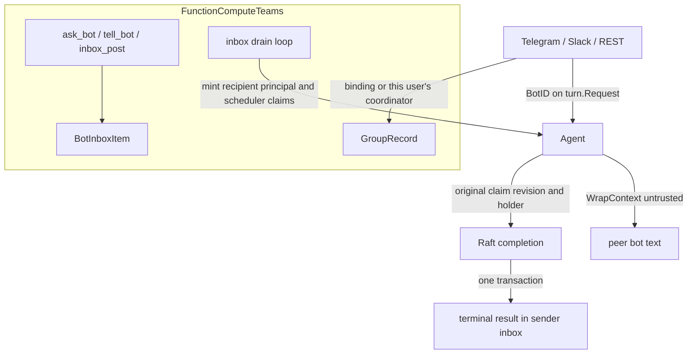
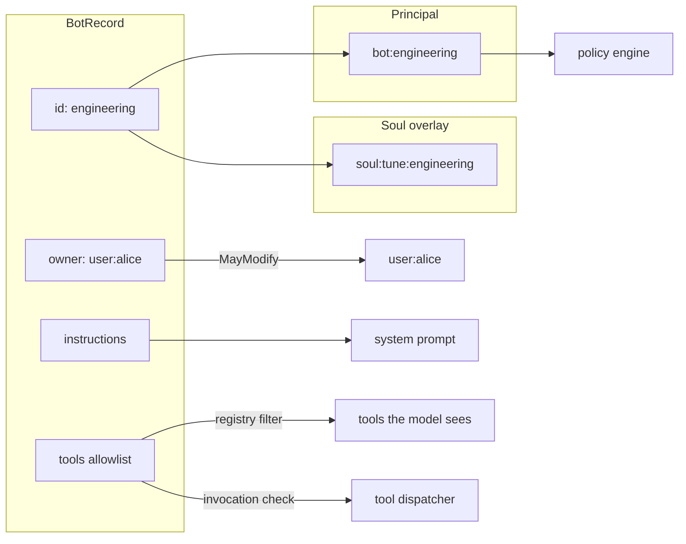
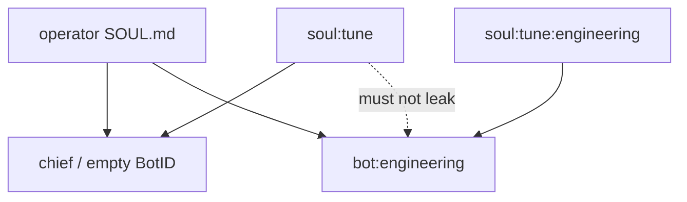

# Bots — a principal, not a permission set

How lobslaw names more than one agent, and why a bot's personality
grants it no authority.

## TL;DR

A **bot is a principal**. Everything that already decides against a
principal — memory ownership, policy subjects, scheduled-task owners,
audit entries — inherits per-bot isolation for free. A bot's authority
is NOT a field on its record; it runs as `bot:<id>` and the policy
engine decides what that may do, exactly as for any other subject.

Persona (instructions, soul overlay) is how the bot answers, not what
it may do.

| Piece | Where | Shape |
|---|---|---|
| Registry | `internal/memory/bots.go` | Raft record, revision-checked CAS |
| Ownership | `BotRecord.owner` | Explicit human `user:<id>`; empty = nobody |
| Personality | `internal/soul` | One overlay per bot; chief keeps `soul:tune` |
| Turns | `internal/compute.TurnIdentityFor` | Mint `bot:<id>`; never `Resolve()` it |

Turns without `BotID` behave as the main assistant.

See aide decisions `owned-bots` and `compute-teams`.

---

## Teams (opt-in: `FunctionComputeTeams`)

Coordinator selection, specialist delegation and a durable inbox.
Off by default. `--all` does not enable it. Ordinary compute does
not seed teams or register team tools.

| Piece | Where | Shape |
|---|---|---|
| Team | `GroupRecord` | Single human owner; empty = inaccessible |
| Coordinator | `GroupRecord.coordinator_bot_id` | An ordinary bot with that role |
| Inbox | `BotInboxItem` | Raft queue, `LOG_OP_CLAIM`, drain loop |
| Delegation | `ask_bot` / `tell_bot` / `inbox_post` | Registered only when teams is on |



Empty group owner is nobody, never public. Channel routing uses an
explicit binding or **that user's** coordinator. A missing binding
does not fall into another person's team.

`ask_bot` requires both a declared edge and the same nonempty human owner at the recipient. It creates a child-local budget that also charges every expense to the parent, without changing the parent's caps. `Without("ask_bot")` is enforced at invocation as well as advertisement; an empty allowlist does not re-grant it. A child requiring confirmation returns a blocked-operation error and is not journalled as completed. Peer text is wrapped with `promptgen.WrapContext`. `TurnBudget.Tighten` runs on both `Run` and `Resume`.

Team tools receive the curated builtin default grants; operators can narrow them with policy. Their handlers independently enforce record ownership. Restore mode pauses the drain. Inbox execution is bounded below the claim lease, and completion must supply the original claim revision and holder. A stale worker cannot overwrite a successor. Terminal completion and the correlated sender receipt commit atomically; read results with `inbox_list` status `all`. Synchronous exchange journals are inserted directly as terminal records, never runnable intermediate work.

---

## The shape



The tools list filters the advertised registry and is checked again before builtin or skill invocation, including pending calls on resume. Policy remains an additional authorization gate. Empty tools means the node default set, not "no tools". A named bot without a configured resolver fails closed instead of running as a generic agent.

---

## Identity

`identity.Bot(id)` mints `bot:<id>`. It is never reached from
`Resolver.Resolve`. The alias map translates ids that arrived FROM a
channel; putting `"bot:devops"` through Resolve yields
`"user:bot:devops"`, which owns nothing the bot owns and matches no
rule written about it.

```mermaid
sequenceDiagram
  participant Turn
  participant Agent
  participant Resolver
  Turn->>Agent: BotID=devops, Claims.UserID=bot:devops
  Agent->>Agent: identity.Bot("devops")
  Note over Agent: minted, not resolved
  Agent-->>Turn: Principal=bot:devops
  Turn->>Agent: BotID=devops, Claims.UserID=alice
  Agent->>Resolver: Resolve("alice")
  Resolver-->>Agent: user:alice
  Note over Agent: the bot did the work; alice owns it
```

A turn with no `BotID` is unchanged: `Resolve(userID)` as before.

---

## Ownership

`BotRecord.owner` is a human principal (`user:<id>`). Empty owner is
nobody — the record is inaccessible, never public. There is no
unowned-editable fallback.

`MayModify` rejects an empty principal **and** an empty owner.

On boot, unowned records are adopted onto the unique `[[user]]` with
`role:operator`. None or more than one operator leaves them
inaccessible (logged). Owner, once set, is preserved across updates.

---

## Personality overlay

The chief's overlay key is the exact pre-existing bytes `soul:tune`.
Changing those bytes would wake an upgraded cluster with a default
personality. Other bots get a suffixed key. Their overlay merges onto
the operator's `SOUL.md` **without** the chief overlay underneath —
"be less sarcastic with me" said to the chief must not retune devops.



`SoulTuneRecordIDFor("")` and `SoulTuneRecordIDFor(ChiefBotID)` both
return `SoulTuneRecordID`. A store that does not implement
`BotTuneStore` falls back to the chief overlay, so a deployment that
never creates a bot is unchanged.

---

## Persistence

Writes go through Raft (`LOG_OP_CLAIM`) with the same revision CAS as
soul tune. `BucketBots`, `BucketGroups` and `BucketBotInbox` are in
`archiveKinds`; credentials and browser sessions are not. Restore mode
pauses the inbox drain. Inbox archive identities include both recipient and item ID. Imported pending/claimed inbox work is cancelled with an import-pause reason and requires an explicit retry; old leases are never resumed automatically.

Deleting a bot does not cascade the records it owned. Recreating the
same id restores the principal.

---

## Out of scope

- Browser console / SPA (`web/`, `FunctionUIWeb`)
- A default team seeded on ordinary compute
- Per-bot channel tokens / avatars
