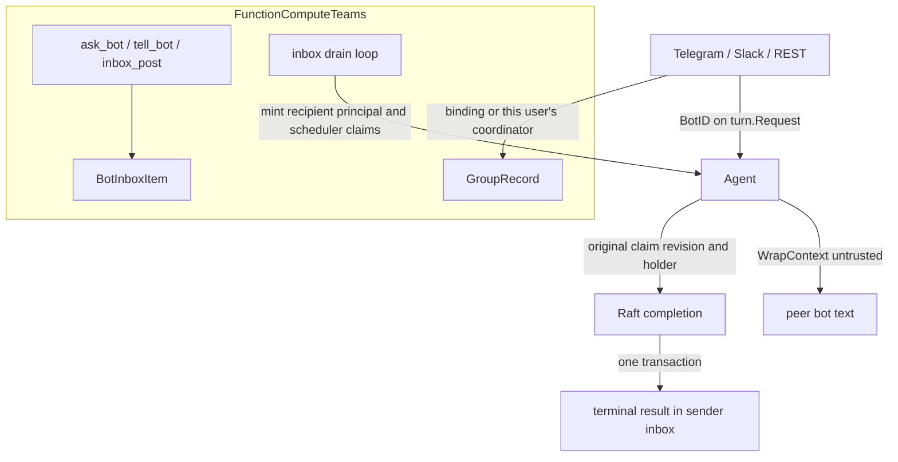
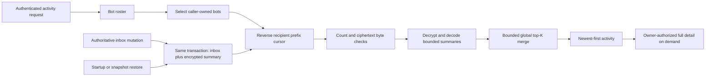
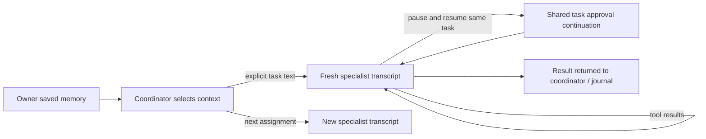
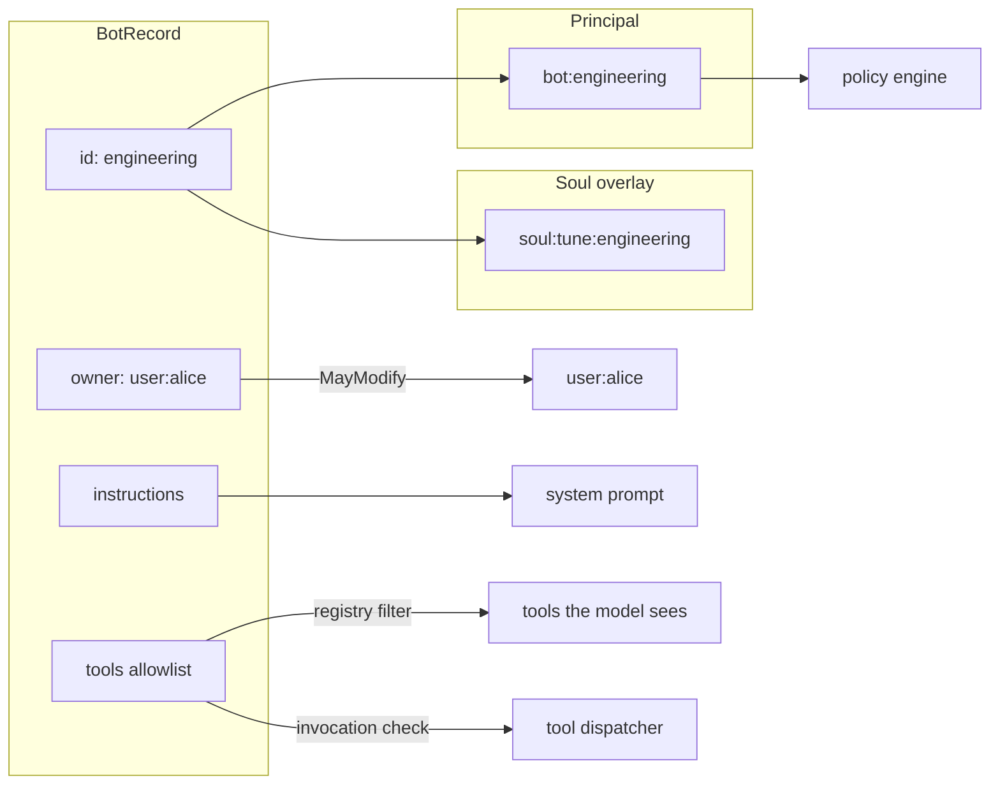
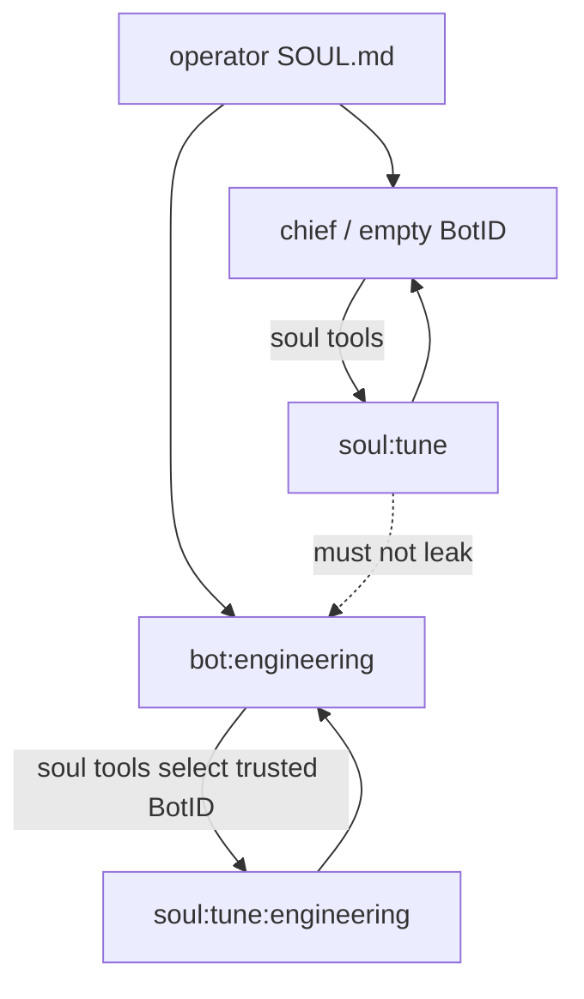

# Bots — a principal, not a permission set

How lobslaw names more than one agent, and why a bot's personality
grants it no authority.

## TL;DR

A **bot is a principal**. Everything that already decides against a
principal — memory ownership, policy subjects, scheduled-task owners,
audit entries — inherits per-bot isolation for free. A bot's authority
is NOT a field on its record; it runs as `bot:<id>` and the policy
engine decides what that may do, exactly as for any other subject.

Persona (instructions, soul overlay) is how the bot answers, not what
it may do.

| Piece | Where | Shape |
|---|---|---|
| Registry | `internal/memory/bots.go` | Raft record, revision-checked CAS |
| Ownership | `BotRecord.owner` | Explicit human `user:<id>`; empty = nobody |
| Personality | `internal/soul` | One overlay per bot; chief keeps `soul:tune` |
| Turns | `internal/compute.TurnIdentityFor` | Mint `bot:<id>`; never `Resolve()` it |

Turns without `BotID` behave as the main assistant.

See aide decisions `owned-bots` and `compute-teams`.

---

## Teams (opt-in: `FunctionComputeTeams`)

Coordinator selection, specialist delegation and a durable inbox.
Off by default. `--all` does not enable it. Ordinary compute does
not seed teams or register team tools.

| Piece | Where | Shape |
|---|---|---|
| Team | `GroupRecord` | Single human owner; empty = inaccessible |
| Coordinator | `GroupRecord.coordinator_bot_id` | An ordinary bot with that role |
| Inbox | `BotInboxItem` | Raft queue, `LOG_OP_CLAIM`, drain loop |
| Delegation | `ask_bot` / `tell_bot` / `inbox_post` | Registered only when teams is on |

```mermaid
flowchart TB
  subgraph gate ["FunctionComputeTeams"]
    Groups[GroupRecord]
    Inbox[BotInboxItem]
    Tools["ask_bot / tell_bot / inbox_post"]
    Drain[inbox drain loop]
  end
  Channel[Telegram / Slack / REST] -->|BotID on turn.Request| Agent
  Channel -->|binding or this user's coordinator| Groups
  Tools --> Inbox
  Drain -->|mint recipient principal and scheduler claims| Agent
  Agent -->|original claim revision and holder| Completion[Raft completion]
  Completion -->|one transaction| Receipt[terminal result in sender inbox]
  Agent -->|WrapContext untrusted| Peer[peer bot text]
```

Empty group owner is nobody, never public. Channel routing uses an
explicit binding or **that user's** coordinator. A missing binding
does not fall into another person's team.

`ask_bot` requires both a declared edge and the same nonempty human owner at the recipient. It creates a child-local budget that also charges every expense to the parent, without changing the parent's caps. `Without("ask_bot")` is enforced at invocation as well as advertisement; an empty allowlist does not re-grant it. A child requiring confirmation returns a blocked-operation error and is not journalled as completed. Peer text is wrapped with `promptgen.WrapContext`. `TurnBudget.Tighten` runs on both `Run` and `Resume`.

Team tools receive the curated builtin default grants; operators can narrow them with policy. Their handlers independently enforce record ownership. Restore mode pauses the drain. Inbox execution is bounded below the claim lease, and completion must supply the original claim revision and holder. A stale worker cannot overwrite a successor. Terminal completion and the correlated sender receipt commit atomically; read results with `inbox_list` status `all`. Synchronous exchange journals are inserted directly as terminal records, never runnable intermediate work.

Queue admission is checked in the serialized Raft apply path for both posts and
terminal-to-pending retries. Claimed work still occupies its slot. A local count
alone cannot enforce capacity when two callers race for the last slot. Pruning
carries the scanned revision and checks that the current record is terminal;
a retry that wins the race makes that prune a conflict, not a deletion.

```mermaid
sequenceDiagram
  participant Scan as Retention scan
  participant User as Owner retry
  participant FSM as Raft FSM
  Scan->>FSM: Read terminal item at revision N
  User->>FSM: Retry expected revision N
  FSM->>FSM: Check capacity, commit pending at N+1
  Scan->>FSM: Delete expected revision N
  FSM-->>Scan: Conflict; keep retried work
```

### Activity timeline reads

`GET /v1/activity` lists the caller's owned bots from the roster and calls
`InboxService.Recent` for each. It does not discover recipients by scanning the
inbox bucket. `Recent` seeks to the end of the `recipient:` prefix in the encrypted
`inbox_activity_v1` derived bucket and walks backwards, returning arrival IDs
newest first regardless of priority.
The execution queue's `List` ordering remains priority descending, then FIFO.

The HTTP limit defaults to 100 (also for zero) and accepts at most 1,000;
negative, malformed, overflowing and oversized limits return 400. The production
read requires a positive limit no larger than `MaxInboxRecentItems` (1,000).
Only those newest summaries are decrypted and decoded. Each summary ciphertext
is checked against `MaxInboxRecentRecordBytes` (16 KiB) before decryption, bounding
input to at most 16 MiB per recipient. Full records have no new size restriction:
large errors, claims and tool lists remain readable through the owner-authorized
`/v1/inbox/{recipient}/{id}` detail route.

The projection contains no prompt body or task claims. Result/error excerpts are
at most 2,048 UTF-8 bytes each; subject is at most 200 bytes. At most 32 tool names
of up to 128 bytes are included; oversized names are omitted rather than turned
into misleading identifiers. Optional identity/link fields (sender, requester,
task, session, correlation) longer than 256 bytes are omitted, never shortened
into a different identifier. Normal links, status, revision, timestamps and usage
are preserved. `truncated_fields` names every abbreviated or omitted field, and
`detail_path` points to the full record. The console labels incomplete summaries,
offers full detail, and does not interpret an omitted task link as an unlinked task.

Recipient IDs obey the existing 63-byte lowercase bot-ID contract. Item IDs are
ULIDs, with optional result suffixes; the projection accepts up to 128 URL-safe
alphanumeric/hyphen/underscore bytes. Malformed or mismatched identities fail
explicitly, rather than aliasing another item's detail route.

Inbox puts, successful CAS updates, completion plus receipt writes, task
admission and archive mutations update the projection in the same bbolt
transaction. Delete removes both records. Startup and snapshot restore rebuild
the projection from authoritative inbox records before publishing the store,
including when an older binary left a stale projection. Rebuild work is a
one-record-at-a-time scan, not a fallback performed by activity requests.
The gateway retains only the global newest K between batches of at most 2K.
Local and remote consoles use this same backend read path.

```mermaid
flowchart LR
  Request[Authenticated activity request] --> Roster[Bot roster]
  Roster --> Owner[Select caller-owned bots]
  Owner --> Recent[Reverse recipient prefix cursor]
  Recent --> Bounds[Count and ciphertext byte checks]
  Bounds --> Decode[Decrypt and decode bounded summaries]
  Decode --> Merge[Bounded global top-K merge]
  Merge --> Response[Newest-first activity]
  Write[Authoritative inbox mutation] --> Tx[Same transaction: inbox plus encrypted summary]
  Tx --> Recent
  Rebuild[Startup or snapshot restore] --> Tx
  Response --> Detail[Owner-authorized full detail on demand]
```

## Specialist working memory

The coordinator chooses relevant saved memories and passes them in the task
text. Specialists receive no automatic saved-memory recall or pinned-memory
blocks, even when executing with the owner's operator claims. The saved-memory,
pinned-memory, dream, and transcript-search tool families are excluded at both
advertisement and dispatch. This also prevents a task from writing a persistent
bot diary; successful specialist turns are not automatically ingested.

Working memory is the task's message/tool-result transcript. A new delegated or
queued task starts with a fresh transcript. An approval continuation retains that
same task's transcript; it does not grant access to saved memory. Results remain
in the task journal for the coordinator to select and pass to later work, rather
than being silently recalled or consolidated as a specialist's long-term memory.

```mermaid
flowchart LR
  Saved[Owner saved memory] --> Main[Coordinator selects context]
  Main -->|explicit task text| Task[Fresh specialist transcript]
  Task -->|tool results| Task
  Task -->|pause and resume same task| Continuation[Shared task approval continuation]
  Continuation --> Task
  Task --> Result[Result returned to coordinator / journal]
  Main -->|next assignment| Next[New specialist transcript]
```

---

## The shape

```mermaid
flowchart LR
  subgraph record [BotRecord]
    ID["id: engineering"]
    Owner["owner: user:alice"]
    Brief[instructions]
    Tools[tools allowlist]
  end
  subgraph principal [Principal]
    BotP["bot:engineering"]
  end
  subgraph overlay [Soul overlay]
    Key["soul:tune:engineering"]
  end
  ID --> BotP
  ID --> Key
  Owner -->|"MayModify"| Human["user:alice"]
  Brief --> Prompt[system prompt]
  Tools -->|"registry filter"| Model[tools the model sees]
  Tools -->|"invocation check"| Dispatch[tool dispatcher]
  BotP --> Policy[policy engine]
```

The tools list filters the advertised registry and is checked again before builtin or skill invocation, including pending calls on resume. Policy remains an additional authorization gate. Empty tools means the node default set, not "no tools". A named bot without a configured resolver fails closed instead of running as a generic agent.

---

## Identity

`identity.Bot(id)` mints `bot:<id>`. It is never reached from
`Resolver.Resolve`. The alias map translates ids that arrived FROM a
channel; putting `"bot:devops"` through Resolve yields
`"user:bot:devops"`, which owns nothing the bot owns and matches no
rule written about it.

```mermaid
sequenceDiagram
  participant Turn
  participant Agent
  participant Resolver
  Turn->>Agent: BotID=devops, Claims.UserID=bot:devops
  Agent->>Agent: identity.Bot("devops")
  Note over Agent: minted, not resolved
  Agent-->>Turn: Principal=bot:devops
  Turn->>Agent: BotID=devops, Claims.UserID=alice
  Agent->>Resolver: Resolve("alice")
  Resolver-->>Agent: user:alice
  Note over Agent: the bot did the work; alice owns it
```

A turn with no `BotID` is unchanged: `Resolve(userID)` as before.

---

## Ownership

`BotRecord.owner` is a human principal (`user:<id>`). Empty owner is
nobody — the record is inaccessible, never public. There is no
unowned-editable fallback.

`MayModify` rejects an empty principal **and** an empty owner.

On boot, unowned records are adopted onto the unique `[[user]]` with
`role:operator`. None or more than one operator leaves them
inaccessible (logged). Owner, once set, is preserved across updates.

Roster reads never adopt unowned legacy bots, including an unowned chief. They
may attach already-owned orphan bots to their owner's team. A user's new default
team gets a stable owner-derived ID, so a second user cannot collide with the
first user's default team or borrow its coordinator.

---

## Personality overlay

The chief's overlay key is the exact pre-existing bytes `soul:tune`.
Changing those bytes would wake an upgraded cluster with a default
personality. Other bots get a suffixed key. Their overlay merges onto
the operator's `SOUL.md` **without** the chief overlay underneath —
"be less sarcastic with me" said to the chief must not retune devops.

```mermaid
flowchart TD
  Baseline["operator SOUL.md"]
  ChiefKey["soul:tune"]
  EngKey["soul:tune:engineering"]
  Baseline --> ChiefTurn[chief / empty BotID]
  ChiefKey --> ChiefTurn
  Baseline --> EngTurn[bot:engineering]
  EngKey --> EngTurn
  EngTurn -->|soul tools select trusted BotID| EngKey
  ChiefTurn -->|soul tools| ChiefKey
  ChiefKey -.->|"must not leak"| EngTurn
```

`SoulTuneRecordIDFor("")` and `SoulTuneRecordIDFor(ChiefBotID)` both
return `SoulTuneRecordID`. A store that does not implement
`BotTuneStore` can serve the chief, but refuses specialist snapshots rather
than leaking chief fragments. A deployment that never creates a bot is unchanged.

Tool mutations require a per-bot writer and fail closed if unavailable. Reads,
tuning, fragments, reset and history rollback all bind to the active turn's
trusted BotID, never a model-supplied argument. Compute-only peers carry that ID
in the typed soul RPCs. Each tool gets a fresh bound adjuster over the current
operator baseline, avoiding a shared mutable current-bot selector.

---

## Persistence

Writes go through Raft (`LOG_OP_CLAIM`) with the same revision CAS as
soul tune. `BucketBots`, `BucketGroups` and `BucketBotInbox` are in
`archiveKinds`; credentials and browser sessions are not. Restore mode
pauses the inbox drain. Inbox archive identities include both recipient and item ID. Imported pending/claimed inbox work is cancelled with an import-pause reason and requires an explicit retry; old leases are never resumed automatically.

Deleting a bot retains a disabled tombstone in `BucketBots`; it disappears from
normal reads and rosters, but its ID can never be reused. Inbox, soul, session,
and memory records retain bot principals, so physically deleting just the
registry record would let a later owner inherit private records. The tombstone
travels in bot archives and Raft snapshots. Choose a new ID when creating a
replacement bot.

---

## Out of scope

- Browser console / SPA (`web/`, `FunctionUIWeb`)
- A default team seeded on ordinary compute
- Per-bot channel tokens / avatars
