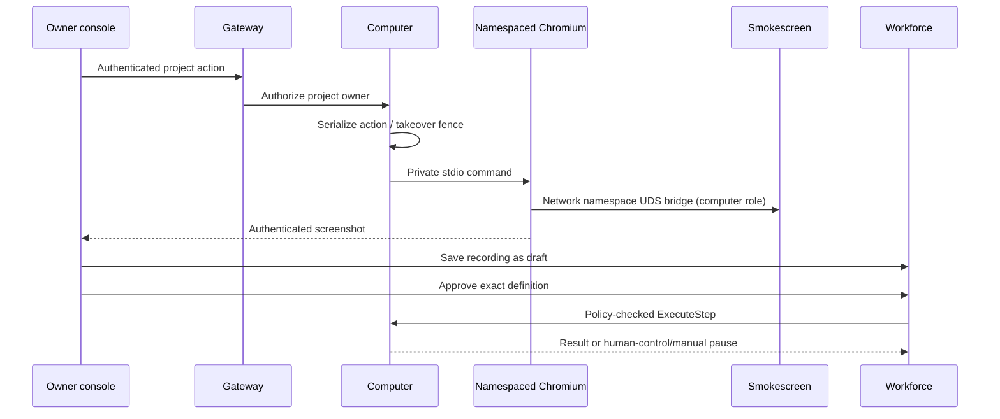

# Project browser computers

## Design

An explicitly configured Chromium workspace is private to one human/project.
The gateway authenticates every frame and action; `ProjectAuthorizer` checks the
current project owner before the service opens local state. `ExecuteStep` is the
worker adapter; the workforce worker must evaluate ordinary tool policy before
calling it. Demonstrations produce routine drafts through the project routine
API, which owns durable approval and definition digests.

Profiles and working state live outside Raft in mode-0700, hashed owner/project
directories. No cookies, screenshots, typed secrets or browser storage are put in
transcripts or portable archives. Takeover is a persisted fence, not a viewer URL:
bot steps fail while a human controls the workspace, including after restart.
All action calls are bounded and serialized with takeover. Recording accepts
only explicit non-secret steps; fill values are never recorded (manual pause).

### Acceptance

- Cross-owner state, screenshot, takeover and action requests fail.
- Taking control excludes worker commands and survives service restart.
- Real Chromium navigation, screenshot and persistent local storage survive restart.
- Recorded fill steps never include literal values; saved routines start as drafts.
- Missing executable, sandbox or proxy returns unavailable without direct fallback.
- Project/channel/task/dependency/attention/routine controls call authoritative APIs.

### Integration surfaces

`computer.ProjectAuthorizer.AuthorizeProject(ctx, principal, projectID) error`;
`computer.Service.ExecuteStep(ctx, principal, projectID, RoutineStep) error`.
`ErrTakeover` and `ErrManual` are durable worker checkpoint/pause conditions.
Browser endpoints: `GET/POST /v1/computers/{projectID}` and
`GET /v1/computers/{projectID}/screenshot`. Saving a draft uses
`POST /v1/projects/{projectID}/routines` with the returned `steps`.
