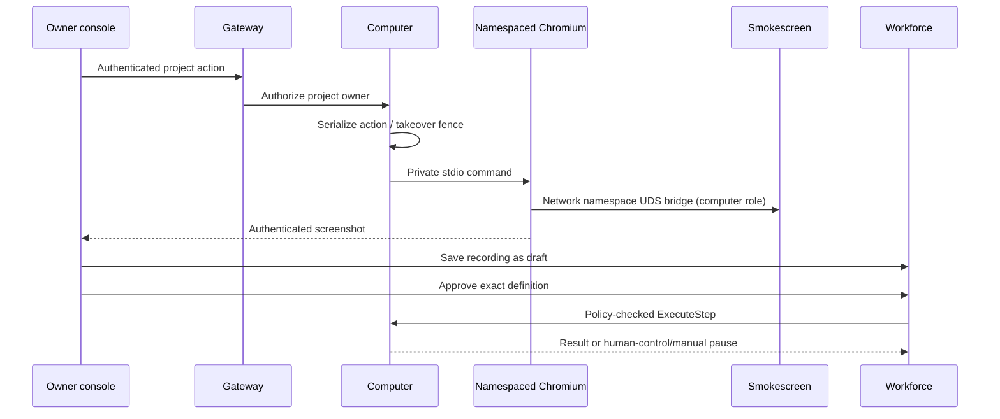

# Project browser computers

Operator setup and the console walkthrough: [User guide](../user/COMPUTER.md).

## Design

An explicitly configured Chromium workspace is private to one human/project.
The gateway authenticates every frame and action; `ProjectAuthorizer` checks the
current project owner before the service opens local state. `ExecuteStep` is the
worker adapter; the workforce worker must evaluate ordinary tool policy before
calling it. Demonstrations produce routine drafts through the project routine
API, which owns durable approval and definition digests.



Profiles and working state live outside Raft in mode-0700, hashed owner/project
directories. No cookies, screenshots, typed secrets or browser storage are put in
transcripts or portable archives. Takeover is a persisted fence, not a viewer URL:
bot steps fail while a human controls the workspace, including after restart.
All action calls are bounded and serialized with takeover. Recording accepts
only explicit non-secret steps; fill values are never recorded (manual pause).

### Acceptance

- Cross-owner state, screenshot, takeover and action requests fail.
- Taking control excludes worker commands and survives service restart.
- Real Chromium navigation, screenshot and persistent local storage survive restart.
- Recorded fill steps never include literal values; saved routines start as drafts.
- Missing executable, sandbox or proxy returns unavailable without direct fallback.
- Project/channel/task/dependency/attention/routine controls call authoritative APIs.

### Integration surfaces

`computer.ProjectAuthorizer.AuthorizeProject(ctx, principal, projectID) error`;
`computer.Service.ExecuteStep(ctx, principal, projectID, RoutineStep) error`.
`ErrTakeover` and `ErrManual` are durable worker checkpoint/pause conditions.
Browser endpoints: `GET/POST /v1/computers/{projectID}` and
`GET /v1/computers/{projectID}/screenshot`. Saving a draft uses
`POST /v1/projects/{projectID}/routines` with the returned `steps`.

## Runtime containment and lifecycle

The embedded `runtime.cjs` is run by an explicitly configured Node executable;
Playwright is loaded from an explicitly configured module path and launches an
explicit Chromium executable. Go never downloads or silently selects a runtime.
The helper speaks one bounded JSON request/response at a time over private stdio.
Runtime diagnostic output is discarded because ordinary Playwright errors can
contain entered values, page text and URLs.

`sandbox.Apply` creates user, network, mount and PID namespaces. The opt-in
`Policy.PrivateProc` remounts procfs **inside** that mount/PID namespace, before
Landlock. Without it, a PID namespace still exposes host `/proc` through the
inherited mount. `Policy.RequireLandlock` refuses the legacy best-effort no-op on
a host without Landlock; supported older ABIs retain their supported enforcement.
Existing sandbox callers retain their defaults.

The namespace contains only loopback. The helper brings it up with the configured
`ip` executable and starts a loopback-only proxy bridge to the host's egress Unix
socket. Both HTTP and CONNECT inject the fixed `computer` role, replacing any
incoming role header. Smokescreen applies the generated hostname ACL and existing
private-address restrictions. There is no host-network fallback, no inherited
secret environment, and no browser-debugging listener. Chromium uses Playwright's
headless launch under the outer subprocess sandbox; this does not depend on
Chromium's setuid sandbox. Resource cgroup limits belong to deployment, not this
runtime.

One service holds an OS lock on its local root. Each workspace serializes state,
actions and takeover through a cancellation-aware channel lock. A takeover does
not acknowledge while an old action is running. Its control record is written by
temp-file/fsync/rename/directory-fsync before acknowledgement. A human fence has
no implicit TTL. Worker steps check it before launching or operating Chromium.
The root lock and persisted fence prevent another local controller from reopening
the same profile with stale bot control.

Four workspace slots bound active browser processes. Closed/inactive slots can be
evicted from the in-memory cache; profile directories remain. Stdio responses are
capped at 8 MiB; actions are bounded to 30 seconds, and cancellation kills the
namespace's init process and its descendants. Shutdown closes Chromium first so
its native profile is flushed. Abrupt process termination retains Chromium's own
crash-recovery semantics rather than promising replicated browser-state durability.

## HTTP and worker contract

| Endpoint | Request / response |
|---|---|
| `GET /v1/computers/{projectID}` | `{project_id,available,control,recording,steps,updated_at}` |
| `POST /v1/computers/{projectID}` | `{action,selector?,value?,url?,sensitive?,x?,y?}` → current state |
| `GET /v1/computers/{projectID}/screenshot` | Authenticated PNG; no-store |

Control actions are `start`, `stop`, `takeover`, `release`, `record`, `discard`.
Browser actions are `navigate`, `click`, `fill`, `press`, `wait`, `capture`.
Coordinates apply only to human clicks in the fixed 1280×800 viewport. Successful
clicks and waits are canonicalized to structural selectors before recording;
coordinates and user-supplied selector expressions do not reach saved drafts.
Every fill is manual/sensitive in a recording, without its selector or value.
Sensitive steps and query/fragment navigation record neither URL nor value.

`ExecuteStep` accepts only browser actions, never control actions. The workforce
adapter must authorize the assignee, tool allowlist and `tool:exec` policy **before**
calling it. It maps `ErrTakeover` and `ErrManual` to a blocked task checkpoint;
approval and manual-step completion remain durable workforce operations. The
adapter maps a missing project to `computer.ErrNotFound` for the gateway's 404.
No browser result carries page content into the task transcript.

`Takeovers(ctx, principal)` returns `{ProjectID,CreatedAt}` for active human fences.
It checks the owner/project directory hash and current project authorization before
returning anything. The workforce Attention hook maps those to `kind=takeover`,
links to the project's Computer tab, and rechecks authorization itself.

Computer routes are mounted through `consoleRoute` and included in
`backendConsoleHandler`. A web-only node forwards authenticated claims over mTLS;
the backend reruns project authorization. Screenshots follow the same route and
are streamed as bounded ConsoleService chunks, not public URLs.

## Verification

The Go tests exercise direct and remotely forwarded route authorization, state
ownership, root locking, takeover across restart, in-flight exclusion, recording
redaction and unavailable runtimes. The real-runtime test uses a local HTTP
fixture through the actual Smokescreen UDS, with only `127.0.0.1` allowed. It
navigates, fills a password, clicks screenshot coordinates, captures a PNG,
reopens Chromium, checks persisted cookies/local storage, then verifies a denied
hostname cannot bypass the proxy.

```sh
COMPUTER_TEST_NODE=/absolute/path/to/node \
COMPUTER_TEST_CHROMIUM=/absolute/path/to/chrome \
COMPUTER_TEST_PLAYWRIGHT=/absolute/path/to/node_modules/playwright \
go test -race ./internal/computer
```

The browser-driven frontend consumer-contract test covers desktop/mobile project
creation, project chat, delegated tasks, stale-revision errors, browser takeover,
secret-free routine draft payloads, explicit approval, edited-definition approval
invalidation, and task-specific Attention approval. Backend fixtures exist only
in that test; end-to-end workforce execution is verified against the integrated
workforce backend after the workstreams merge.

```sh
# From web/, with Node and Chromium installed:
PLAYWRIGHT_MODULE=/absolute/path/to/node_modules/playwright \
CHROMIUM_PATH=/absolute/path/to/chrome node tests/workforce.browser.mjs
```
