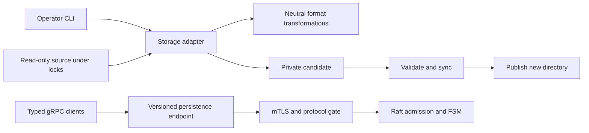

# Design: persisted data compatibility

## Overview

Data format support is independent of release numbers. Startup, physical recovery
and portable import share the ordered migration runner in `internal/dataformat`;
their adapters own validation, locking and publication. No application feature,
agent tool or console endpoint owns migrations.

This first release requires a coordinated stop and upgrade of all Raft members.
It does not claim arbitrary historical compatibility or rolling upgrades across
persistence protocols. Never downgrade an upgraded directory: restore the retained
pre-upgrade source using its original binary and keys instead.

## Interfaces and boundaries

- `dataformat.Upgrade[T]`: ordered, deterministic transformations of isolated data;
  rejects unsupported versions, missing paths, ambiguity and cancellation.
- `dataformat.NormalizeLog`: translates only the historical protobuf envelope.
  `compatibleLogStore` supplies the same canonical bytes for Raft replay and peer
  replication. Original committed log bytes, terms, indexes and membership survive.
- `memory.InspectData`: offline validation under the state and Raft database locks.
- `memory.MigrateData`: validates the source, builds and validates a private copy,
  then publishes a new directory. Never overwrites the source or an existing target.
- State open and snapshot restore: format metadata and supported buckets are
  checked; version changes use staged snapshot publication and a retained backup.
- `archive.Upgrade`: normalizes authenticated portable records in memory before
  the existing import planner applies ownership mappings and paused restore rules.
- gRPC compatibility guards: versioned mutation endpoints and server enforcement, in
  addition to mTLS. The leader also checks a proposed member before adding it.

## Supported formats

| Surface | Current | Historical handling |
|---|---|---|
| State database / physical snapshot | 1 | Unversioned known buckets: validate, preserve encrypted records, add manifest |
| Raft command envelope | 1 | Explicit historical profile for colliding fields; additive version on new proposals |
| Physical directory manifest | 1 | Missing manifest allowed only when historical interpretation is unambiguous or explicitly selected |
| Portable knowledge archive | 2 | Schema 1 upgrades without inventing SourceID; owner/source mappings remain explicit |

The state manifest names the required persistence protocol. Future versions or
unknown buckets are refused before recovery publishes an image. Normal startup of
an already-current store retains existing per-record corruption handling; migration
and recovery validate ciphertext before publication.

Historical Raft profiles are fixture-backed:

- `main-v0`: released main at `5f4e6c4`; fields 37/38/39 are sharing/calendar.
- `pr348-v0`: #348 at `9c651d6`; bot is 51, inbox/group are 38/39.
- `pr348-early-v0`: #348 at `ad38c95`; bot/inbox/group are 37/38/39.

The framework can translate team envelopes, but the foundation binary cannot
interpret team payloads or buckets. Use the #348 binary stacked on this foundation
for those profiles. Main never silently drops an unsupported feature.

A profile must describe the retained **unversioned log history**, not merely the
last installed binary. Mixed histories that reused a number for two meanings
cannot be resolved by one profile and are not supported automatically. Do not
choose a profile by trial and error. An ID-only delete can decode under either
schema. Resolve provenance first; ambiguous histories need an explicit per-index
migration designed from that history. New versioned entries remove this ambiguity
for future changes. Fixtures and their exact schema hashes live in
`internal/dataformat/testdata`.

## Operator workflow

Stop all source cluster nodes before copying or upgrading physical data. Retain
configuration, certificates and the original memory encryption key separately.
The command copies only state.db, raft.db and snapshots; it does not clone machine
identity files, attachments or provider secrets. A physical copy retains Raft
membership and must not be booted as a second copy of the original node.

```sh
lobslaw data inspect --data-dir /srv/lobslaw --memory-key-ref env:LOBSLAW_MEMORY_KEY --legacy-format main-v0
lobslaw data migrate --data-dir /srv/lobslaw --output /srv/lobslaw-upgraded --memory-key-ref env:LOBSLAW_MEMORY_KEY --legacy-format main-v0
```

`inspect` is the preflight/dry run. The source is opened read-only and locked;
missing files, wrong keys, incompatible versions, unsafe paths, corrupt pages or
ambiguous logs fail. `migrate` creates a private sibling staging directory. Copy or
validation errors leave the source intact and do not publish the requested output.
Publication is a rename followed by directory sync. A post-publication sync error
names the destination and requires inspection; it is not reported as success.
Interrupted staging directories are never automatically selected as live state.
The retained source is the complete rollback image. Keep sufficient disk space for
the source, destination and snapshot/state staging copies; failed writes abort.

Configure the destination data directory with `[memory] restore_mode = true` and
upgrade all members before restarting. Review pending tasks and any external
operations that may already have happened after the backup was taken. Stop the
node again, then acknowledge that review explicitly:

```sh
lobslaw data accept-recovery --data-dir /srv/lobslaw-upgraded --memory-key-ref env:LOBSLAW_MEMORY_KEY --acknowledge-external-effects
```

Only then disable restore mode. Neither migration nor acknowledgement executes
pending work itself, resets revisions, changes owners, or grants new authority.

For encrypted backup repository generations, keep using `lobslaw backup restore`.
These are portable knowledge archives, not physical Raft images. They remain
immutable: authenticate the complete archive, upgrade an in-memory copy, then use
the existing preview/apply workflow and owner mappings. Credentials and membership
are not portable archive content. Missing keys cannot be repaired by migration.

## Acceptance criteria

- Historical wire fixtures normalize without modifying source bytes or revisions.
- ID-only ambiguous payloads and unknown future versions are rejected.
- Unsupported feature stores are not opened by a less capable binary.
- Physical migration preserves original state/log bytes and refuses existing output.
- Cancellation, bad keys, symlinks and corrupt snapshots cannot replace live state.
- Snapshot publication retains the existing interrupted-restore recovery behavior.
- Old peers cannot dispatch versioned Raft mutations; new peers interoperate.
- Portable schema 1 imports retain explicit identity/ownership requirements.
- Recovery requires deliberate acknowledgement before normal execution.

## Extending support

Add a format-specific transformation and fixture for every new version, then bump
its writer version. Do not renumber released protobuf fields. New persisted
semantics require a compatible reader on every voter; this release enforces an
exact protocol match rather than assuming that matching Go/protobuf compilation
proves semantic compatibility. A future rolling-upgrade implementation must add
cluster-wide capability negotiation and gate new writers until all voters agree.


## Compatibility dispatch and performance

Persistence mutations use the typed service descriptors under a versioned gRPC
service name (`lobslaw.persistence.v1.*`). Pre-control servers do not register
these names, so reconnecting to an older process cannot dispatch a mutation after
a successful handshake with a different process. Server interceptors still check
protocol metadata and mTLS peer authority on every call, including streams.
Discovery and membership checks retain explicit `GetPeers` negotiation; ordinary
Raft RPCs no longer pay a separate serial negotiation round-trip.

Retained-log validation decodes entries on replication reads and startup scans
every retained entry. Snapshot inspection first copies the repository into a
private temporary directory because the HashiCorp constructor writes a permission
test file. Source repositories are never passed to that constructor. Budget space
for this repository copy plus the individual validation image. Symlinks and
special files are rejected before library access.



```mermaid
sequenceDiagram
  participant O as Operator
  participant A as Migration adapter
  participant S as Locked source
  participant T as Private staging
  O->>A: inspect or migrate
  A->>S: Read state, logs and snapshot repository
  A->>T: Copy snapshots before library inspection
  A->>T: Validate versions, framing and ciphertext
  alt migrate
    A->>T: Build and validate full candidate
    A->>T: Sync and rename to new destination
    A-->>O: Recovery acknowledgement required
  else inspect
    A-->>O: Format report; source unchanged
  end
```
