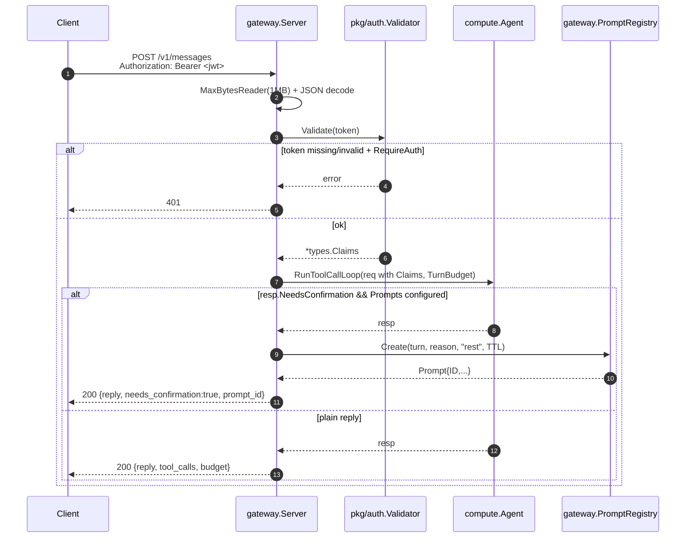
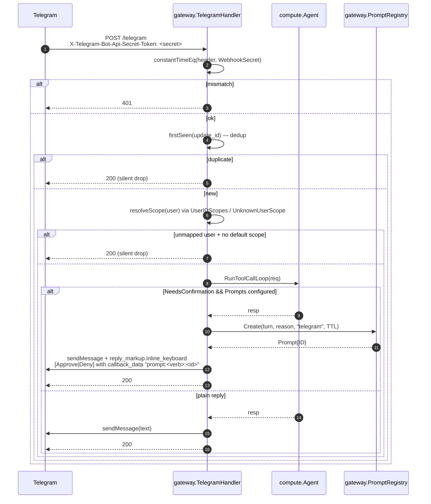
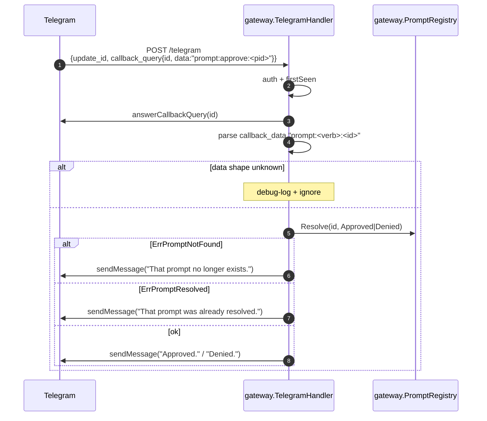

# lobslaw — Gateway (channels)

The gateway is the user-facing edge. It turns inbound REST / Telegram traffic into `compute.ProcessMessageRequest` calls on the agent loop, then turns the agent's response back into a channel-appropriate reply (JSON, or a Telegram message with inline buttons).

Three packages cooperate:

- `internal/gateway` — the REST server (`Server`), the Telegram webhook handler (`TelegramHandler`), and the in-memory confirmation `PromptRegistry` both channels share.
- `pkg/auth` — JWT validation (`Validator`, `ExtractBearer`) used by the REST server to authenticate inbound requests.
- `internal/compute` — the agent loop, tool registry, executor, budget, and mock/real LLM providers the channels drive.

The agent loop knows nothing about HTTP or Telegram. Each channel is a thin adapter that translates inbound transport into an internal request.

---

## Request flow — REST



Client then polls `GET /v1/prompts/<id>` for state and confirms via `POST /v1/prompts/<id>/resolve` with `{"approve": bool}`.

### Routes

| Method + Path | Purpose | Status codes |
|---|---|---|
| `POST /v1/messages` | Main user entry — sends a message to the agent | 200, 400, 401 (w/ RequireAuth), 500, 503 (no agent) |
| `GET  /healthz` | Liveness — process alive | 200 |
| `GET  /readyz` | Readiness — server bound + agent configured | 200, 503 |
| `GET  /v1/prompts/<id>` | Fetch prompt state | 200, 404 |
| `POST /v1/prompts/<id>/resolve` | Approve/deny a confirmation | 200, 400, 404, 409 (already resolved) |
| `POST /telegram` | Telegram webhook (if `Telegram` configured on the server) | 200, 401 |

### Auth modes

The `RESTConfig` `JWTValidator` + `RequireAuth` pair gives four regimes:

| Validator | RequireAuth | Behaviour |
|---|---|---|
| configured | false | Valid JWT → use its scope. Missing/invalid → fall back to `DefaultScope` with a warn log. Good for localhost + reverse-proxy-terminated deployments. |
| configured | true | Reject missing/invalid with 401. Use the token's scope on success. Good for internet-reachable deployments. |
| nil | false | Everyone gets `DefaultScope`. Good for trusted environments / development. |
| nil | true | **Fail-closed.** Every request 401. Intentional: "I asked for auth but provided no validator" is an operator error that shouldn't silently allow traffic. |

Validated tokens with a missing `scope` claim default to `DefaultScope` rather than an empty string.

---

## Request flow — Telegram



### Callback query resolution

When the user taps a button:



### Update dedup

`firstSeen` stores each `update_id` with the time it was processed, reaping entries older than 5 minutes opportunistically on every call. This makes Telegram's retry-on-network-error semantics idempotent — the second delivery of the same update_id is silently dropped so the agent doesn't run twice.

For personal-scale deployments (tens of updates/minute) the O(n) per-call reap is fine. A much busier deployment would want an LRU.

### Webhook secret compare

`constantTimeEq` does a length-prefix-tolerant constant-time comparison. Unequal lengths still do a timed XOR of the first operand against itself, so attackers can't detect "right-length but wrong secret" vs "wrong length" via timing.

---

## Confirmation prompt flow

The `PromptRegistry` is an in-memory map keyed by an unguessable 32-hex ID. Each prompt has:

- `ID` — random from `crypto/rand` (16 bytes → 32 hex chars).
- `TurnID` — the original agent turn this blocks on; threaded through for audit correlation.
- `Reason` — rendered to the user verbatim.
- `Channel` — `"rest"` or `"telegram"`; audit-only, not used for routing.
- `Decision` — transitions once from `Pending` to `Approved` / `Denied` / `TimedOut`. First writer wins.
- `ExpiresAt` — after this, the registry's `time.AfterFunc` fires and flips Pending → TimedOut without any user interaction.

### Registry semantics

| Method | Contract |
|---|---|
| `Create(turnID, reason, channel, ttl)` | Register a new Pending prompt. Starts an `AfterFunc(ttl)` that auto-resolves to TimedOut if still Pending. Returns the `Prompt`. |
| `Get(id)` | Snapshot of current state, or `ErrPromptNotFound`. Snapshot so external mutation can't corrupt the stored entry. |
| `Resolve(id, Approved\|Denied)` | Atomic check-and-set under `r.mu`. Returns `ErrPromptNotFound`, `ErrPromptResolved` (already decided), or nil. Rejects `Pending` / `TimedOut` — those are internal transitions only. |
| `Wait(ctx, id)` | Blocks until the `resolved` channel closes (Resolve or timeout) or ctx cancels. Returns the final Decision or ctx.Err(). |
| `Reap()` | Sweeps non-Pending entries whose ExpiresAt is in the past. Pending entries are left to their timer; Reap never forces a transition. |

The atomicity of Resolve matters: a split lock would let multiple concurrent callers each pass the Pending check and each return nil, even though only one actually mutated state. The `TestPromptRegistryConcurrentResolveOnlyOneWinner` test pins this behaviour — exactly one goroutine sees `nil`, everyone else sees `ErrPromptResolved`.

### Not clustered

The registry is in-memory per REST server / per Telegram handler. A clustered deployment that wants "start a prompt on node A, resolve it on node B" would back this with `memory.Store` keyed by TurnID. Out of scope for Phase 6 — MVP is single-node.

---

## JWT validator (pkg/auth)

Two validation modes, independently configurable — a deployment can enable either, both, or neither.

### HS256 (shared secret)

- `NewValidator(Config)` with `AllowHS256=true` + `HS256Secret=<≥32 bytes>`.
- Good for single-node / personal deployments where a shared secret between the token minter and the server is the simplest answer.
- Secret is pre-resolved; the caller translates `jwt_secret_ref` (e.g. `env:JWT_SECRET`) via the same resolver used for LLM API keys.

### JWKS (RS256/384/512, ES256/384/512, EdDSA)

- `NewValidator(Config)` with `JWKSURL="https://idp.example/.well-known/jwks.json"`.
- Keys fetched lazily on first validation, cached in memory, refreshed every `JWKSRefreshInterval` (default 10m).
- **Key rotation:** a token whose `kid` isn't in the cache force-refreshes once (rate-limited to `JWKSForceRefreshMin`, default 30s) — so an IdP rotation is picked up automatically without operator action, but a flood of bogus `kid` values can't DDoS the IdP through us.
- **Stale-beats-dead:** a refresh that HTTP-errors or returns malformed JSON leaves the existing cache intact and logs a warn. Auth stays up through transient IdP hiccups.
- Supported `kty`: `RSA`, `EC` (P-256/P-384/P-521), `OKP` (Ed25519).
- **Alg/key type coherence:** the validator refuses any combination the IdP didn't advertise — an ES256-header token presented against an RSA JWK is rejected before verification. Blocks classic alg-confusion attacks.

### Shared guarantees (both modes)

- Strict alg allowlist. Accepted algs are the union of what each enabled mode permits; `alg=none` is never accepted.
- Optional `Issuer` claim check.
- `Validate(token)` → `*types.Claims{UserID, Scope, Roles}`. The raw token is parsed, verified, and discarded — never returned.
- `ValidateContext(ctx, token)` plumbs a ctx through to the JWKS fetcher so a hung IdP doesn't stall a request indefinitely.
- `ExtractBearer(header)` — case-insensitive `Bearer` prefix + whitespace-tolerant.

### Construction-time validation

Misconfiguration fails at `NewValidator` rather than on the first inbound request:

- `AllowHS256=true` with no secret → error.
- Secret supplied but `AllowHS256=false` → error.
- No HS256 AND no JWKS → `Validate` always returns `ErrNoValidator`. The REST server maps this to anon-fallback (when `RequireAuth=false`) or 401 (when `RequireAuth=true`).

---

## Mounting

The REST server's `Start` wires:

```
mux.HandleFunc("/v1/messages", ...)
mux.HandleFunc("/healthz", ...)
mux.HandleFunc("/readyz", ...)
if Telegram != nil  { mux.Handle("/telegram", Telegram) }
if Prompts != nil   { mux.HandleFunc("/v1/prompts/", handlePrompt) }
```

Telegram shares the REST server's listener — one TLS cert, one port, one log stream. A deployment that wants to run them on separate ports can spin up two `Server`s with different RESTConfig values and wire the same agent into both.

### Address binding

`RESTConfig.Addr` defaults to `":8443"`. Tests pass `"127.0.0.1:0"` to let the OS pick an ephemeral port, then read `srv.Addr()` after `Start` binds. `Addr()` is empty before `Start` — both tests and production code rely on this.

---

## Binary wiring (Phase 6h)

`node.Node.wireGateway` constructs the `gateway.Server` when both `FunctionGateway` is enabled for the node AND `cfg.Gateway.Enabled = true`. Either gate keeps the HTTP surface dormant — a gateway node that's in the cluster but waiting to be cut-in can boot without binding a user-facing port.

```
cfg.Gateway.Channels[]   -> switch ch.Type { case "telegram": buildTelegramHandler(ch) ... }
```

The channel list is the extension point. Adding a new backend (Slack, Matrix, Signal) is a new `case` in `wireGateway` plus a handler package; the config shape stays stable. Unknown types log a warn and skip so a typo in one entry doesn't prevent the rest of the server from coming up.

### Secret resolution

Channel-level secrets (`bot_token_ref`, `secret_token_ref`) go through `node.Config.ChannelSecretResolver` if set, else the node's default `APIKeyResolver` (the same `env:`/`file:` scheme LLM providers use). Tests inject canned secrets via `ChannelSecretResolver`; production reads them from env/file.

Empty resolved secrets fail boot loudly — a Telegram channel with no bot token is a silent drop of every webhook, so we surface the misconfig at `node.New` time rather than silently accepting updates that never reach the agent.

### Port + TLS

`cfg.Gateway.HTTPPort` defaults to `8443`. Pass `0` for "OS-picked ephemeral port" (tests rely on this). If any channel in `Channels` supplies `tls_cert` + `tls_key`, that pair fronts the whole REST surface — Telegram's webhook demands TLS, so a deployment that lists Telegram automatically gets HTTPS on `/v1/messages` too. No channel with TLS → plaintext (localhost / reverse-proxy-terminated deployments).

### Gateway without compute

A node with `FunctionGateway` but no `FunctionCompute` has no agent to dispatch to. `wireGateway` returns an error from `node.New` rather than silently serving 503s — operators see the misconfiguration at boot, not at first message.

## Agent auto-resume

When an agent turn returns `NeedsConfirmation`, both channels now resume automatically on approval:

- **REST:** `handleMessages` long-polls `PromptRegistry.Wait` in a loop. Approved → `agent.ResumeFromConfirmation` with a `Budget.Relax()`'d turn budget, then loop again if the resumed turn hits another confirmation. Denied / TimedOut → short "Confirmation denied/timed_out: <reason>" reply. Client sees exactly one response per `POST /v1/messages`, whether or not a confirmation was involved.
- **Telegram:** `handleMessage` sends the inline keyboard as before AND stashes the in-flight `TurnBudget` + conversation slice in a per-handler `continuations` map keyed by prompt ID. `handleCallbackQuery` on Approve drains that entry, relaxes the budget, calls `agent.ResumeFromConfirmation`, and `sendMessage`s the final reply. Deny drops the continuation. Approval AFTER a process restart (state lost) tells the user to resend.

Caps are lifted for the remainder of the turn via `TurnBudget.Relax()` — semantically, the user's Approve means "I authorize this turn to continue however it needs to." Counters are preserved so audit records the full trail.

The continuation is per-handler and in-memory; a clustered deployment with node-A-sends-keyboard / node-B-receives-tap scenarios needs a shared store, which isn't shipped yet.

## What's not yet shipped

Callouts deferred past Phase 6h:

- **`GET /v1/plan` and `GET /v1/health`.** Owned by Phase 7 (scheduler) and Phase 11 (audit) respectively.
- **ACME / Let's Encrypt.** TLS certs are passed explicitly; automatic issuance isn't wired.
- **Clustered confirmations.** PromptRegistry + Telegram continuations are per-process; cluster-wide state for multi-node deployments would need a shared backend (future: memory.Store keyed by TurnID).

See [PLAN.md Phase 6](../../PLAN.md#phase-6-channels-rest--telegram--shipped) for the shipped-scope summary.
