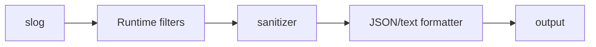

# Logging and secret redaction

Lobslaw uses `log/slog` through `internal/logging.New`, backed by
`github.com/jmylchreest/slog-logfilter`. The pipeline is:

Filters match original attributes and remain live on child loggers. Sanitization
is mandatory for the application logger, including attributes attached with
`With`, nested groups, LogValuer results, errors and JSON-shaped objects. Source,
level, timestamp and ordinary numeric fields retain their normal behavior.

The shared policy redacts credential fields, authorization/cookie values, URL
userinfo and sensitive query parameters, private-key blocks and recognizable
provider tokens. Telegram bot paths and GitHub/OpenAI/Slack token shapes are
application rules on top of the generic library redactor. No global registry
retains live credential values. Unserializable objects are replaced with a fixed
marker instead of being handed to an output formatter unsanitized.

This does not identify every secret or private fact in arbitrary prose. DEBUG
request logging still contains excerpts from all conversation messages, including
tool results. Treat those logs as private. LLM body excerpts are sanitized before
truncation so a cut cannot split a credential before its rule sees it. Error
response reads stop after 64 KiB plus an overflow byte. If that limit is exceeded,
the entire excerpt is omitted: a partial credential is never sent to the redactor
or output. The bounded prefix is used only for internal failover classification.

## Integration rules

- Use the supplied `*slog.Logger`, `slog.Default()` or `logging.WithComponent`.
  Create production loggers only through `logging.New`.
- The CLI installs the shared logger before dispatch. Command errors and flag
  parser diagnostics go through it. Intended command data, static help and
  interactive prompts remain command output.
- HTTP error loggers and Raft standard diagnostics forward through the same
  handler. Smokescreen requires a logrus interface; its boundary adapter disables
  direct output and forwards all levels/fields to slog. It owns no filtering
  policy. Both dependency adapters preserve an injected logger. Nil callers wrap
  the default sink with the same sanitizer, including before CLI setup, without
  replacing global filters. Production should supply the configured logger so
  filtering sees original attributes before redaction.
  Do not use logrus in application code.
- Raft standard diagnostics default to Info, honor forced/inferred levels, and
  pass through normal filtering. CLI `noticef` progress/confirmation messages are
  Info too: warn/error-only configurations intentionally suppress them. Successful
  progress is not promoted to Warning merely to bypass a configured level.
- `logging.SafeError` sanitizes errors returned from Telegram APIs, including
  transport errors, download URLs and HTTP response diagnostics. It retains
  `errors.Is` and `errors.As`; trusted code can unwrap the original error, so do
  not forward the unwrapped value externally.
- `TestProductionLoggingBoundaries` guards against new independent constructors.
  New adapters must include tests proving output reaches the shared pipeline.

The library is pinned to a published immutable Go pseudo-version for the
merged sanitizer commit. There is no local module replacement. A subsequent
tagged library release can replace the pseudo-version. Fresh downloads need
network access; cached/offline verification does not establish fresh availability.
