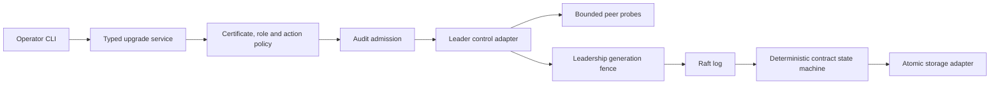
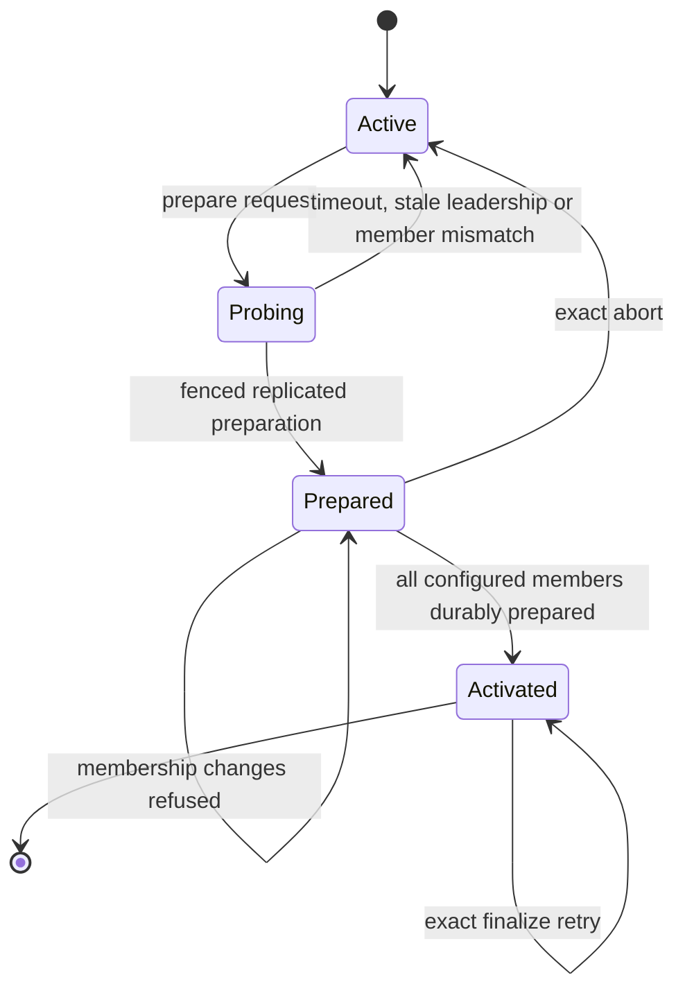

# Rolling data contracts

## Overview

This branch is the rolling-control baseline. The first move from an unversioned
or migration-only binary remains coordinated. Subsequent supported binaries can
coexist while retaining the active cluster contract. Activation is an explicit,
replicated operator action, not a side effect of installing a binary.

The baseline supports contract 1; the stacked team implementation supports 1 and
2. Compatibility is an explicit tested set, never an inferred version range.
No arbitrary skipped-release or zero-quorum availability guarantee is made.

## Interfaces and separation

- `internal/dataformat.ContractState`, `Transition` and `Advance` implement the
  deterministic state machine independently of storage, transport and features.
- `Store.ContractState` and `applyUpgrade` persist it in the format metadata bucket.
  Activation, feature schema changes and the replay watermark share one bbolt
  transaction. A stale control command is a deterministic conflict, not an FSM
  fatal error. Unsupported readers are refused before mutation.
- `RaftNode.ChangeUpgrade` owns leader checks, member probes, membership fencing
  and proposal admission. `SetUpgradeProbe` injects authenticated peer discovery.
- `UpgradeService` exposes typed status/change messages. Node wiring owns mTLS
  identity checks and policy evaluation. Configured operators receive separate
  read/write fallback grants, overridden by stored policy; a verified operator
  certificate is still required for changes. Peers may inspect capabilities;
  only operators with the configured role and grant may change the contract.
- gRPC interceptors exchange the stable control protocol, required contract and
  supported contract set. Both directions are checked before sending persisted
  data. Compatibility metadata never substitutes for authentication.
- The CLI provides `cluster upgrade status|prepare|finalize|abort|transfer`.

## Transition and failure semantics

1. A binary rollout preserves the active storage/log contract. New-only writes
   are rejected before proposal, including forwarded raw commands and team
   archive imports. New team tools and execution remain disabled.
2. Prepare runs after a Raft barrier and checks every configured member. It commits
   a unique transition ID, expected epoch, target and membership fingerprint.
   The pinned Raft library returns zero from `GetConfiguration().Index()`; the
   stored membership index is therefore the applied barrier fence, and the full
   fingerprint includes IDs, addresses and suffrage.
3. Every applied preparation is a durable restart fence. Membership changes are
   serialized with preparation and rejected while it is pending. A new leader
   barriers before making these decisions; capability probes alone cannot
   authorize a transition.
4. Finalize checks that every member has applied that exact preparation. An
   offline/old member blocks activation even if there is quorum. Finalization
   activates the contract at a single log index. No automatic member removal.
5. Abort retains the old active contract and advances the epoch. Lost responses
   are handled by status and idempotent retries with the same ID. Prepared history
   may remain in snapshots/logs, so supported binary rollback ends at preparation.
6. Leadership transfer uses Raft's catch-up transfer to a verified configured
   voter. It changes no contract and is permitted during a prepared transition.
7. Snapshot bytes are captured at the FSM snapshot boundary into a private
   temporary file, not copied from future state during Persist. This adds disk
   space/copy cost and can briefly pause application while the image is captured.
   Temporary images are removed on normal release; interrupted images are never
   startup candidates. Their bytes remain encrypted.
8. Installed snapshots may leave gaps among retained logs. Preflight tolerates
   missing entries only at/below a fully validated snapshot index; unexplained
   gaps and unsupported entries still fail. Original log bytes remain immutable.

The team branch creates team buckets/indexes only at activation (or while
migrating an already-team-capable historical directory), and keeps contract-1
snapshots readable by baseline binaries. Restart configured team compute nodes
one at a time after activation to wire their new services.

## Validation

`internal/memory/rolling_cluster_test.go` runs genuine separate baseline and
candidate binaries over mTLS, with encrypted stores and real Raft transport. It
covers old/new leaders, individual replacements, old-follower snapshot catch-up,
new-only proposal refusal, old-member activation refusal, membership freeze,
prepared-state restart, idempotent finalization, activated writes and old-binary
refusal before/after activation without changing state bytes.

Focused tests cover stale epochs/membership, abort, durable format refusal,
configuration fingerprint identity, snapshot capture timing, snapshot-covered log
gaps, ordinary-proposal control rejection and separate read/write operator grants.
Existing snapshot I/O failure and rollback tests continue to run.

To run against a supported baseline checkout:

```sh
# In the baseline checkout:
go test -c -o /tmp/lobslaw-baseline.test ./internal/memory
# In the candidate checkout:
LOBSLAW_ROLLING_BASELINE=/tmp/lobslaw-baseline.test go test -count=1 -run '^TestRollingMixedBinaries$' ./internal/memory
```

The process harness is skipped without an explicit baseline binary. The team PR
adds CI for the pinned baseline/candidate pair. Future compatibility claims must
add an actual binary pair and the corresponding schema/command migration.

## Limits

This is not a deployment controller, automatic historical-tag resolver or online
downgrade mechanism. The old historical-profile/key/ownership constraints still
apply. Two voters cannot tolerate stopping one voter. Rolling upgrades require
quorum and may have brief leader-transfer/snapshot latency. Large future schema
rewrites may require a different staged migration adapter and cannot be promised
online simply by adding a contract number.


## Admission and leadership fences

Peer probes run outside the cancellable control lease. Before submission, the
leader reacquires that lease, barriers, and revalidates the generation, durable
contract and complete membership. A synchronous Raft state observer fences the
final enqueue against a leadership change; merely comparing terms before a
network call is insufficient. The integration explicitly uses unbuffered apply
submission and holds the generation guard only through the bounded enqueue,
never while waiting for commitment. This relies on the pinned HashiCorp observer
filter running synchronously on state transitions and is regression-tested.

If a caller times out after submission, the outcome may already be committed.
Admission remains serialized until that future resolves; waiting callers can
cancel. Inspect status and reuse the exact transition tuple on retry. Completed
transitions retain their target and membership tuple, so a changed target is an
error even when the ID and epoch match.

Operator mutations record verified actor, granting policy, action and transition
before admission, plus an outcome event afterwards. Admission audit failure
refuses the mutation. A failed outcome audit never retries an already submitted
mutation: it emits a warning. Configure local audit alongside Raft audit to retain
outcome evidence when a successful leadership transfer removes this node's
ability to append to the Raft sink. Explicitly disabled audit sinks retain the
existing deployment behavior.




