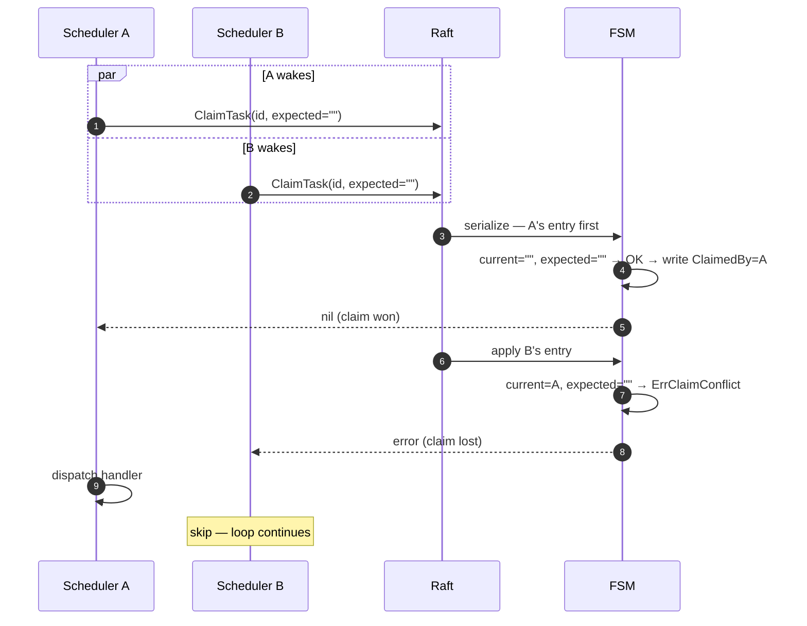

# lobslaw — Scheduler (Phase 7)

Fires scheduled tasks and agent commitments on time, across a cluster, at most once per firing. Two record types + one loop + a pluggable handler registry.

Three cooperating pieces:

- **`internal/scheduler`** — the sleep-until-due loop, the handler registry, and the CAS-claim submission path.
- **`internal/memory` FSM** — the `LOG_OP_CLAIM` primitive (atomic check-and-set under the FSM's lock) and the scheduler-change callback that wakes the loop when records are written from anywhere in the cluster.
- **`internal/plan`** — PlanService, the write path for commitments and the aggregation surface (`GetPlan`) that backs `/v1/plan`.

The agent loop, policy engine, and channel handlers don't know about the scheduler — they just run whatever the scheduler's handlers dispatch.

---

## Record types

Both live in Raft-replicated bbolt buckets so every voter sees the same state.

- **`ScheduledTaskRecord`** (bucket `scheduled_tasks`) — recurring operator-defined work. Carries a cron expression, `HandlerRef`, `Params`, plus claim fields (`ClaimedBy`, `ClaimExpiresAt`) and fire-tracking fields (`LastRun`, `NextRun`).
- **`AgentCommitment`** (bucket `commitments`) — one-shot user-originated deferred work ("remind me in 2 hours"). Carries `DueAt`, `HandlerRef`, `Params`, a `Status` (pending/done/cancelled), the same claim fields, and a `Reason` the `agent:turn` handler uses as a prompt fallback.

Claim state is scheduler-owned. PlanService strips caller-supplied claim fields on `AddCommitment` so user RPCs can't pre-claim a record.

---

## Sleep-until-due loop

```go
for {
    wait := s.computeSleepDuration(now)    // min(next-due, MaxSleep)
    select {
    case <-timer.C:                         // fire anything due
        s.fireDue(ctx, now)
    case <-s.wakeCh:                        // FSM callback said a record changed
        timer.Stop()
    case <-ctx.Done():
        return nil
    }
}
```

The scheduler never polls. It computes the earliest firing time across all tasks + commitments and sleeps until then — or until a wake signal arrives. `MaxSleep` (default 60s) caps the sleep as belt-and-braces: if the wake callback is ever lost the scheduler self-heals within a minute.

### Wake propagation

Every FSM apply that touches `scheduled_tasks` or `commitments` fires `FSM.schedulerChange` — a nil-safe callback set by `scheduler.NewScheduler`. It posts a non-blocking send on the scheduler's buffered-of-1 `wakeCh`. Coalesced, so a burst of adds produces one wake.

Critically, this fires on every node — the FSM's `Apply` runs on every voter for every committed log entry, so Node B's scheduler wakes as soon as Node A's `AddCommitment` lands in the replicated log. No separate gossip layer.

Skipped on failed applies (a rejected CAS leaves the store unchanged; nothing to recompute).

---

## CAS claim

`LOG_OP_CLAIM` is a third `LogOp` alongside `LOG_OP_PUT` and `LOG_OP_DELETE`. The FSM's `applyClaim` reads the record, compares its `ClaimedBy` to `LogEntry.ExpectedClaimer`, and only writes on match. Mismatch returns `ErrClaimConflict` through the Raft `Apply` response.

Expiry bypass: a claim whose `ClaimExpiresAt` is in the past counts as unclaimed. Gives a crashed node's abandoned work time to be picked up by the next tick without operator intervention.

### The exactly-one-fires guarantee



Raft serializes the Apply calls. The FSM sees them one at a time under its own mutex. Exactly one writer lands the change; every other caller sees `ErrClaimConflict`.

### In-loop self-claim skip

A subtle case the concurrent-claim test caught: after a scheduler's own `tryFireTask` writes a claim and spawns a handler goroutine, the main loop continues. The handler hasn't yet written back the completion — so the scheduler's next scan sees the task with its own claim still live and (under a naive "skip only other claims" policy) would re-fire against its own live claim.

Fix: `fireDue` skips any task where `extractClaimer` returns non-empty, including self-claims. The scheduler only re-enters a task after its own completion-CAS clears the claim.

---

## Partition caveats

The one genuine edge case where "exactly once" can break: an isolated former-leader that hasn't yet noticed it lost leadership (i.e. still within its lease window). Its local FSM.Apply can succeed, its handler fires, and any side effect the handler performed (sent email, posted message, ran tool) sticks — but the commit never replicates, so the new majority can also fire the same task.

Mitigations, in order of cost:

1. **Accept it** and document. For a personal assistant, a rare duplicate on partition heal is tolerable; lease default is 250ms so the window is tiny.
2. **Leader-only scheduler** — only one node walks due records. Simpler, loses the N-nodes-share-work model, and makes the leader a bottleneck.
3. **Idempotent handlers** keyed by `(task_id, fire_timestamp)` so a duplicate dispatch is a no-op at the side-effect layer. Correct long-term answer; each handler opts in.

Shipped today: option 1 + the expectation that handlers will start adopting option 3 as they grow teeth (audit, messaging, commits).

---

## HandlerRegistry

`HandlerRef` → function map, populated at boot. Missing handler releases the claim so a sibling node (with a different handler set) can try — useful during rolling upgrades when only some nodes know about a new ref.

Two registers because task and commitment handlers have different signatures:

```go
type TaskHandler       func(ctx, *ScheduledTaskRecord) error
type CommitmentHandler func(ctx, *AgentCommitment) error
```

Both are expected to be idempotent per the partition caveat. Currently enforced only by convention; a future middleware could wrap a handler in a `(task_id, fire_ts)` de-dup guard.

### Built-in `agent:turn`

Registered during `node.New` when both a scheduler and an agent are present. Dispatches the record's `Params["prompt"]` (or for commitments, `Reason` as a fallback) through `compute.Agent.RunToolCallLoop` with synthetic `"scheduler"` scope claims and a fresh `TurnBudget` from `cfg.Compute.Budgets`.

Operators who want "every morning check the weather and summarize" configure a task with `HandlerRef = "agent:turn"` and `Params.prompt = "check the weather and summarize it"`. Natural-language commitments ("remind me to call the plumber in 2 hours") skip `Params` and let `Reason` drive.

Handler errors are logged; the next tick retries via the regular cron schedule (for tasks) or not at all (commitments — they're one-shot).

---

## PlanService

Three RPCs:

| RPC | Behaviour |
|---|---|
| `GetPlan(window)` | Aggregates pending commitments and enabled scheduled tasks whose next firing is in `[now, now+window]`. Sorted ascending by fire time. Window defaults to 24h. Done / cancelled commitments and disabled tasks are filtered — this is "what's coming," not audit history. |
| `AddCommitment(AgentCommitment)` | Writes via `LOG_OP_PUT`. Auto-fills `id` (random 32 hex) and `status="pending"`. Strips caller-supplied claim fields. `due_at` required. |
| `CancelCommitment(id)` | `LOG_OP_CLAIM` with `expected_claimer=""` — fails with `Aborted` if a handler is firing (claim held, not expired), succeeds on pending or on an expired-stale claim (so cancelling a crashed node's work works). Already-done / already-cancelled return `FailedPrecondition`. |

### REST surface

`GET /v1/plan` wraps `GetPlan`. `?window=<duration>` accepts Go-duration syntax (`24h`, `30m`, `1h30m`); invalid values silently fall through to the default. JSON shape kept narrow (`planResponseJSON`) so adding new proto fields doesn't leak into client expectations.

Not mounted when `RESTConfig.Plan` is nil — minimal deployments don't serve the endpoint.

---

## Boot wiring

```
node.New
 ├─ needsRaft → wireRaft → store + fsm + raft
 │              └─ policySvc, memorySvc, planSvc, scheduler  ← all constructed here
 │                 └─ scheduler.NewScheduler wires the FSM change callback
 ├─ FunctionCompute → wireCompute → agent
 │                     └─ registerAgentTurnHandlers (if scheduler also exists)
 └─ FunctionGateway → wireGateway → RESTConfig{Plan: node.planSvc, ...}
node.Start → spawns scheduler.Run as a goroutine (ctx-cancelled on Shutdown)
```

Scheduler is constructed on any Raft-hosting node. A compute-only node without Raft has no scheduler; that's correct — you can't replicate scheduling state without Raft.

### Exit-criterion test

`TestNodeSchedulerFiresCommitmentAfterBoot` in `internal/node/node_test.go` boots a real node, calls `PlanService.AddCommitment` with a due-now commitment, and asserts a registered handler fires within 5 seconds. Exercises the full chain: gRPC → Raft → FSM callback → wake → CAS claim → handler dispatch.

`TestNodeSchedulerAgentTurnHandler` exercises the built-in `agent:turn` handler: MockProvider captures the agent's ChatRequest and we verify the user-role message equals the commitment's `Reason`.

---

## What's not yet shipped

- **Multi-node end-to-end test.** The scheduler's concurrent-claim test uses two `Scheduler` instances sharing one Raft group; a proper 3-node mTLS test is the Phase 2.6 pattern extended to scheduler. Not blocking — the single-node + shared-Raft path covers the FSM's CAS semantics.
- **AddScheduledTask / RemoveScheduledTask RPCs.** Scheduled tasks are operator-defined, expected to come from config. If the user-facing "tell me to re-run this every Monday" flow lands, we'll add them then.
- **`InFlightWork` / `CheckBackThreads`** fields on `GetPlanResponse`. Currently empty. Populated when the agent gains an in-flight tracker (Phase 10-ish) and the audit bridge lands (Phase 11).
- **Idempotency middleware.** See partition caveats — planned as handler wrapping once real side effects (messaging, audit writes) start being scheduled.
