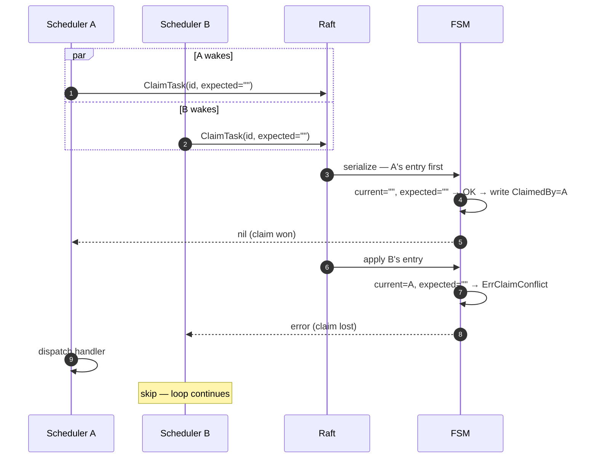
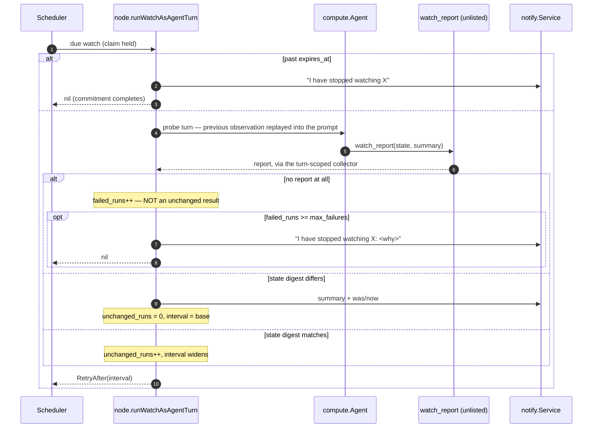

# lobslaw — Scheduler (Phase 7)

Fires scheduled tasks and agent commitments on time, across a cluster, at most once per firing. Two record types + one loop + a pluggable handler registry.

Three cooperating pieces:

- **`internal/scheduler`** — the sleep-until-due loop, the handler registry, and the CAS-claim submission path.
- **`internal/memory` FSM** — the `LOG_OP_CLAIM` primitive (atomic check-and-set under the FSM's lock) and the scheduler-change callback that wakes the loop when records are written from anywhere in the cluster.
- **`internal/plan`** — PlanService, the write path for commitments and the aggregation surface (`GetPlan`) that backs `/v1/plan`.

The agent loop, policy engine, and channel handlers don't know about the scheduler — they just run whatever the scheduler's handlers dispatch.

---

## Record types

Both live in Raft-replicated bbolt buckets so every voter sees the same state.

- **`ScheduledTaskRecord`** (bucket `scheduled_tasks`) — recurring operator-defined work. Carries a cron expression, `HandlerRef`, `Params`, plus claim fields (`ClaimedBy`, `ClaimExpiresAt`) and fire-tracking fields (`LastRun`, `NextRun`).
- **`AgentCommitment`** (bucket `commitments`) — one-shot user-originated deferred work ("remind me in 2 hours"). Carries `DueAt`, `HandlerRef`, `Params`, a `Status` (pending/done/cancelled), the same claim fields, and a `Reason` the `agent:turn` handler uses as a prompt fallback.

An `AgentCommitment` may additionally carry a **`WatchState`** (field `watch`). It is present only on records whose `HandlerRef` is `agent:watch`, which is what makes a watch identifiable without a second bucket or a kind enum. See [Built-in `agent:watch`](#built-in-agentwatch).

Claim state is scheduler-owned. PlanService strips caller-supplied claim fields on `AddCommitment` so user RPCs can't pre-claim a record.

---

## Sleep-until-due loop

```go
for {
    wait := s.computeSleepDuration(now)    // min(next-due, MaxSleep)
    select {
    case <-timer.C:                         // fire anything due
        s.fireDue(ctx, now)
    case <-s.wakeCh:                        // FSM callback said a record changed
        timer.Stop()
    case <-ctx.Done():
        return nil
    }
}
```

The scheduler never polls. It computes the earliest firing time across all tasks + commitments and sleeps until then — or until a wake signal arrives. `MaxSleep` (default 60s) caps the sleep as belt-and-braces: if the wake callback is ever lost the scheduler self-heals within a minute.

#### Scan cost at scale

`nextDueTime` walks every scheduled task + pending commitment on each wake. Baseline from `BenchmarkSchedulerNextDueTime`:

| Tasks   | ns/op   | Notes                                  |
|---------|---------|----------------------------------------|
| 10      |   7,181 | personal-scale (microseconds)          |
| 100     |  66,624 | typical operator-scripted deployment   |
| 1,000   | 620,463 | sub-ms — still negligible              |
| 10,000  | 7.1 ms  | within any reasonable tick cadence     |

Classic O(n), ~10× per decade of task count. Works fine through low thousands; at tens of thousands the scan approaches noticeable cost (not a hotspot, but measurable).

**If this becomes a hotspot**, swap `nextDueTime` for a min-heap keyed on `NextRun`/`DueAt`. The heap cost is keeping it in sync with FSM writes — every add/remove/update has to push/pop/reshuffle. That maintenance bookkeeping is the reason not to ship it today: the scan is cheap enough that the complexity doesn't pay off yet. The benchmark is in-tree (`scheduler_bench_test.go`) so a future engineer wondering "is this still fine?" has data instead of intuition.

### Wake propagation

Every FSM apply that touches `scheduled_tasks` or `commitments` fires `FSM.schedulerChange` — a nil-safe callback set by `scheduler.NewScheduler`. It posts a non-blocking send on the scheduler's buffered-of-1 `wakeCh`. Coalesced, so a burst of adds produces one wake.

Critically, this fires on every node — the FSM's `Apply` runs on every voter for every committed log entry, so Node B's scheduler wakes as soon as Node A's `AddCommitment` lands in the replicated log. No separate gossip layer.

Skipped on failed applies (a rejected CAS leaves the store unchanged; nothing to recompute).

---

## CAS claim

`LOG_OP_CLAIM` is a third `LogOp` alongside `LOG_OP_PUT` and `LOG_OP_DELETE`. The FSM's `applyClaim` compares **two** things against the stored record and only writes when both match:

- `LogEntry.ExpectedRevision` against the record's `Revision`, and
- `LogEntry.ExpectedClaimer` against its `ClaimedBy`.

Mismatch on either returns `ErrClaimConflict` through the Raft `Apply` response.

Expiry bypass: a claim whose `ClaimExpiresAt` is in the past counts as unclaimed. Gives a crashed node's abandoned work time to be picked up by the next tick without operator intervention.

### Why the revision, and not just the claimer

`ClaimedBy` cannot distinguish *"nobody holds this"* from *"somebody held it, did the work, and released it"* — both are the empty string. Every write also replaces the whole record from the writer's own read. Together those let a writer whose read had gone stale pass the check, which produced three bugs:

- **Double fire.** A and B both scan and see an unclaimed, due task. A claims, runs it, and completes, clearing the claim. B then claims from its original read, succeeds, and the task runs twice.
- **Lost update.** B's write is its entire stale record, so it also rolls `NextRun` back into the past and drops `LastRun` — and the task fires again on the very next scan.
- **Reverted operator edits.** The completion path writes a record cloned at *claim* time, so disabling a task or changing its schedule while the handler ran was silently undone.

`Revision` is assigned by the FSM and bumped on every write to that record, so it detects staleness directly rather than through a proxy. A successful CAS always writes `expected + 1`, which lets a caller track the new revision without reading it back — necessary, because a write forwarded to the leader returns no FSM response.

`ExpectedRevision` is **required** on `CLAIM` and explicitly optional in the proto rather than defaulting to "no check": a `uint64` whose zero value meant unconditional would hand the unsafe behaviour to anyone who forgot the field.

Dueness stays out of the FSM. Whether a task should fire is a scheduling decision needing a clock the FSM must not read; the revision check already guarantees the scheduler decided against the current record, which is the only thing it was missing.

On conflict, `completeTask` re-reads and retries onto current state rather than giving up — otherwise a lost race leaves `NextRun` un-advanced and the claim held until TTL, stalling the task and then re-firing it. It stops as soon as the record shows the claim is no longer this node's.

### The exactly-one-fires guarantee


```mermaid
sequenceDiagram
  autonumber
  participant A as Scheduler A
  participant B as Scheduler B
  participant Raft
  participant FSM

  par A wakes
    A->>Raft: ClaimTask(id, expected="")
  and B wakes
    B->>Raft: ClaimTask(id, expected="")
  end
  Raft->>FSM: serialize — A's entry first
  FSM->>FSM: current="", expected="" → OK → write ClaimedBy=A
  FSM-->>A: nil (claim won)
  Raft->>FSM: apply B's entry
  FSM->>FSM: current=A, expected="" → ErrClaimConflict
  FSM-->>B: error (claim lost)
  A->>A: dispatch handler
  Note over B: skip — loop continues
```

Raft serializes the Apply calls. The FSM sees them one at a time under its own mutex. Exactly one writer lands the change; every other caller sees `ErrClaimConflict`.

### In-loop self-claim skip

A subtle case the concurrent-claim test caught: after a scheduler's own `tryFireTask` writes a claim and spawns a handler goroutine, the main loop continues. The handler hasn't yet written back the completion — so the scheduler's next scan sees the task with its own claim still live and (under a naive "skip only other claims" policy) would re-fire against its own live claim.

Fix: `fireDue` skips any task where `extractClaimer` returns non-empty, including self-claims. The scheduler only re-enters a task after its own completion-CAS clears the claim.

---

## Partition caveats

The one genuine edge case where "exactly once" can break: an isolated former-leader that hasn't yet noticed it lost leadership (i.e. still within its lease window). Its local FSM.Apply can succeed, its handler fires, and any side effect the handler performed (sent email, posted message, ran tool) sticks — but the commit never replicates, so the new majority can also fire the same task.

Mitigations, in order of cost:

1. **Accept it** and document. For a personal assistant, a rare duplicate on partition heal is tolerable; lease default is 250ms so the window is tiny.
2. **Leader-only scheduler** — only one node walks due records. Simpler, loses the N-nodes-share-work model, and makes the leader a bottleneck.
3. **Idempotent handlers** keyed by `(task_id, fire_timestamp)` so a duplicate dispatch is a no-op at the side-effect layer. Correct long-term answer; each handler opts in.

Shipped today: option 1 + the expectation that handlers will start adopting option 3 as they grow teeth (audit, messaging, commits).

---

## HandlerRegistry

`HandlerRef` → function map, populated at boot. Missing handler releases the claim so a sibling node (with a different handler set) can try — useful during rolling upgrades when only some nodes know about a new ref.

Two registers because task and commitment handlers have different signatures:

```go
type TaskHandler       func(ctx, *ScheduledTaskRecord) error
type CommitmentHandler func(ctx, *AgentCommitment) error
```

Both are expected to be idempotent per the partition caveat. Currently enforced only by convention; a future middleware could wrap a handler in a `(task_id, fire_ts)` de-dup guard.

### Handler-ref namespaces

Handler refs use a `<namespace>:<name>` convention that signals what kind of operation the ref resolves to. Three namespaces exist:

- **`agent:*`** — dispatches through `compute.Agent.RunToolCallLoop` (the LLM agent loop). Two members: `agent:turn`, which operators use for "every morning run this prompt" tasks, and `agent:watch`, which runs a check and speaks only when its answer has changed.
- **`memory:*`** — memory-layer Go-native operations registered at boot. Today's member is `memory:dream`, which fires one Dream/REM consolidation pass on the Raft leader (soft-skip on followers).
- **`skill:*`** — reserved for Phase 8 on-disk skills (manifest + handler script + sandboxed subprocess). Not currently used by any built-in handler.

The prefix is a semantic hint only — the scheduler's `HandlerRegistry` treats refs as opaque strings. An operator registering a custom handler can use any prefix they like; the conventions here exist so reading a config.toml tells you at a glance which subsystem handles which task.

### Built-in `agent:turn`

Registered during `node.New` when both a scheduler and an agent are present. Dispatches the record's `Params["prompt"]` (or for commitments, `Reason` as a fallback) through `compute.Agent.RunToolCallLoop` with synthetic `"scheduler"` scope claims and a fresh `TurnBudget` from `cfg.Compute.Budgets`.

A user who wants "every morning check the weather and summarize" asks the agent, which creates the task through its schedule tool with `HandlerRef = "agent:turn"` and `Params.prompt = "check the weather and summarize it"`. Natural-language commitments ("remind me to call the plumber in 2 hours") skip `Params` and let `Reason` drive.

Handler errors are logged; the next tick retries via the regular cron schedule (for tasks) or not at all (commitments — they're one-shot).

### Built-in `agent:watch`

A watch answers "tell me when this changes". It is an `AgentCommitment` that re-arms itself rather
than completing, so its cadence can respond to what it finds — which is why it is not a
`ScheduledTaskRecord`: **a cron expression cannot describe an interval that widens when nothing
happens.**

Registered `Idempotent()`, so the handler runs *before* completion and a returned
`*scheduler.RetryAfter` leaves the commitment pending with a new `DueAt` and no claim. That is the
same loop `generation:poll` uses; what a watch adds is state, carried in `AgentCommitment.watch`.


```mermaid
sequenceDiagram
  autonumber
  participant S as Scheduler
  participant H as node.runWatchAsAgentTurn
  participant A as compute.Agent
  participant T as watch_report (unlisted)
  participant N as notify.Service

  S->>H: due watch (claim held)
  alt past expires_at
    H->>N: "I have stopped watching X"
    H-->>S: nil  (commitment completes)
  else
    H->>A: probe turn — previous observation replayed into the prompt
    A->>T: watch_report(state, summary)
    T-->>H: report, via the turn-scoped collector
    alt no report at all
      Note over H: failed_runs++ — NOT an unchanged result
      opt failed_runs >= max_failures
        H->>N: "I have stopped watching X: <why>"
        H-->>S: nil
      end
    else state digest differs
      H->>N: summary + was/now
      Note over H: unchanged_runs = 0, interval = base
    else state digest matches
      Note over H: unchanged_runs++, interval widens
    end
    H-->>S: RetryAfter(interval)
  end
```

**The state rides back on the record the re-arm writes.** The handler mutates `c.Watch` in place and
returns; `rearmCommitment` clones the commitment *after* the handler ran, so the mutation travels
with the re-arm in a single Raft write. A handler that wrote the record itself and then asked for a
retry would move the revision its own re-arm CASes against, and lose every time.
`TestRearmCarriesHandlerMutations` pins this.

**How "changed" is decided.** Not by digesting the turn's reply — an LLM rewording an unchanged fact
would read as a change, and the watch would fire constantly. The probe turn instead calls
`watch_report(state, summary)`, and only `state` is digested. Two things hold that string stable:
the previous observation is replayed verbatim into the next probe's prompt, and `watch_report`'s
description constrains the shape. Anchoring on the prior value is what stops rewording; the digest
only compares.

`watch_report` is `Unlisted` in the tool registry — registered and invocable, but absent from the
default LLM tool list, because it means nothing outside a check. The watch turn adds it back by
naming it in `ProcessMessageRequest.Tools`, the same per-turn scoping `buildResearchToolList` uses.

**A probe cannot speak or schedule.** `buildWatchToolList` denies `notify` and the
watch/commitment/schedule mutators. Both are correctness rather than tidiness: a probe that can call
`notify` can message the user from inside an unchanged check, which is precisely what a watch
promises not to do — the handler decides whether anything is said, from the digest, and it must be
the only thing that can. A probe that can schedule can schedule itself, so a check that decides to
also watch something related would create a watch on every run.

**The replayed observation is untrusted.** It is model-authored text summarising whatever the last
probe read, so a watched page can influence what ends up in it — and it is replayed into every
subsequent check. It goes through `promptgen.WrapContext` as `TrustUntrusted`, which also
neutralises delimiters so a state containing `</untrusted>` cannot break out. `watch_report` bounds
one state at `MaxWatchStateChars` (512), which caps both the injection surface and the prompt growth
that an unbounded state would compound on every check.

**A silent probe is a failure, not an unchanged result.** A turn that ends without reporting
increments `failed_runs` and leaves the stored observation untouched. After `max_failures` (default
5) the watch suspends and says so once. Counting a broken probe as "unchanged" would leave a dead
watch looking exactly like a quiet one — the worst outcome available, because it is invisible.

**Nothing ends in silence.** Change, suspension and expiry all notify; an unchanged check never
does. A watch that stopped without saying so leaves the user believing they are still covered.

Backoff is `min(base × 1.5^(unchanged+failed), max_interval)`, reset to base on a change, and
clamped so a check never lands after `expires_at` — otherwise a watch that had widened to daily
would announce its expiry a day after it stopped covering anything.

**A check is not remembered.** The probe turn sets `SkipEpisodicIngest`, because a watch runs on its
own cadence forever and its reply carries nothing a person would want recalled. Without it a watch
writes an episodic record per check and those records are then *recalled into the next check's
prompt* — observed on a running node within two minutes of creating a 10-second watch, along with a
promptguard quarantine per check once the probe prompt legitimately contained `</untrusted>`.

A report is read from the collector *before* a turn error is acted on: a check that reported and
then failed has already produced the only thing a check exists to produce, and discarding it would
both lose a good observation and push a working watch toward suspension.

Watches are created by the agent through `watch_create` and expire after 30 days by default.

---

### Built-in `memory:dream`

Registered during `node.New` when both a scheduler and a `memory.Service` are present (Raft-hosting nodes). Dispatches to `memory.Service.DreamRunner().Run(ctx)`, which performs one Dream/REM pass: score → select-top-N → consolidate (if a Summarizer is wired) → prune → dream-session record. See [MEMORY.md](MEMORY.md) for the pass semantics.

Seeded automatically at boot, not declared in config. Its schedule comes from
`[memory.dream] schedule` (default `0 2 * * *`):

```toml
[memory.dream]
schedule = "0 3 * * *"
```

There is no `[[scheduler.tasks]]`. Tasks reach the store from the built-in seeds
and from the agent's own schedule tool; a task table in config is not read by
anything, and one written there is silently ignored.

Cluster behaviour: the scheduler's CAS-claim model means exactly one node per firing wins the claim. The winner's `DreamRunner.Run` then leader-gates — if that node isn't the current Raft leader it soft-skips (returns nil, nil). The next scheduled fire races the claim again, so a leadership change between fires is handled naturally. Worst case on a just-failed-over cluster: one fire silently skipped, the next one succeeds.

`memory:dream` takes no `Params` — the configuration lives on the underlying `DreamRunner` (half-life, max candidates, prune threshold), typically set at memory-service construction from `config.Memory.Dream`.

---

## PlanService

Three RPCs:

| RPC | Behaviour |
|---|---|
| `GetPlan(window)` | Aggregates pending commitments and enabled scheduled tasks whose next firing is in `[now, now+window]`. Sorted ascending by fire time. Window defaults to 24h. Done / cancelled commitments and disabled tasks are filtered — this is "what's coming," not audit history. |
| `AddCommitment(AgentCommitment)` | Writes via `LOG_OP_PUT`. Auto-fills `id` (random 32 hex) and `status="pending"`. Strips caller-supplied claim fields. `due_at` required. |
| `CancelCommitment(id)` | `LOG_OP_CLAIM` with `expected_claimer=""` — fails with `Aborted` if a handler is firing (claim held, not expired), succeeds on pending or on an expired-stale claim (so cancelling a crashed node's work works). Already-done / already-cancelled return `FailedPrecondition`. |

### REST surface

`GET /v1/plan` wraps `GetPlan`. `?window=<duration>` accepts Go-duration syntax (`24h`, `30m`, `1h30m`); invalid values silently fall through to the default. JSON shape kept narrow (`planResponseJSON`) so adding new proto fields doesn't leak into client expectations.

Not mounted when `RESTConfig.Plan` is nil — minimal deployments don't serve the endpoint.

---

## Boot wiring

```
node.New
 ├─ needsRaft → wireRaft → store + fsm + raft
 │              └─ policySvc, memorySvc, planSvc, scheduler  ← all constructed here
 │                 └─ scheduler.NewScheduler wires the FSM change callback
 ├─ FunctionCompute → wireCompute → agent
 │                     └─ registerAgentTurnHandlers (if scheduler also exists)
 └─ FunctionGateway → wireGateway → RESTConfig{Plan: node.planSvc, ...}
node.Start → spawns scheduler.Run as a goroutine (ctx-cancelled on Shutdown)
```

Scheduler is constructed on any Raft-hosting node. A compute-only node without Raft has no scheduler; that's correct — you can't replicate scheduling state without Raft.

### Exit-criterion test

`TestNodeSchedulerFiresCommitmentAfterBoot` in `internal/node/node_test.go` boots a real node, calls `PlanService.AddCommitment` with a due-now commitment, and asserts a registered handler fires within 5 seconds. Exercises the full chain: gRPC → Raft → FSM callback → wake → CAS claim → handler dispatch.

`TestNodeSchedulerAgentTurnHandler` exercises the built-in `agent:turn` handler: MockProvider captures the agent's ChatRequest and we verify the user-role message equals the commitment's `Reason`.

---

## What's not yet shipped

- **Multi-node end-to-end test.** The scheduler's concurrent-claim test uses two `Scheduler` instances sharing one Raft group; a proper 3-node mTLS test is the Phase 2.6 pattern extended to scheduler. Not blocking — the single-node + shared-Raft path covers the FSM's CAS semantics.
- **AddScheduledTask / RemoveScheduledTask RPCs.** Scheduled tasks are operator-defined, expected to come from config. If the user-facing "tell me to re-run this every Monday" flow lands, we'll add them then.
- **`InFlightWork` / `CheckBackThreads`** fields on `GetPlanResponse`. Currently empty. Populated when the agent gains an in-flight tracker (Phase 10-ish) and the audit bridge lands (Phase 11).
- **Idempotency middleware.** See partition caveats — planned as handler wrapping once real side effects (messaging, audit writes) start being scheduled.

## Ownership

Commitments and scheduled tasks carry an `owner` — the canonical principal from
`[identity.aliases]`, distinct from the `created_for` / `created_by` fields
beside them, which hold the raw per-channel id and so cannot be compared across
channels.

`commitment_list` / `schedule_list` show only the caller's own records plus
unowned ones, and `commitment_cancel` / `schedule_delete` / `schedule_get`
refuse anything else. The refusal is worded identically to "no such record":
ids are handed out by the list tools and are otherwise guessable, so a
distinguishable error would be an oracle for what other people have scheduled.

Records written before ownership existed have an empty owner and stay
actionable by anyone — the alternative is that an upgrade silently orphans every
commitment already scheduled, and a reminder that never fires is worse than one
visible to the wrong person on a node that probably has one user.
