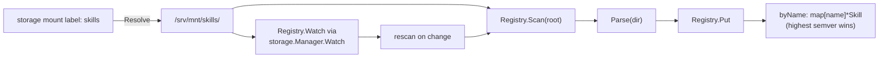
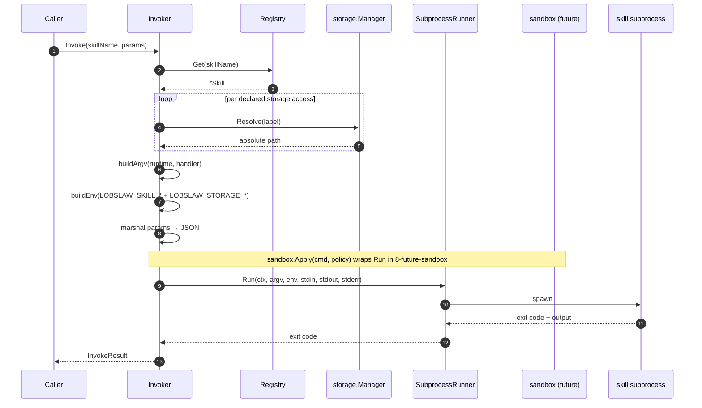

# lobslaw — Skills (Phase 8)

User-authored higher-level operations that live on a storage mount as directories of `manifest.yaml` + handler script. The skill registry watches the mount, the invoker dispatches to python or bash runtimes, and the sandbox machinery (Phase 4.5.5) gates filesystem + syscall reach via Landlock + seccomp.

Two packages cooperate:

- **`internal/skills`** — `Skill`, `Manifest`, `Registry`, `Invoker`.
- **`internal/storage`** — Phase 9's mount manager and watcher, consumed via `Registry.Watch` and `Invoker.storage.Resolve`.

Nothing in this package manages the filesystem or subprocess sandboxing directly — storage and sandbox are existing systems skills compose.

---

## Manifest shape

```yaml
# skills/agenda/manifest.yaml
name: agenda
version: 1.0.0
description: Render today's plan in a natural voice
runtime: python        # or: bash
handler: handler.py    # relative to this manifest's directory
storage:
  - label: shared
    mode: read         # default; or: write
network: []            # declared allow-list (enforcement = Phase 8 future)
params_schema:
  type: object
  properties:
    window: { type: string }
```

### Validation rules

Parse rejects manifests that violate any of:

- **Name** non-empty, no `/` or `\`. Skill names are bucket keys in the registry, not filesystem paths.
- **Version** non-empty. Parsed with `golang.org/x/mod/semver`; non-semver sorts lexicographically (tolerated, but a warn shows up in the registry log).
- **Runtime** one of `python`, `bash`. Unknown runtimes reject — better than a confusing "binary not found" at invocation.
- **Handler** resolves to a file inside the manifest directory (blocks `../` traversal in operator-authored files). The file must exist — a manifest pointing at a missing handler fails Parse, not first invocation.
- **Storage** entries: non-empty label, mode in `{read, write}` (default: read). Raw paths are never accepted — operators wire a storage mount first.

---

## Registry

`internal/skills.Registry` is name-indexed. Multiple storage mounts can expose the same skill name (e.g. `agenda` shipped by the operator's config alongside `agenda` from a plugin bundle); the registry resolves via semver-highest-wins with deterministic lexicographic tie-break on `ManifestDir`. Two replicas with identical mounts pick the same winner.



`Registry.Watch(ctx, mgr, "skills")` subscribes to the mount via the storage watcher (recursive, `manifest.yaml`-filtered) and rescans on every relevant event. Full rescan is simpler than per-file surgery and cheap at realistic skill counts.

`Registry.Remove(manifestDir)` falls back to the next-highest candidate rather than dropping the name — taking a mount offline doesn't orphan a skill the cluster still has other copies of.

---

## Invoker

`internal/skills.Invoker` looks up a skill, composes argv + env, pipes JSON params on stdin, captures stdout + stderr into capped buffers, returns exit code + duration.



### argv by runtime

| runtime | argv |
|---|---|
| `python` | `python3 <handler-abs-path>` |
| `bash` | `bash <handler-abs-path>` |

### env conventions

The subprocess sees only what the invoker composes (not inherited `os.Environ()`):

- `LOBSLAW_SKILL_NAME` — set to the skill name so handlers can log their own identity.
- `LOBSLAW_SKILL_VERSION` — the version from the manifest.
- `LOBSLAW_STORAGE_<LABEL>` — one var per declared storage access. Label is uppercased, non-`[A-Z0-9_]` characters become `_`. Value is the resolved absolute path. Lets bash handlers do `cat "$LOBSLAW_STORAGE_SHARED/file.txt"` without re-parsing config.

### stdin

`InvokeRequest.Params` is JSON-marshalled and piped to the subprocess. Handler reads from stdin:

```python
# python
import json, sys
params = json.load(sys.stdin)
print(json.dumps({"window": params.get("window", "24h"), "reply": "ok"}))
```

```bash
# bash
params="$(cat)"
echo "{\"reply\": \"got $params\"}"
```

### stdout / stderr

- **stdout** — captured into a capped buffer (1 MB). Returned as `InvokeResult.Stdout`. Convention: handlers emit JSON; the caller decodes into whatever shape they expect.
- **stderr** — capped buffer (64 KB). Surfaced on failure for operator diagnostics.
- Non-zero exit codes are NOT errors from `Invoke`'s perspective — the integer is returned via `InvokeResult.ExitCode`. `err` is reserved for spawn failures (binary missing, permission denied).

### Timeout

`InvokeRequest.Timeout` bounds the subprocess lifetime. Zero → `InvokerConfig.DefaultTimeout` (30s). The timeout plumbs through the runner's context, so both the production `CmdBuilder` (uses `exec.CommandContext`) and test fakes respect it.

---

## Security model

**Access control sits in the sandbox, not the invoker.** Today's invoker pipes JSON into a subprocess under the inherited security context; the next layer — integration with `internal/sandbox` — wraps the runner in a per-invocation `sandbox.Policy` computed from the manifest:

1. **Base** — no network, no filesystem outside handler dir + the runtime interpreter's path, seccomp allowlist from `DefaultSeccompPolicy` (same as tools), namespaces (CLONE_NEWNET, CLONE_NEWUSER, etc.), NoNewPrivs.
2. **Manifest-declared storage** — each `storage: [{label, mode}]` entry resolves via `Manager.Resolve` and adds that absolute path to Landlock's `AllowedPaths` (with `ReadOnlyPaths` for `mode: read`). A skill declaring `storage: [{label: shared, mode: read}]` can `open(O_RDONLY)` anything under the resolved path and nothing else.
3. **Runtime executable** — `python3` / `bash` paths are added to the exec allowlist.
4. **Network** — declared `network: [host:port]` entries. No enforcement today; nftables or eBPF integration is a Phase 11 item.

**Raw paths are rejected in manifests.** Skill authors can't write `path: /etc/shadow` or `path: ../../secrets`. Labels only. An operator who wants a skill to read an arbitrary host path wires a `type: local` storage mount pointing there first — same Raft-replicated audit trail as every other mount.

See [SANDBOX.md](SANDBOX.md) for the sandbox internals.

**Not yet shipped:** the sandbox integration. `Invoker.Invoke` spawns via the production `CmdBuilder` with only env + stdio isolation today. The integration is a straightforward extension — wrap the `CmdBuilder.Run` body in `sandbox.Apply(cmd, policy)` with `policy` composed per the rules above — and is Phase 8's top follow-up.

---

## Boot wiring

Scheduler and channels are the natural skill consumers. The node layer wires:

```
node.New (when FunctionStorage + skills mount configured)
 ├─ storage.Manager already up (Phase 9)
 ├─ skills.Registry constructed
 ├─ Registry.Watch(ctx, mgr, "skills-label")
 ├─ skills.Invoker(Registry, Manager)
 └─ register with agent / scheduler / channels as needed
```

Not wired into `node.New` today — consumers that want skills instantiate the pair themselves. Node-level integration (register as a `agent:skill-invoke` scheduler handler, expose via a SkillsService gRPC) is the next boot-wiring step.

---

## What's shipped vs deferred

| Item | Status |
|---|---|
| Manifest parsing + validation | ✅ shipped |
| Registry (winner selection, fallback, scan, watch) | ✅ shipped |
| Invoker (python/bash, JSON stdin, capped stdio, timeout) | ✅ shipped |
| Storage-label env vars | ✅ shipped |
| **Sandbox integration** (Landlock/seccomp/ns per manifest) | ⬜ Phase 8b.2 |
| **Agent integration** (skills as tool-registry entries) | ⬜ Phase 8c |
| **Plugin install CLI** (`lobslaw plugin install/enable/disable/list/import`) | ⬜ Phase 8d |
| **MCP client** (stdio JSON-RPC subprocess, tool surfacing) | ⬜ Phase 8e |
| **RTK hooks** (config-only PreToolUse/PostToolUse integration) | ⬜ Phase 8f |
| **Signature verification** (minisign / SHA-pinning) | ⬜ Phase 8g |
| Go runtime, WASM runtime | ⬜ roadmap |
