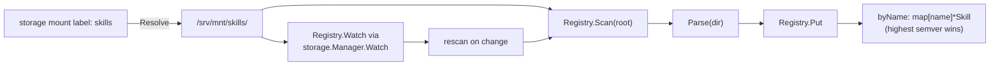
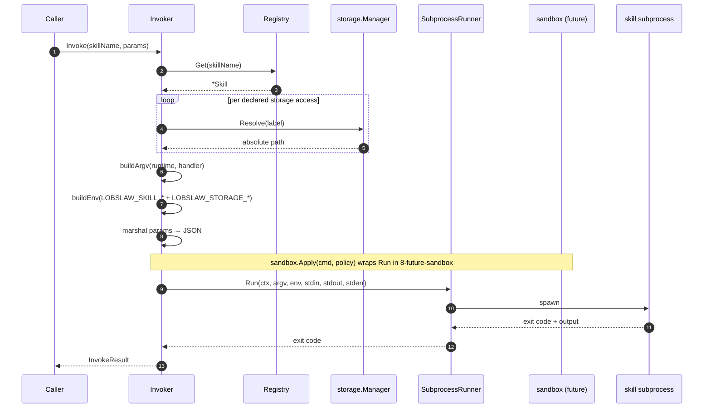
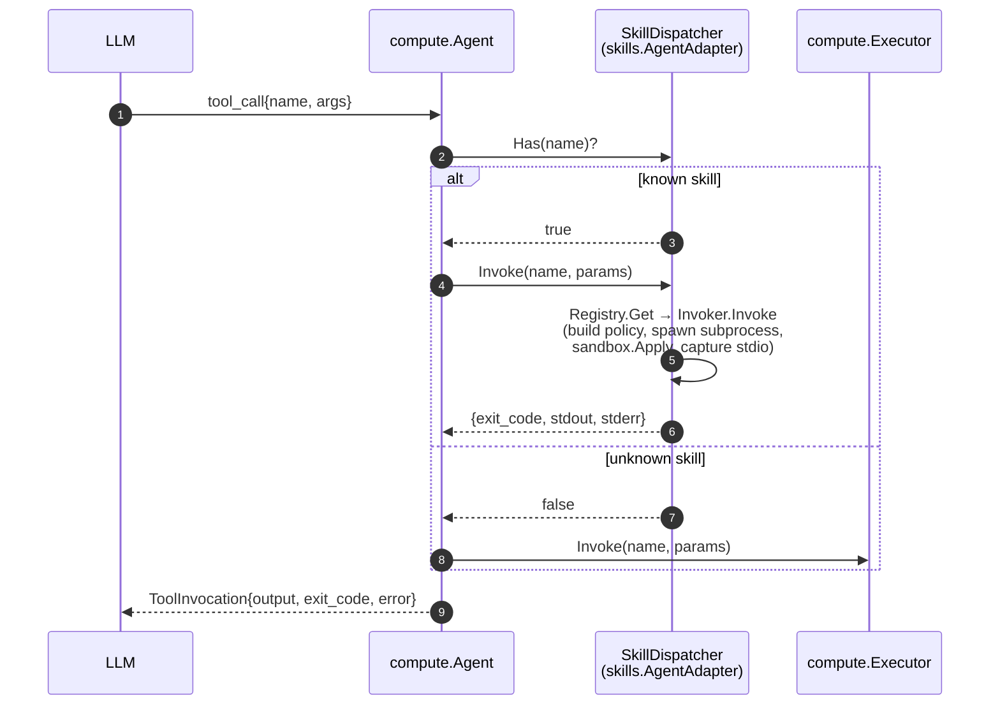
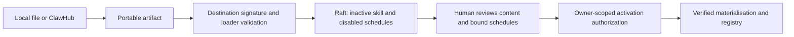

# lobslaw — Skills (Phase 8)

User-authored higher-level operations that live on a storage mount as directories of `manifest.yaml` + handler script. The skill registry watches the mount, the invoker dispatches to python or bash runtimes, and the sandbox machinery (Phase 4.5.5) gates filesystem + syscall reach via Landlock + seccomp.

Two packages cooperate:

- **`internal/skills`** — `Skill`, `Manifest`, `Registry`, `Invoker`.
- **`internal/storage`** — Phase 9's mount manager and watcher, consumed via `Registry.Watch` and `Invoker.storage.Resolve`.

Nothing in this package manages the filesystem or subprocess sandboxing directly — storage and sandbox are existing systems skills compose.

---

## Manifest shape

```yaml
# skills/agenda/manifest.yaml
name: agenda
version: 1.0.0
description: Render today's plan in a natural voice
runtime: python        # or: bash
handler: handler.py    # relative to this manifest's directory
handler_sha256: 9f86d0…  # hex SHA-256 of handler.py; required when signed
storage:
  - label: shared
    mode: read         # default; or: write
network: []            # declared allow-list (enforcement = Phase 8 future)
params_schema:
  type: object
  properties:
    window: { type: string }
```

### Validation rules

Parse rejects manifests that violate any of:

- **Name** non-empty, no `/` or `\`. Skill names are bucket keys in the registry, not filesystem paths.
- **Version** non-empty. Parsed with `golang.org/x/mod/semver`; non-semver sorts lexicographically (tolerated, but a warn shows up in the registry log).
- **Runtime** one of `python`, `bash`. Unknown runtimes reject — better than a confusing "binary not found" at invocation.
- **Handler** resolves to a file inside the manifest directory (blocks `../` traversal in operator-authored files). The file must exist — a manifest pointing at a missing handler fails Parse, not first invocation.
- **handler_sha256**, when present, must match the handler's actual contents. Checked under every signing policy including `off`: the digest is a claim the manifest makes about itself, and a mismatch is tampering regardless of whether provenance was demanded. Re-checked immediately before exec — see [Manifest signing](#manifest-signing).
- **Storage** entries: non-empty label, mode in `{read, write}` (default: read). Raw paths are never accepted — operators wire a storage mount first.

---

## Registry

`internal/skills.Registry` is name-indexed. Multiple storage mounts can expose the same skill name (e.g. `agenda` shipped by the operator's config alongside `agenda` from a plugin bundle); the registry resolves via semver-highest-wins with deterministic lexicographic tie-break on `ManifestDir`. Two replicas with identical mounts pick the same winner.


```mermaid
flowchart LR
  mount["storage mount label: skills"]
  root["/srv/mnt/skills/"]
  scan["Registry.Scan(root)"]
  parse["Parse(dir)"]
  put["Registry.Put"]
  win["byName: map[name]*Skill<br/>(highest semver wins)"]
  watch["Registry.Watch via<br/>storage.Manager.Watch"]
  reload["rescan on change"]

  mount -->|Resolve| root
  root --> scan
  scan --> parse
  parse --> put
  put --> win
  root --> watch
  watch --> reload
  reload --> scan
```

`Registry.Watch(ctx, mgr, "skills")` subscribes to the mount via the storage watcher (recursive, `manifest.yaml`-filtered) and rescans on every relevant event. Full rescan is simpler than per-file surgery and cheap at realistic skill counts.

`Registry.Remove(manifestDir)` falls back to the next-highest candidate rather than dropping the name — taking a mount offline doesn't orphan a skill the cluster still has other copies of.

---

## Invoker

`internal/skills.Invoker` looks up a skill, composes argv + env, pipes JSON params on stdin, captures stdout + stderr into capped buffers, returns exit code + duration.


```mermaid
sequenceDiagram
  autonumber
  participant Caller
  participant Inv as Invoker
  participant Reg as Registry
  participant Mgr as storage.Manager
  participant Run as SubprocessRunner
  participant SB as sandbox (future)
  participant Proc as skill subprocess

  Caller->>Inv: Invoke(skillName, params)
  Inv->>Reg: Get(skillName)
  Reg-->>Inv: *Skill
  loop per declared storage access
    Inv->>Mgr: Resolve(label)
    Mgr-->>Inv: absolute path
  end
  Inv->>Inv: buildArgv(runtime, handler)
  Inv->>Inv: buildEnv(LOBSLAW_SKILL_* + LOBSLAW_STORAGE_*)
  Inv->>Inv: marshal params → JSON
  Note over Inv,SB: sandbox.Apply(cmd, policy) wraps Run in 8-future-sandbox
  Inv->>Run: Run(ctx, argv, env, stdin, stdout, stderr)
  Run->>Proc: spawn
  Proc-->>Run: exit code + output
  Run-->>Inv: exit code
  Inv-->>Caller: InvokeResult
```

### argv by runtime

| runtime | argv |
|---|---|
| `python` | `python3 <handler-abs-path>` |
| `bash` | `bash <handler-abs-path>` |

### env conventions

The subprocess sees only what the invoker composes (not inherited `os.Environ()`):

- `LOBSLAW_SKILL_NAME` — set to the skill name so handlers can log their own identity.
- `LOBSLAW_SKILL_VERSION` — the version from the manifest.
- `LOBSLAW_STORAGE_<LABEL>` — one var per declared storage access. Label is uppercased, non-`[A-Z0-9_]` characters become `_`. Value is the resolved absolute path. Lets bash handlers do `cat "$LOBSLAW_STORAGE_SHARED/file.txt"` without re-parsing config.

### stdin

`InvokeRequest.Params` is JSON-marshalled and piped to the subprocess. Handler reads from stdin:

```python
# python
import json, sys
params = json.load(sys.stdin)
print(json.dumps({"window": params.get("window", "24h"), "reply": "ok"}))
```

```bash
# bash
params="$(cat)"
echo "{\"reply\": \"got $params\"}"
```

### stdout / stderr

- **stdout** — captured into a capped buffer (1 MB). Returned as `InvokeResult.Stdout`. Convention: handlers emit JSON; the caller decodes into whatever shape they expect.
- **stderr** — capped buffer (64 KB). Surfaced on failure for operator diagnostics.
- Non-zero exit codes are NOT errors from `Invoke`'s perspective — the integer is returned via `InvokeResult.ExitCode`. `err` is reserved for spawn failures (binary missing, permission denied).

### Timeout

`InvokeRequest.Timeout` bounds the subprocess lifetime. Zero → `InvokerConfig.DefaultTimeout` (30s). The timeout plumbs through the runner's context, so both the production `CmdBuilder` (uses `exec.CommandContext`) and test fakes respect it.

---

## Security model

**Access control sits in the sandbox, not the invoker.** Today's invoker pipes JSON into a subprocess under the inherited security context; the next layer — integration with `internal/sandbox` — wraps the runner in a per-invocation `sandbox.Policy` computed from the manifest:

1. **Base** — no network, no filesystem outside handler dir + the runtime interpreter's path, seccomp allowlist from `DefaultSeccompPolicy` (same as tools), namespaces (CLONE_NEWNET, CLONE_NEWUSER, etc.), NoNewPrivs.
2. **Manifest-declared storage** — each `storage: [{label, mode}]` entry resolves via `Manager.Resolve` and adds that absolute path to Landlock's `AllowedPaths` (with `ReadOnlyPaths` for `mode: read`). A skill declaring `storage: [{label: shared, mode: read}]` can `open(O_RDONLY)` anything under the resolved path and nothing else.
3. **Runtime executable** — `python3` / `bash` paths are added to the exec allowlist.
4. **Network** — declared `network: [host:port]` entries. No enforcement today; nftables or eBPF integration is a Phase 11 item.

**Raw paths are rejected in manifests.** Skill authors can't write `path: /etc/shadow` or `path: ../../secrets`. Labels only. An operator who wants a skill to read an arbitrary host path wires a `type: local` storage mount pointing there first — same Raft-replicated audit trail as every other mount.

See [SANDBOX.md](SANDBOX.md) for the sandbox internals.

**Sandbox integration (Phase 8b.2) is shipped.** `Invoker` builds a `sandbox.Policy` per invocation and passes it via `RunSpec.Policy`; the production `CmdBuilder.Run` wraps `cmd.Start` with `sandbox.Apply(cmd, policy)` so every skill subprocess runs under Landlock + seccomp + user-namespace isolation + NoNewPrivs. Test fakes receive the policy too, so "did we ask for read-only on this label?" becomes a direct assertion.

Composition rules:

| Source | Becomes |
|---|---|
| Always | `NoNewPrivs: true`, default seccomp, user + PID + IPC + UTS namespaces |
| Manifest dir | Read-only entry in `AllowedPaths` + `ReadOnlyPaths` |
| Runtime interpreter dir (e.g. `/usr/bin` for `/usr/bin/bash`) | Read-only entry |
| `/tmp` | Writable entry (scratch for bytecode caches, lockfiles, etc.) |
| Each manifest `storage` entry | `AllowedPaths` always; `ReadOnlyPaths` only when `mode: read` |

---

## Boot wiring

Scheduler and channels are the natural skill consumers. The node layer wires:

```
node.New (Raft branch)
 ├─ storage.Manager already up (Phase 9)
 ├─ skills.Registry(log)
 ├─ skills.Invoker(Registry, Storage)
 ├─ skills.AgentAdapter(Registry, Invoker)
 └─ later, inside wireCompute:
     compute.NewAgent(AgentConfig{..., Skills: adapter})
```

`Node.SkillRegistry()` exposes the registry so tests (and eventually a `skill install` CLI) can `Put` directly. Storage-mounted skills are picked up via `Registry.Watch(ctx, mgr, "skills")` — the node deliberately doesn't hard-code the mount label; operators configure a `[[storage.mounts]]` entry labelled `skills` and call `Registry.Watch` from their startup script (or future `lobslaw skill watch` subcommand).

### Agent ↔ skills wiring

The agent sees skills as if they were tools: when the LLM emits a `tool_call` whose `name` matches a registered skill, `compute.Agent.runToolCall` short-circuits the executor path and routes through `compute.SkillDispatcher` (backed by `skills.AgentAdapter`). The executor is consulted only when `Has(name)` returns false.


```mermaid
sequenceDiagram
  autonumber
  participant LLM
  participant Agent as compute.Agent
  participant Skills as SkillDispatcher<br/>(skills.AgentAdapter)
  participant Exec as compute.Executor

  LLM->>Agent: tool_call{name, args}
  Agent->>Skills: Has(name)?
  alt known skill
    Skills-->>Agent: true
    Agent->>Skills: Invoke(name, params)
    Skills->>Skills: Registry.Get → Invoker.Invoke<br/>(build policy, spawn subprocess,<br/>sandbox.Apply, capture stdio)
    Skills-->>Agent: {exit_code, stdout, stderr}
  else unknown skill
    Skills-->>Agent: false
    Agent->>Exec: Invoke(name, params)
  end
  Agent-->>LLM: ToolInvocation{output, exit_code, error}
```

Budget accounting is shared: `RecordToolCall` fires for skill-routed calls too, and `RecordEgressBytes` counts `len(stdout) + len(stderr)`. A skill can't be a loophole around per-turn budgets.

Skill errors (missing storage label, sandbox install failure, invoker config error) surface as the `ToolInvocation.Error` field — same shape as executor errors, so the model sees a uniform "this call failed because X" message regardless of which path handled it.

---

## Manifest signing

Ed25519 detached signatures, operator-configurable policy. The config flag lives under `[skills]`:

```toml
[skills]
signing_policy      = "prefer"                    # off | prefer | require
trusted_publishers  = "/etc/lobslaw/publishers"   # file path
```

**Three-state policy, not a boolean.** Most community skills ship unsigned; requiring signatures would exclude them entirely, while ignoring signatures loses the safety benefit for skills that DO ship signed.

| Policy | Unsigned manifest | Signed (valid) | Signed (invalid / wrong key) |
|---|---|---|---|
| `off` | accepted, `IsSigned=false` | accepted, `IsSigned=false` (verification never runs) | accepted, `IsSigned=false` |
| `prefer` | accepted, `IsSigned=false` | accepted, `IsSigned=true`, `SignedBy=<key name>` | **rejected** (tamper signal) |
| `require` | **rejected** | accepted, `IsSigned=true` | **rejected** |

Under `prefer`, the registry's winner-selection uses IsSigned as a tiebreaker: when two candidates share a semver, the signed one wins. Higher semver still beats lower regardless — signing is only a tiebreaker, not an override.

### Publisher key format

`trusted_publishers` points at a text file:

```
# one publisher per line
lobslaw-core       Zq3N8X4rT2aQ8m4yL7e6vJh5CpR9wK1sX0fN3tB2uV4=
community-pack-a   5XbMvQ2tGh9rP3cL8kN7wA1eF6yB4sZ0uK2dJ5nT8=
```

Format is deliberately minimal — no TOML nesting, no JSON schema — because trust roots should be human-auditable at a glance. Blank lines and `#` comments are supported.

### Signing the manifest

Publishers use any ed25519 tool (`signify`, `minisign --raw`, `openssl pkeyutl`) to sign `manifest.yaml` and drop the result next to it as `manifest.yaml.sig`. Both raw-binary and base64-encoded signature files are accepted so editors and CI pipelines don't need to agree on a format.

Example with openssl:
```bash
openssl pkeyutl -sign -inkey privkey.pem -rawin -in manifest.yaml > manifest.yaml.sig
```

### What the signature actually covers

The signature is over `manifest.yaml`'s bytes and nothing else. That only
protects the handler because the manifest pins its digest — so pin it before
signing, and re-pin whenever the handler changes:

```bash
sha256sum handler.py    # paste into handler_sha256:, then sign
```

**A signed manifest without `handler_sha256` is rejected.** It would otherwise
be worse than an unsigned one: the registry prefers signed candidates and the
audit log names a signer, while the signature covers a document that merely
*names* a script. Swapping the script afterwards would leave the signature
perfectly valid.

The digest is checked twice — at parse, and again immediately before exec.
The second check exists because registration and invocation are separated by
however long the node has been up, and the registry holds a path, not
content: everything proved at load is a statement about a file that may since
have been rewritten. This does not make the window zero (the file could
change between the final hash and the `execve`), but it reduces it from hours
to microseconds and catches the realistic case — a handler edited on a
writable mount after the node started.

---

## MCP servers

[Model Context Protocol](https://modelcontextprotocol.io/) servers are third-party subprocesses that expose tool surfaces over JSON-RPC 2.0 via stdio. Lobslaw's MCP client (`internal/mcp`) consumes these exactly like it consumes locally-authored skills — tools appear in the agent's dispatch table, go through the same per-turn budget, the same hook pipeline, and the same sandbox.

### Declaring servers

Each plugin can include a `.mcp.json` at its root. Format mirrors Claude Code's so existing manifests port over verbatim:

```json
{
  "mcpServers": {
    "fs": {
      "command": "/usr/local/bin/mcp-server-filesystem",
      "args": ["--root", "/srv/shared"]
    },
    "playwright": {
      "command": "npx",
      "args": ["-y", "@playwright/mcp@latest"],
      "secret_env": {
        "ANTHROPIC_API_KEY": "env:ANTHROPIC_API_KEY"
      }
    },
    "disabled-example": {
      "command": "mcp-foo",
      "disabled": true
    }
  }
}
```

Fields:
- `command` / `args` — subprocess argv; `command` required unless `disabled=true`.
- `env` — plain KEY=value pairs.
- `secret_env` — maps env-var names to secret refs (`env:`, `file:`, or any `[[secrets.providers]]` label). Resolved via the same resolver LLM providers + rclone use; refs never appear in process argv or logs.
- `disabled` — honoured by the loader so operators can ship a manifest with a temporarily-off entry without removing it.

### Boot flow

At startup, `mcp.Loader.Start` walks the plugins root for `.mcp.json` files, spawns each enabled server, handshakes via `initialize`, calls `tools/list`, and catalogues the advertised tools. Same `compute.SkillDispatcher` contract the skill invoker satisfies — the agent's `runToolCall` treats MCP tools and local skills interchangeably.

Tool name collisions across servers: the first server wins; subsequent servers advertising the same tool name log a warn and are skipped. Deterministic because `DiscoverManifests` sorts by plugin directory.

### Dispatch semantics

| MCP response | What the agent sees |
|---|---|
| `IsError=false`, text content | `ExitCode=0`, stdout = joined content |
| `IsError=true`, text content | `ExitCode=1`, stderr = joined content |
| Transport / protocol failure | tool-call `Error` surfaces, same shape as an executor or skill failure |

Non-text content types (image, resource) aren't surfaced yet — deferred.

### Security posture

MCP servers run as regular subprocesses under lobslaw's control; their tool invocations are routed through the same sandbox machinery as everything else. The MCP server process itself isn't sandboxed by default (it's an operator-trusted subprocess), but the *tool calls* it serves go through the agent's normal guard pipeline.

A signed-plugin deployment (under `signing_policy = require`) should require signed MCP manifests the same way — but manifest signing for `.mcp.json` entries is a follow-up; today only skill manifests are signed.

### What's not yet shipped

- Server notifications (push updates from server → client).
- Streaming tool responses.
- Resources / prompts / sampling (only tools are consumed).
- Per-invocation sandbox for the MCP *server* process itself (trusted-subprocess model today).
- `.mcp.json` manifest signature verification.

---

## RTK integration

RTK (Rust Token Killer) compresses tool output and decorates prompts to cut token cost on routine dev operations. Because it already speaks the Claude-Code hook protocol (JSON request on stdin, JSON response on stdout) and lobslaw adopted that same protocol in `internal/hooks`, no RTK-specific Go code is needed — it's a pure-config integration.

Drop the entries from `examples/hooks.rtk.toml` into your `config.toml` and restart the node. RTK fires on every `PreToolUse` / `PostToolUse` event, runs outside the tool's sandbox (it's a hook, not a tool), and returns its decision in the usual hook response shape.

Short timeouts are intentional: a stuck RTK shouldn't block tool dispatch. The hooks dispatcher treats a timed-out hook as approve-through so a mis-installed RTK can't wedge the agent.

---

## What's shipped vs deferred

| Item | Status |
|---|---|
| Manifest parsing + validation | ✅ shipped |
| Registry (winner selection, fallback, scan, watch) | ✅ shipped |
| Invoker (python/bash, JSON stdin, capped stdio, timeout) | ✅ shipped |
| Storage-label env vars | ✅ shipped |
| **Sandbox integration** (Landlock/seccomp/ns per manifest) | ✅ shipped (8b.2) |
| **Agent integration** (skills as tool-registry entries) | ✅ shipped (8c) |
| **RTK hooks example** (config-only, uses existing hooks system) | ✅ shipped (8f) |
| **Signature verification** (tri-state policy + ed25519) | ✅ shipped (8g) |
| **Skill policy.d/ loading** (sandbox.LoadSkillPolicies wired into Scan) | ✅ shipped |
| **memory:dream scheduler handler** (scheduler trigger for the Dream/REM pass) | ✅ shipped |
| **Plugin install CLI** (`lobslaw plugin install/enable/disable/list/import`) | ✅ shipped (8d) |
| **MCP client** (stdio JSON-RPC subprocess, tool surfacing) | ✅ shipped (8e) |
| **RTK hooks** (config-only PreToolUse/PostToolUse integration) | ⬜ Phase 8f |
| **Signature verification** (minisign / SHA-pinning) | ⬜ Phase 8g |
| Go runtime, WASM runtime | ⬜ roadmap |

---

## Progressive disclosure

The skill index is level 0: **every** installed skill, by name and one
line, in the system prompt on every turn. Bodies are fetched on demand.

| Level | What | Cost |
|---|---|---|
| 0 | name + one-line description + named references | bounded, O(skills) |
| 1 | the skill body | on demand *(not yet built)* |
| 2 | a bundled reference file | on demand *(not yet built)* |

**The index is complete, and says so.** Ranking and showing the top few
is the obvious optimisation and it is the wrong one: a retrieval miss
makes a capability invisible and the model then confabulates about what
it has — precisely the failure that killed keyword tailoring here
before. Ranking better is not the same as not hiding things.

### Description limit

`MaxDescriptionChars` (160 runes, single line) is enforced at **parse**,
not at render. Truncating when the index is built means an operator
writes a 200-character description, sees it accepted, and silently
loses most of it. The error belongs where it can be fixed, naming the
manifest. Counted in runes, so a non-Latin description gets the limit
that is documented.

### Conditional activation

The one thing safely dropped from the index is a skill that could not
run here at all. Advertising it teaches the model it has a capability
it will then fail to use, which is worse than silence.

```yaml
platforms: [darwin]              # GOOS allowlist; empty means anywhere
requires_capability: [vision]    # provider capabilities the skill needs
requires_binary: [ffmpeg]        # host binaries that must resolve
references:                      # named in the index, never inlined
  - references/api.md
```

Every requirement must hold. A skill dropped for any of them is logged
**once** with the reason — an operator asking "where did my skill go"
needs an answer, and a skill vanishing silently is indistinguishable
from one that failed to parse.

The binary check fails **open** when the node cannot answer it: the
invoker checks again before exec, so the cost of being wrong is one
clear error rather than a capability that quietly disappeared.

### The index was empty

`promptgen.GenerateInput.Skills` existed and `BuildSkills` rendered it,
and nothing ever populated it — so "Installed Skills" said "(none
installed)" on every turn no matter what was installed. A skill could
only be invoked by a model that guessed its name. `AgentConfig.SkillsProvider`
is what fills it.

---

## Pinning what actually runs

| Artefact | Signed | Pinned |
|---|---|---|
| `manifest.yaml` | detached ed25519 | `Skill.SHA256` |
| handler script | via `handler_sha256` in the signed manifest | verified at parse **and** before exec |
| reference files | via per-reference `sha256` | verified at parse **and** before exec |

The manifest signature covers the manifest bytes, so pinning digests
*inside* it is what transitively covers the content. Without that, a
publisher signs a document that merely names a script.

References are pinned for the same reason one level out: a skill whose
behaviour comes from an adjacent rules document or prompt template is
as changeable as one whose behaviour comes from its code.

```yaml
references:
  - references/quick.md          # declared, unpinned
  - path: references/rules.md    # pinned
    sha256: 3b1f...
```

**A signed manifest must pin every reference it declares.** A signature
covering the code and not the document that drives it reads as
provenance in logs and in the registry's signed-candidate preference
while guaranteeing less than it appears to — refused rather than
recorded as a guarantee that cannot be made.

Unpinned references stay legal under `SigningOff`. A skill with nothing
to sign against should not have to carry digests it cannot verify.

Both are re-hashed immediately before exec. That does not make the
window zero — something could swap a file between the read and the
exec — but it reduces it from hours to microseconds and catches the
realistic case: a file edited after the node started.

---

## Which skill wins a contested name

Precedence is **tier → version → directory**:

| Tier | Source |
|---|---|
| `signed` | manifest verified against a trusted publisher key |
| `operator` | on-disk, operator-authored |
| `agent` | written by the review fork |

**A version bump cannot promote a skill past its provenance.** That is
the whole point of the ordering. Precedence used to be version-first,
with signing as a tie-break only at equal version — defensible while
nothing but an operator could write a skill, and a
privilege-escalation path the moment the agent could author one: name
your skill after a signed one, set `version: 99.0.0`, take the name.

Within a tier the version still decides, so a newer signed release
still supersedes an older one.

Tier is derived from how a skill arrived: verified signature → signed,
anything else off a disk an operator controls → operator. `agent` is
never derived — it is set explicitly by whatever materialises the
self-taught store, because provenance-by-location is what establishes
it and a parsed manifest carries no trace of having been
machine-written.

The signing *policy* no longer affects precedence. A signature that was
checked is a fact about provenance whatever the policy says to do about
signatures; and under `SigningOff` nothing is verified, so nothing
reaches the signed tier and the order is exactly what it was.

The escape hatch for an operator who wants to override a signed skill
locally is a dev source that wins outright — **not** bumping a version.
A rule that can be beaten by editing a number is not a rule.

---

## What an agent-authored skill may not do

Tier-first precedence stops an agent taking a name it should not have.
It says nothing about what an agent-authored skill may *do* once it has
a name of its own — and a manifest is a capability request.

Without a floor, a skill the agent wrote for itself could declare a
credential grant, an egress allowlist, or a binary to fetch and
execute. Each would be granted by the same machinery that grants them
to an operator, on the strength of a document the agent wrote.

| Declaration | At the agent tier |
|---|---|
| `credentials` | refused |
| `binaries` | refused |
| `network` | refused |
| `requires_binary` | refused |
| `storage` | **allowed** |

Storage is allowed deliberately: it is scoped to mounts the operator
already configured, so it cannot reach past what they permitted — and
refusing it would stop the agent writing a skill that reads a file,
which is most of them.

Refused at **load**, not at invoke, and loudly. A skill that silently
lost half its manifest would fail later in a way nobody can trace back
to this decision; and a skill that asked for a credential and did not
get one is not a working skill with a smaller blast radius, it is a
broken one pretending.

The refusal names every capability asked for — reporting the first and
stopping means fixing a manifest one round trip per declaration — and
says how an operator can grant them: **adopt the skill**. Copy it into
the skills directory and it loads at the operator tier, where those
declarations are legitimate. The floor caps the *agent*, not the
capability.

Enforced at `ParseAgentSkill` **and** at `Registry.Put`. A rule applied
by one entry point is a rule a second entry point silently does not
apply.

---

## The prose runtime

Every manifest used to have to name a handler, which encoded an
assumption that turns out to be wrong: that a skill is a program.

Most of what the agent teaches itself is procedure in prose — how to
approach a class of task, what this user wants, what to check before
answering. There is nothing to execute. Inventing a no-op handler so
the type-check passes would be a lie the invoker would then try to run.

```yaml
name: how-to-review
version: 0.0.3
runtime: prose
description: how this user likes code reviewed
references:
  - SKILL.md
```

A prose skill is delivered the way every skill's references already
are: the index advertises it, the model reads the file. That path
exists and works; the prose runtime only stops the manifest insisting
on a handler that was never going to be called.

The two halves cannot disagree. A prose manifest naming a handler is
refused, and so is one pinning `handler_sha256` — a digest pinning a
file that does not exist reads, to anybody auditing, as a skill whose
code is pinned. Every other runtime still requires a handler exactly as
before. `HandlerPath` on a parsed prose skill is empty rather than the
manifest directory: an empty string is a value nothing can mistake for
a script.

Asking the invoker to run one returns `ErrNotExecutable` from the top
of `Invoke`, not "unsupported runtime" from the interpreter lookup —
that error reads as a misconfiguration, and this is not one.

## Materialising the self-taught store

The store is the authority for what the agent has taught itself; the
filesystem is where a skill can actually be read. The materialiser is
the **one-way** bridge between them.

```
<data-dir>/skills-cache/<name>/<version>/
    manifest.yaml    generated: runtime prose, references listed
    SKILL.md         the record body
    references/…     the record's bundled files
```

Written by the materialiser and by nothing else. An artefact edited on
disk is not an edit — it is drift the next pass reverts. **`rm -rf` the
cache and restart is complete recovery**, and that is the test of
whether the store is really the authority. If it ever stops being true,
something on disk has quietly become one.

**Convergent, not incremental.** Each pass writes what should be there
and removes what should not, from the full ACTIVE set. A cache that
drifted — a half-written directory from a crash, a stale version from a
rollback — is corrected rather than accumulated. Nothing has to tell it
what changed, which matters because the only thing that could is the
store, and the store does not know what any particular node has on
disk.

Removal is what makes the authority run in both directions: without it,
archiving an artefact would leave it loaded on every node that ever saw
it ACTIVE, and *"forget what you taught yourself"* would be true of the
store and false of the prompt.

**Not leader-gated.** Every node serves turns, so every node needs the
cache. A leader-only materialiser would make the assistant differently
capable depending on which node answered. It is safe everywhere because
the cache is derived state: two nodes materialising the same set
produce byte-identical directories.

**Reconciled on boot and then once a minute.** A poll, not a watch: the
store has no change feed, and a skill approved a minute ago becoming
available a minute later is not a problem anybody has. The boot pass is
the one that matters and it is not on a timer.

**A pending refinement is never materialised.** It is a proposal, and
writing it to the cache would put it in the prompt — precisely what
proposing instead of applying exists to prevent.

### Refusals

Checked *before* any path is built from a name, because a name
containing a separator **is** a traversal the moment it reaches
`filepath.Join`:

| Refused | Why |
|---|---|
| a name with `/` or `\`, `.`, `..`, a leading dot | it would escape the cache, or the scan would skip it |
| a bundled path outside the directory, or named `SKILL.md` / `manifest.yaml` | it would escape, or overwrite a file the materialiser owns |
| an empty body | there is nothing to teach |

One refused artefact is recorded and skipped; the rest still
materialise. A library that will not load because one entry is
malformed is a worse outcome than a library missing one entry.

An over-long or multi-line description is **truncated and flattened**,
not refused — the cap exists because the description is in the system
prompt on every turn, and a skill with a clipped summary is far more
useful than a skill that is not there. The store is where an over-long
description should be rejected, at the moment its author could fix it.

### Loading

`Registry.ScanAgent` reads the cache. Separate from `Scan` rather than
a flag on it, and that is not a convenience: everything it finds is
tagged `TierAgent` and passed through the [capability
floor](#what-an-agent-authored-skill-may-not-do). A shared scan with a
tier parameter would put that decision in the caller, where getting it
wrong is a one-word mistake that grants an agent-authored skill
operator authority.

`policy.d/` is ignored on this path. The floor refuses the capabilities
a tool policy would grant, so honouring the directory would be a second
door to the same place.

An agent-authored skill that loses its name to an operator's is logged
once per node. Tier-first precedence already decides it correctly and
*silently* — and silently is the problem: the artefact is ACTIVE in the
store, listed by `lobslaw learned`, and never once reaches the prompt.

---

## Deciding on what the agent proposed

`propose` mode means every artefact costs somebody an approval. Two
things follow from that, and both were missing.

### Approval must not require an outage

Every `lobslaw learned` subcommand opened `state.db` directly, which
takes bbolt's exclusive lock and therefore needs the node **stopped**.
That is the right shape for forensics — you want to read a cluster that
will not start. It is the wrong one for approval: approving a proposal
is routine, and a workflow beginning "stop the cluster" is one nobody
performs. After which propose mode is a queue that only fills.

So the routine operations reach a **running** node over mTLS:

```console
$ lobslaw learned pending --all
ID          KIND   NAME   WAITING ON  DESCRIPTION
skill:tidy  skill  tidy   approval    how this user likes things tidied
skill:plan  skill  plan   refinement  a better opening question

$ lobslaw learned approve skill:tidy
approved skill:tidy (tidy) by user:john
```

`--offline` selects the stopped-node path instead. Live is the default
and offline is the opt-out, not the other way round: the common case
should not be the one that needs a flag.

| Subcommand | Live | Offline |
|---|---|---|
| `pending`, `accept`, `reject`, `archive`, `restore` | default | `--offline` |
| `approve` | only | — |
| `list`, `history`, `rollback`, `discard` | — | only |

`approve` has no offline form. Somebody who passes `--offline` believes
the node is down, and recording a decision against a store they think
is quiescent — which the running cluster then never sees — is exactly
the misunderstanding worth refusing.

**Approval is attributed.** `--as` defaults to the OS user; an approval
recorded against the tool rather than a person is one nobody can be
asked about, which is the whole reason the field exists. A *rejection*
needs no attribution: it changes nothing about what the agent follows,
and the thing discarded was never in force.

**Not reachable from a conversation.** Approval decides whether the
agent's own suggestion becomes something it follows, and routing that
through the channel the agent writes in puts the request and the
approval on one wire. The in-channel path is a separate decision and
belongs on the durable confirmation records.

### The queue is bounded

An unbounded inbox is not an inbox. A queue of two hundred is one
nobody will work through, at which point the review fork is writing
into something that functions as `/dev/null` — and the operator has
*lost* the thing rather than deferred it.

```toml
[self_learning]
proposal_expiry_days = 30   # default; negative disables
```

This is an uncomfortable threshold and it is worth saying so.
Expiring a proposal converts "not reviewed yet" into a decision nobody
made. Three things make it tolerable:

- **Archived, not deleted.** Restorable like everything else here.
- **`archived_reason = "unreviewed"`**, distinct from anything somebody
  declined. An operator reading the archive needs to tell "nobody
  looked" from "somebody said no" — they are different facts.
- **Shorter than the staleness thresholds**, on purpose. A proposal has
  never been useful to anyone, so the evidence for keeping it is weaker
  than for a skill that was in service and went quiet.

Pinned proposals are exempt, like everything else pinned. A proposal
with no `created_at` is left alone rather than expired — a missing
timestamp is not evidence of age.

---

## Where skills come from

| Source | Tier | How it gets in |
|---|---|---|
| dev source | `dev` | scanned directly, outranks everything |
| signed import | `signed` | store → cache, signature verified |
| operator import | `operator` | store → cache |
| portable release / ClawHub proposal | `signed` with verified manifest signature, otherwise `operator` | validate → inactive Raft staging → separate authorized activation → cache |
| self-taught | `agent` | store → cache, capability floor |

Precedence is **tier first**, then version, then directory. A version
bump cannot promote a skill past its provenance.

The mount is an **import source**, not a live one. Drop a skill in and
it is imported into the store, replicated, materialised and loaded.
Deleting the file does not remove the skill — it is in the store, and
comes out with `lobslaw skills remove`.

### Portable releases and ClawHub

`sharing.Source` retrieves an immutable portable artifact. The ClawHub source
performs bounded extraction, retains exact native manifest/signature bytes and
converts SKILL.md bundles without installing host binaries or granting policy.
Both CLI installation and agent proposals use the same destination validation
and Raft staging path. The agent cannot activate its own proposal.


```mermaid
flowchart LR
    Source[Local file or ClawHub] --> Artifact[Portable artifact]
    Artifact --> Validate[Destination signature and loader validation]
    Validate --> Stage[Raft: inactive skill and disabled schedules]
    Stage --> Review[Human reviews content and bound schedules]
    Review --> Activate[Owner-scoped activation authorization]
    Activate --> Cache[Verified materialisation and registry]
```

The destination checks any present manifest signature against its trusted keys
even with signing policy off; conversion does not claim to verify that identity.
A release signature additionally covers schedule declarations and dependencies.
Signature verification and human activation remain separate requirements.
See [portable sharing](../docs/features/skill-sharing.md) for commands and limits.

## The dev source

Tier-first precedence leaves an operator with a real problem: a signed
skill is misbehaving, they have a fix, and there is no way to try it.
Bumping the version no longer wins, which is exactly what tier-first
was for.

So the escape hatch is a separate **source**, not a way to game the
order:

```toml
[skills]
dev_source = "/home/john/skills-dev"
```

```console
$ LOBSLAW_DEV=1 lobslaw serve
WARN skills: a DEV skill is overriding by tier skill=tidy dir=/home/john/skills-dev/tidy
```

Without `LOBSLAW_DEV` the node **refuses to start**:

```
skills: dev source is configured but LOBSLAW_DEV is not:
  skills.dev_source = "/home/john/skills-dev" would outrank every signed
  skill on this node. Set LOBSLAW_DEV=1 to develop against it, or remove
  the setting
```

### Why two gates

Either alone is easy to leave behind. A config file gets copied to
production wholesale; an environment variable gets set in a shell
profile and forgotten. **Both at once is a coincidence somebody has to
arrange.**

Refusing to boot is the answer rather than ignoring the setting. An
operator who configured a dev source and had it silently skipped would
develop against a skill that was never loaded; one who left it in a
production config would be running an unsigned override without
knowing. Neither is a state to start in.

### Details

- **One level**, `<dir>/<name>/manifest.yaml` — not the two-level cache
  layout. This is a working directory somebody edits by hand, and
  making them mint version subdirectories to try a change would defeat
  the purpose.
- **Never signature-checked.** A dev skill is by definition not the
  published one; demanding a signature would make the hatch useless in
  the case it exists for. The gates are on the *source*, not its
  contents.
- **Re-scanned every reconcile**, so an edit is picked up without a
  restart.
- **Warns on every override**, because it is a state the operator
  should be reminded they are in.
- A **missing** dev directory is refused, not treated as empty: a
  typo'd path loads nothing and looks exactly like a directory whose
  skills all failed to parse.

---

## Installing from anywhere

```console
$ lobslaw skills import ./my-skill --config /etc/lobslaw/config.toml
installed tidy 1.2.3 (operator, 3 files)

$ lobslaw skills list
NAME  VERSION  TIER      ACTIVE  FILES  SOURCE
tidy  1.2.3    operator  yes     3      cli:/home/john/my-skill

$ lobslaw skills export tidy 1.2.3 ./out
exported tidy 1.2.3 to ./out (3 files)

$ lobslaw skills remove tidy 1.2.3
removed tidy 1.2.3
```

**Live only — there is no `--offline` form.** Importing writes to raft
and replicates; doing it against a stopped node's `state.db` would
produce a record the running cluster never sees. `learned approve`
refuses `--offline` for the same reason.

### The bytes travel, not a path

The command runs on somebody's laptop and the cluster is elsewhere. A
service taking a directory would be reading one that exists perfectly
well on the wrong machine, and the failure would be a confusing "no
such file" naming a path that is right there.

So the directory is read client-side and the bundle is sent. The gRPC
message ceiling is raised above the bundle limit deliberately: a bundle
at the 4 MiB cap would otherwise fail with "message too large" instead
of the store's error naming the offending file.

### Validated through the real loader

A bundle is written to a temporary directory and run through
`ParseWithPolicy` before it is stored, so an import is held to exactly
the standard a load is.

Verifying the signature by hand would have admitted a signed manifest
that pins no `handler_sha256` — which the loader refuses, because a
signature naming a script but not its digest covers no executable
content — and the skill would replicate to every node and fail to load
on all of them. **The feedback belongs at the door, where somebody is
watching.**

### Two smaller decisions

**Name and version come from the manifest**, not from flags. Both are
already stated in the file, and two sources for one fact eventually
disagree — an operator who typed a version that did not match would
install a record describing a skill that is not the one in it.

**`--tier=agent` is refused.** That tier means "the agent wrote this".
Letting a person claim it from a command line would make provenance
something anybody can assert rather than a fact about where a skill
came from.

### Rolling back

```console
$ lobslaw skills list --all
NAME  VERSION  TIER      ACTIVE  FILES  SOURCE
tidy  2.0.0    operator  yes     3      cli:/home/john/tidy
tidy  1.0.0    operator          3      cli:/home/john/tidy

$ lobslaw skills rollback tidy 1.0.0
rolled back to tidy 1.0.0 (operator)
```

**A rollback is nothing more than activating a version already in the
log.** Every version ever imported is still there, so going back to one
is a matter of saying which — there is no bundle to supply and nothing
is re-imported. `skills list --all` is where to find the versions not
currently in force.

It is **not** re-validated against the current signing policy. The
record was parsed through the loader when it arrived, and re-parsing it
on activation would refuse a skill that a tightened policy no longer
admits — which is exactly the situation somebody rolling back is trying
to escape.

Rolling back to the version already in force succeeds and says so.
Scripting a rollback should not mean special-casing having already done
it, and an error there would be indistinguishable from one that failed.

Activation is scoped to the **tier**: rolling back an operator version
does not disturb a signed version of the same name. Which of those wins
is a precedence question the loader answers, and answering it here too
would give one skill two authorities.

---

## Progressive disclosure

A skill's index entry costs one line. Its instructions cost whatever
they cost, and are read only when the agent has decided the skill is
relevant.

| Level | What the agent sees | When |
|---|---|---|
| 0 | name, one-line description, the NAMES of bundled documents | every turn, in the system prompt |
| 1 | the skill's own instructions | `skill_view(name)` |
| 2 | one bundled document | `skill_view(name, path)` |

Level 0 costs O(skills) and stays that way as those documents grow. A
prompt that inlined every skill's instructions would spend most of a
context window on capabilities the turn will not use.

### The body

```yaml
name: tidy
version: 1.2.3
runtime: python
handler: handler.py
handler_sha256: "…"
body: SKILL.md
body_sha256: "…"
references:
  - path: rules.md
    sha256: "…"
```

`body` names a prose document — `SKILL.md` by convention. A file
rather than a manifest field: the description is one line and belongs
in the index, whereas this is paragraphs and would make every manifest
a document.

**`body_sha256` is required when the manifest is signed**, for the same
reason `handler_sha256` is. A signature over a manifest that merely
names a document leaves the document swappable, and the swap would not
break the signature — while a skill's instructions steer what the agent
does as surely as its code does.

The digest is re-checked when the document is READ, not trusted from
parse time. A document that changed since registration is refused
outright rather than served with a warning: the caveat would land in a
log nobody reads, and the instructions in the model's context.

### What is not served

Only paths the manifest **declares**. Otherwise the agent could read
any file beside the manifest by naming it, which is a directory listing
dressed as documentation. A path that climbs out of the skill directory
is refused even if a manifest declares it — a manifest is not a licence
to read the filesystem.

A skill with **no** body is ordinary, not an error: many are a handler
and a description. `skill_view` says so and succeeds, because reporting
it as a failure would teach the agent to avoid a tool that is working
correctly. A typo in the *name* reports differently, because it is a
different problem with a different fix.
