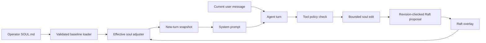

# Soul: implementation and format review

Reviewed 2026-09-07 alongside the soul wiring repair. This document distinguishes implemented behavior from proposed extensions.

## Current model

The operator's `SOUL.md` supplies a node-local baseline: optional YAML frontmatter followed by Markdown. The agent's bounded edits live in one Raft-replicated overlay for the cluster. Explicit overlay fields override the baseline; absent fields inherit it. There is no per-user soul selection in the current node wiring.

The adjuster owns the effective snapshot. File reload replaces its baseline; tools persist overlay edits; remote nodes refresh at turn/tool boundaries. A new turn takes one snapshot. Its structured identity/style, Markdown guidance, and anecdotal fragments are rendered into the system prompt. A resumed turn retains the original prompt.

The soul is standing configuration, never the current task. The existing prompt contract precedes its Markdown guidance, and the guidance carries an additional instruction to apply it silently rather than acknowledge, recite, or answer it. The user message stays separate. Recording-provider tests verify this separation; they do not prove every model will follow the guidance on every turn.

Sources: `internal/soul/loader.go`, `adjuster.go`, `mutate.go`, `store.go`; `internal/node/soul_tune_adapter.go`, `soul_tune_service.go`, `wire_compute.go`; `internal/compute/agent.go`; `pkg/promptgen/generate.go`, `sections.go`.



```mermaid
sequenceDiagram
    participant Compute as Compute node
    participant Policy as Policy service
    participant Leader as Soul service on Raft leader
    participant Raft as Replicated store
    Compute->>Policy: Evaluate caller's soul tool permission
    Policy-->>Compute: Allow or deny
    opt Allowed edit
        Compute->>Leader: Read current overlay and revision
        Leader-->>Compute: Overlay and revision
        Compute->>Leader: Submit bounded edit with expected revision
        Leader->>Raft: Compare revision and apply
        Raft-->>Leader: Committed or conflict
        Leader-->>Compute: Success or explicit failure
    end
    Note over Compute: Current turn retains its prompt; next turn reads the new overlay
```

## Field audit

| Field | Current behavior | Consequence |
|---|---|---|
| `name` | Stored, tunable, shown by `soul_get`; deliberately omitted by `BuildIdentity` | A rename changes metadata; it does not automatically insert a named character into the prompt. An operator can still explicitly name a persona in prose. |
| `persona_description` | Rendered in the identity section | Keep it about disposition and role, not an instruction to perform the current task. |
| Markdown body | Rendered as standing soul guidance after the prompt contract | Put detailed writing preferences here. It is not a conversation message. |
| `scope` | Defaults to `default`; rendered as identity metadata | It does not select among souls or establish authorization. Do not mistake it for a confidentiality boundary. |
| `culture`, `nationality` | Free-form strings rendered as metadata | There is no validated archetype catalogue or deterministic culture-to-style mapping. Precise prose is more predictable than a label. |
| `language.default` | Defaults to `en`; rendered in identity | The model sees a default-language hint. |
| `language.detect` | Parsed; the detector library exists but has no normal-turn caller | The flag does not currently select a detected reply language. Prose can request language matching, but that is model guidance, not an implemented detector path. |
| `emotive_style.emoji_usage` | `minimal`, `moderate`, or `generous`; translated into prose instructions | Effective in prompts and explicitly tunable. |
| Five numeric `emotive_style` fields | Validated as 0–10; rendered in bands: 1–3 low, 4–7 middle, 8–10 high | Zero currently means “unset” in rendering. Changes within a band may produce identical instructions. Directness also gates interim gateway messages. |
| `fragments` | Baseline list, optionally replaced by a persisted overlay list; rendered as contextual facts | An explicit empty overlay clears fragments. Reset restores inheritance. These are cluster-wide, so personal/private facts belong in appropriately scoped memory. |
| `adjustments.feedback_coefficient`, `cooldown_period` | Used by the library's `Adjuster.Apply`; no normal-turn feedback hook calls it | Explicit `soul_tune` bypasses these controls. Omitting them from a file does not disable explicit tuning. |
| `feedback.classifier` | Accepted values `llm` and `regex`; default says `llm`, while node wiring supplies no classifier and the adjuster defaults to regex | The advertised LLM feedback mode is not active in normal turns. |
| `min_trust_tier` | Enforced by provider validation/routing, and rendered as metadata | This is an operational constraint, not just writing style. Agent tuning cannot modify it. |

Language/feedback evidence: `internal/soul/language.go` and `classifier.go` contain implementations, but their constructors and feedback application have no normal-turn wiring in `internal/node` or `internal/compute`. Explicit owner-authorized tuning through model tool calls is a separate, working path.

## Format issues to resolve before expanding it

1. **Presence versus zero.** Numeric fields use Go zero values. An omitted style dimension and an explicit zero are indistinguishable. Likewise, zero feedback coefficient/cooldown is replaced by defaults. A future schema should track presence and give zero a documented meaning rather than use it for both inheritance and a value.
2. **Unknown keys are silently ignored.** YAML decoding does not enable known-field checking. A misspelling can look like an accepted edit. Add diagnostics first for compatibility, then strict validation under an explicit schema version. Unknown version numbers should fail rather than silently degrade.
3. **Validation is incomplete.** The loader checks style ranges and categorical labels, but not all other frontmatter constraints, such as feedback coefficient bounds. Stronger validation should be shared by startup, reload, and doctor, while reload keeps the last valid state.
4. **The file mixes voice, facts, and operational policy.** Markdown can describe writing style well without new keys. Per-user facts and project state belong in scoped memory; provider trust belongs to deployment policy even though its existing field must remain compatible.
5. **Some names overpromise.** `scope` does not route souls, and the language/feedback flags suggest runtime behavior that does not exist. Either wire those behaviors with tests or clearly mark them reserved; more fields will not solve that mismatch.

## Recommended evolution

Keep YAML plus Markdown. Avoid a wholesale format replacement or a mandatory migration as part of the wiring repair.

| Candidate | Recommendation | Why |
|---|---|---|
| Optional `schema_version` | Add before introducing incompatible semantics; unversioned files remain legacy-compatible | Enables strict validation and a deliberate fix for zero/presence behavior. The key is a proposal, not implemented by this repair. |
| Explicit verbosity | Useful next extension: concise/balanced/detailed | Directness controls how an answer opens, not its length. These are different user preferences. |
| Spelling locale | Useful next extension: e.g. `en-GB` | More precise than inferring spelling from nationality. Distinguish reply language from spelling conventions. |
| Output-format preference | Consider only when repeated demand exists | Channel formatting already controls Markdown details; a second format authority needs a clear precedence rule. |
| More personality sliders | Defer | The current sliders already collapse into coarse bands. More apparent precision would overstate the behavior. |
| Structured projects, user biography, or current tasks | Keep in scoped memory/task records | They change independently of voice and can cause the soul to be mistaken for the topic of the turn. |
| Automatic feedback adaptation | Separate implementation with explicit opt-in and policy checks | Do not silently turn ordinary user messages into persistent cluster-wide personality edits. |

Any new style field must render into the existing configuration section, have defined precedence with prose and channel rules, be visible through introspection, and have a provider-request test proving it never becomes user-message content. No proposed schema keys are added by this repair.

## Deployment and compatibility

Existing frontmatter and Markdown remain accepted. Explicit tuning overrides survive reload; numeric overrides are clamped against each node's current baseline at read time. Apply the same baseline to all nodes when identical behavior is desired.

Compute-only nodes now require a reachable memory/policy node for successful edits. Reads of a standalone node's baseline still work. There is no successful-but-volatile tuning fallback.

Upgrade all Raft nodes before enabling new tuning writes: the repair uses revision-checked soul updates, which older FSM implementations do not support. Existing saved overlays and history remain readable; history cannot reconstruct a pre-first-edit version that an older binary never stored.

The recorded decisions `lobslaw-soul-adjustment` and `lobslaw-soul-culture` dated 2026-04-22 describe the original intent (file writes, language detection, CWD/shared-local selection). They are not evidence those paths were implemented. The 2026-04-24 `lobslaw-soul-self-identity` decision explicitly rejects equating the assistant's identity with the lobslaw codebase; examples should respect that separation.
