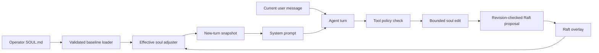

# Soul: implementation and format review

Reviewed 2026-09-07 alongside the soul wiring repair. This document distinguishes implemented behavior from proposed extensions.

## Current model

The operator's `SOUL.md` supplies a node-local baseline: optional YAML frontmatter followed by Markdown. The agent's bounded edits live in one Raft-replicated overlay for the cluster. Explicit overlay fields override the baseline; absent fields inherit it. There is no per-user soul selection in the current node wiring.

The adjuster owns the effective snapshot. File reload replaces its baseline; tools persist overlay edits; remote nodes refresh at turn/tool boundaries. A new turn takes one snapshot. Its structured identity/style, Markdown guidance, and anecdotal fragments are rendered into the system prompt. A resumed turn retains the original prompt.

The soul is standing configuration, never the current task. The existing prompt contract precedes its Markdown guidance, and the guidance carries an additional instruction to apply it silently rather than acknowledge, recite, or answer it. The user message stays separate. Recording-provider tests verify this separation; they do not prove every model will follow the guidance on every turn.

Sources: `internal/soul/loader.go`, `adjuster.go`, `mutate.go`, `store.go`; `internal/node/soul_tune_adapter.go`, `soul_tune_service.go`, `wire_compute.go`; `internal/compute/agent.go`; `pkg/promptgen/generate.go`, `sections.go`.



```mermaid
sequenceDiagram
    participant Compute as Compute node
    participant Policy as Policy service
    participant Leader as Soul service on Raft leader
    participant Raft as Replicated store
    Compute->>Policy: Evaluate caller's soul tool permission
    Policy-->>Compute: Allow or deny
    opt Allowed edit
        Compute->>Leader: Read current overlay and revision
        Leader-->>Compute: Overlay and revision
        Compute->>Leader: Submit bounded edit with expected revision
        Leader->>Raft: Compare revision and apply
        Raft-->>Leader: Committed or conflict
        Leader-->>Compute: Success or explicit failure
    end
    Note over Compute: Current turn retains its prompt; next turn reads the new overlay
```

## Field audit

| Field | Current behavior | Consequence |
|---|---|---|
| `name` | Stored, tunable, shown by `soul_get`; deliberately omitted by `BuildIdentity` | A rename changes metadata; it does not automatically insert a named character into the prompt. An operator can still explicitly name a persona in prose. |
| `persona_description` | Rendered in the identity section | Keep it about disposition and role, not an instruction to perform the current task. |
| Markdown body | Rendered as standing soul guidance after the prompt contract | Put detailed writing preferences here. It is not a conversation message. |
| `scope` | Defaults to `default`; rendered as identity metadata | It does not select among souls or establish authorization. Do not mistake it for a confidentiality boundary. |
| `culture`, `nationality` | Free-form strings rendered as metadata | There is no validated archetype catalogue or deterministic culture-to-style mapping. Precise prose is more predictable than a label. |
| `language.default` | Defaults to `en`; rendered as a reply-language instruction | The model sees a default-language hint. |
| `language.detect` | Selects the default reply language once per new turn, using the lazy, reused Lingua detector | Detection samples only the current user message (up to 2,048 characters), never soul text or history; empty/uncertain results fall back to the default. Explicit requests for another language take precedence. |
| `emotive_style.emoji_usage` | `minimal`, `moderate`, or `generous`; translated into prose instructions | Effective in prompts and explicitly tunable. |
| Five numeric `emotive_style` fields | Validated as 0–10; rendered in bands: 1–3 low, 4–7 middle, 8–10 high | In legacy files zero means “unset”; schema version 1 renders zero in the low band and defaults omitted dimensions to 5. Changes within a band may produce identical instructions. Directness also gates interim gateway messages. |
| `fragments` | Baseline list, optionally replaced by a persisted overlay list; rendered as contextual facts | An explicit empty overlay clears fragments. Reset restores inheritance. These are cluster-wide, so personal/private facts belong in appropriately scoped memory. |
| `adjustments.feedback_coefficient`, `cooldown_period` | Used by the library's `Adjuster.Apply`; no normal-turn feedback hook calls it | Explicit `soul_tune` bypasses these controls. Omitting them from a file does not disable explicit tuning. |
| `feedback.classifier` | Accepted values `llm` and `regex`; default says `llm`, while node wiring supplies no classifier and the adjuster defaults to regex | The advertised LLM feedback mode is not active in normal turns. |
| `min_trust_tier` | Enforced by provider validation/routing, and rendered as metadata | This is an operational constraint, not just writing style. Agent tuning cannot modify it. |

Language detection is wired in `internal/compute/agent.go`. Passive feedback application remains unwired by design; ordinary messages must not silently mutate cluster-wide personality. Explicit owner-authorized tuning through model tool calls is a separate, working path.

## Versioned format (implemented)

YAML plus Markdown remains the format. Add `schema_version: 1` to opt into strict known-field validation, including nested keys. Unsupported version numbers fail. Unversioned files retain legacy parsing/defaults, including silently ignored unknown keys and zero-as-unset style dials; enabling an existing `language.detect` flag now activates detection.

```yaml
schema_version: 1
verbosity: concise
language:
  default: en
  detect: true
  spelling_locale: en-GB
emotive_style:
  sarcasm: 0
  humor: 2
```

Wrap that YAML in `---` delimiters and follow it with writing guidance. In version 1, omitted numeric style dimensions default to **5**; explicit **0** means the low end, including “No sarcasm.” This is an opt-in semantic change: when migrating, specify every dimension whose behaviour matters. Zero feedback coefficient/cooldown stays zero; omitted values retain the existing defaults. Version 1 checks coefficient bounds (finite, 0–1) and nonnegative cooldown. Startup, reload and doctor use the same loader; a failed live reload retains the last valid soul.

New attributes:

| Attribute | Values and behaviour |
|---|---|
| `schema_version` | Omit for legacy semantics, or `1` for strict validation and versioned defaults. |
| `verbosity` | `concise`, `balanced`, `detailed`; version 1 defaults to `balanced`. Controls explanatory detail independently of directness. |
| `language.spelling_locale` | Valid language tag, e.g. `en-GB`. Applies spelling conventions when writing that language; does not force a reply-language switch. |

These new fields are **operator file settings**, visible in `soul_get.config` and hot-reloaded. They are not additional `soul_tune`/`soul_reset` fields. The persisted overlay continues to support its existing bounded dimensions, emoji, name and fragments. All new settings render as system configuration; provider-request tests verify the user question is unchanged.

Explicit user requests for length, language, spelling or format take precedence over style defaults. Channel formatting and operational policy retain their existing priority. Keep Markdown consistent with structured fields; prose is flexible guidance, not a second machine-enforced schema.

## Deliberate limits

- Automatic feedback adaptation stays disabled. `feedback.classifier` and `adjustments` configure the library path, not an active normal-turn feature. A future activation needs explicit opt-in and policy checks.
- `scope` remains metadata, not soul routing or an authorization boundary.
- User biography, project state and current tasks belong in scoped memory/task records, not shared personality prose.
- Further personality sliders and output-format preferences are deferred until there is a concrete need. Current sliders already collapse into broad instruction bands.

## Deployment and compatibility

Existing frontmatter and Markdown remain accepted. Explicit tuning overrides survive reload; numeric overrides are clamped against each node's current baseline at read time. Apply the same baseline to all nodes when identical behavior is desired.

Compute-only nodes now require a reachable memory/policy node for successful edits. Reads of a standalone node's baseline still work. There is no successful-but-volatile tuning fallback.

Upgrade all Raft nodes before enabling new tuning writes: the repair uses revision-checked soul updates, which older FSM implementations do not support. Existing saved overlays and history remain readable; history cannot reconstruct a pre-first-edit version that an older binary never stored.

The recorded decisions `lobslaw-soul-adjustment` and `lobslaw-soul-culture` dated 2026-04-22 describe the original intent (file writes, language detection, CWD/shared-local selection). They are not evidence those paths were implemented. The 2026-04-24 `lobslaw-soul-self-identity` decision explicitly rejects equating the assistant's identity with the lobslaw codebase; examples should respect that separation.
