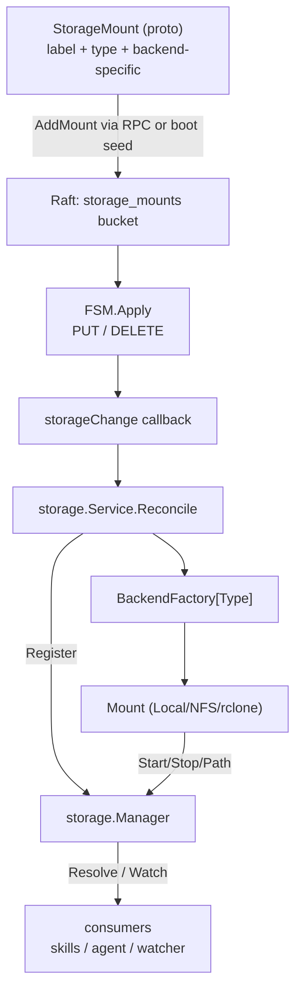

# lobslaw — Storage (Phase 9)

Maps named mount labels to backing filesystem paths and watches them for change. Skills, plugin loaders, and config watchers all consume storage through a single `Manager.Resolve(label) → path` + `Manager.Watch(label, opts) → events` API. Mount config is Raft-replicated; every storage-enabled node sees the same set.

Four packages cooperate:

- **`internal/storage`** — `Mount` interface, `Manager`, `Watcher`, `Service` (gRPC).
- **`internal/storage/local`** — the trivial backend: label points at an existing host directory.
- **`internal/storage/nfs`** — kernel NFS via `mount -t nfs`.
- **`internal/storage/rclone`** — subprocess-backed FUSE mount via `rclone mount --daemon`.

---

## Design choice: path resolution, not bind-mount namespaces

The original Phase 9 sketch in PLAN.md used `unshare --mount` + `bind-mount cfg.Path` at `/cluster/store/{label}` so consumers could hard-code `/cluster/store/shared` paths. This ships with path resolution instead:

```
Manager.Resolve("shared") → "/srv/mnt/shared"
```

The label is a lookup, not a mount-namespace convention. Consumers ask for a path when they need one and get a regular filesystem path back.

**Why.** Access control sits in the *sandbox* (see [SANDBOX.md](SANDBOX.md)) — Landlock path rules, seccomp syscall filters, namespaces on the subprocess. The literal `/cluster/store/{label}` prefix adds no security; it was just a naming convention. Trading it for path-resolution drops:

- The `CAP_SYS_ADMIN` requirement that bind-mounting the daemon's namespace would impose.
- Linux-only behaviour (macOS dev setups lose bind mounts).
- Coordinate-with-the-mount-namespace complexity at subprocess launch.

The convention is preserved operationally: docs + examples use `/cluster/store/{label}` as the default `MountRoot` for NFS and rclone backends, so operators who want a uniform prefix get it. Consumers inside lobslaw never depend on the string.

**Opt-in bind mount is a future option.** Nothing stops adding a `WithBindMount` path later. Deferred until a use case actually needs it.

---

## Lifecycle



1. Operator (or bootstrap seed config) submits a `StorageMount` via `StorageService.AddMount`.
2. Raft replicates the PUT; every voter's FSM applies it.
3. The FSM's change callback fires `storage.Service.Reconcile` on every node.
4. Reconcile compares the desired set (from the store) to the live set (from the Manager), calls `Unregister` for dropped entries, calls the backend Factory for new/changed entries, then `Manager.Register` (which runs `Mount.Start`).
5. Consumers call `Manager.Resolve(label)` and `Manager.Watch(label, opts)`.

### Reconcile is idempotent

Running Reconcile twice produces the same Manager state as running it once. Safe to call on every FSM hook trigger without distinguishing Add vs. Remove. Boot also calls it once to pick up pre-existing state.

### Unknown backends are skipped, not errored

A `StorageMount` with `type="future-backend"` on a binary that doesn't register that factory logs a warn and leaves the mount unmaterialised. This lets a rolling upgrade stage config before all binaries have the factory code — once every node is on the new build, the Reconcile picks it up without a config change.

---

## Security model

**Storage resolves paths. The sandbox gates access.**

Storage has no access-control responsibility:

- `Manager.Resolve("shared")` returns an absolute path to any caller in the same process.
- The path is treated as a value, not a capability.

Access control is entirely in the tool + skill sandbox (Phase 4.5.5 + Phase 8b):

- Tool invocation composes a per-invocation `sandbox.Policy` from the tool's declared read/write/exec paths.
- The sandbox `Apply` hooks compile that policy into Landlock rules + a seccomp filter + namespaces and rewrites the subprocess argv to `/proc/self/exe sandbox-exec ...`.
- The reexec helper inside the subprocess enforces Landlock + seccomp before `execve`'ing the real binary.

For skills specifically (Phase 8b), the manifest declares `storage:` entries by label, the invoker resolves each label via `Manager.Resolve`, and the resolved path is added to the Landlock read/write rules for that invocation. A skill asking for no storage access can't read anything under `MountRoot`; a skill declaring `label: shared, mode: read` can read only under the resolved path for `shared`.

**Raw paths in manifests are rejected.** Skill manifests accept label references only. An operator who wants a skill to reach outside the declared envelope configures a `local:` mount pointing at that path first — the same config mechanism + the same Raft-replicated audit trail.

See [SANDBOX.md](SANDBOX.md) for the sandbox internals.

---

## Backends

### `local:` — internal/storage/local

Simplest case: operator-supplied directory path becomes the mount's `Path`. `Start` verifies the directory exists + resolves symlinks; `Stop` is a no-op (nothing to unmount).

```toml
[[storage.mounts]]
label = "shared"
type  = "local"
path  = "/home/johnm/lobslaw-data"
```

### `nfs:` — internal/storage/nfs

Shells out to `mount -t nfs <server>:<export> <mountpoint>`. `Options` map flattens to `-o key1=val,key2`. Default mountpoint is `<MountRoot>/<label>` where `MountRoot` defaults to `/cluster/store`.

```toml
[[storage.mounts]]
label  = "team-fs"
type   = "nfs"
server = "nfs.internal"
export = "/exports/team"
options = { nfsvers = "4.2", sec = "krb5p" }
```

Operational constraints (documented in DEPLOYMENT.md when it lands):

- Requires `CAP_SYS_ADMIN` or rootless-NFS capability.
- Kubernetes: `securityContext: { capabilities: { add: ["SYS_ADMIN"] } }`.
- Docker/Podman: `--cap-add SYS_ADMIN` or `--privileged`.

### `rclone:` — internal/storage/rclone

Spawns `rclone mount --daemon` against any rclone-supported remote (S3/R2/B2/Dropbox/OneDrive/GCS/…). The rclone subprocess handles the FUSE layer; we just track the lifecycle.

```toml
[[storage.mounts]]
label  = "s3-archive"
type   = "rclone"
remote = "s3-prod"
bucket = "lobslaw-archive"
path   = "snapshots"
options = {
  buffer_size       = "64M",
  access_key_id_ref = "env:AWS_ACCESS_KEY_ID",
  secret_key_ref    = "env:AWS_SECRET_ACCESS_KEY",
}
```

**Secret handling.** Keys suffixed `_ref` are split out at factory time and resolved via the same secret-resolver LLM providers use (env:, file:, kms:). The resolved values become environment variables on the rclone subprocess — never written to logs, never stored in the Raft log.

**FUSE prerequisites:**
- `/dev/fuse` access on the container.
- `CAP_SYS_ADMIN` or user-namespace FUSE support.
- Stop uses `fusermount -u` — available under util-linux on most distros.

**What's not shipped:** rclone's crypt backend (per-mount encryption layer). Documented as a Phase 9 follow-up — shipping VFS-mount first lets operators start putting data on object stores without the extra config surface.

---

## Watcher

`Manager.Watch(label, opts)` returns a channel of `Event{Path, Op, Stat}`. `Op` is one of `Initial` / `Create` / `Write` / `Remove` / `Rename`.

Two feeds run concurrently per subscription:

1. **fsnotify** — kernel watch, near-zero latency. Works for local-origin writes on every backend.
2. **Periodic scan** — walks the tree every `PollInterval` and diffs `(size, mtime)` against a seen-map. Catches remote-origin writes that fsnotify misses (a peer wrote to the NFS server directly; another rclone client uploaded an S3 object).

Defaults picked per backend:

| Backend | PollInterval |
|---|---|
| `local:` | disabled (fsnotify is complete) |
| `nfs:` | 5 minutes |
| `rclone:` | 5 minutes |

Operator-overridable per-mount via `StorageMount.PollInterval`.

### Subscription behaviour

- On first subscription, the scanner emits a synthetic `Initial` event per existing file. Subscribers handle startup and runtime uniformly.
- `Include` / `Exclude` globs filter the stream — `Include` empty means "match all"; `Exclude` runs after.
- `Recursive` descends into subdirectories, registering kernel watches on new subdirs as they appear.
- The channel is buffered (128). Slow subscribers who can't keep up get their events dropped (logged) rather than blocking the scan loop.
- Cancelling the subscription context closes the channel.

---

## gRPC surface

| RPC | Purpose |
|---|---|
| `AddMount(StorageMount)` | Replicates a new mount via Raft. Auto-validates backend type against registered factories. Auto-rejects with `InvalidArgument` for unknown types so misconfigured clusters fail at the RPC rather than on first Reconcile. |
| `RemoveMount(label)` | Deletes the Raft entry. Every node's Reconcile picks up the delete and Unregisters locally. Returns `NotFound` for unknown labels. |
| `ListMounts()` | Reads the replicated bucket directly — authoritative view even on nodes whose Reconcile hasn't caught up. |

No REST surface today. Operators use `lobslaw` CLI (Phase 12.x when it lands) or direct gRPC tooling.

---

## Boot wiring

```
node.New
 ├─ needsRaft → wireRaft → store + fsm + raft
 │              └─ policySvc, memorySvc, planSvc, scheduler, storageSvc  ← all constructed here
 │                 └─ storage.NewService wires:
 │                      • Manager
 │                      • BackendFactory map (local, nfs, rclone)
 │                      • FSM storage-change hook → Reconcile
 │                      • StorageService gRPC server
 └─ node.Start → initial Reconcile to pick up pre-existing mounts
node.Shutdown → Manager.StopAll (umount / fusermount -u / etc.)
```

Factories are registered by the node layer rather than by backend init() so node-specific dependencies (the rclone SecretResolver) can be injected cleanly.

### Exit criterion

`TestNodeStorageServiceReplicatesAndReconciles` (in `internal/node/node_test.go`) boots a real node with `FunctionStorage`, calls `StorageService.AddMount` with a `type="local"` entry, polls until `Manager.Resolve` returns the resolved source path, then `RemoveMount`s and verifies the Manager drops it.

Multi-node exit criterion (3-node cluster, `AddMount` on node 1 → mount appears on nodes 2 + 3) is covered by the existing in-proc Raft test patterns; a dedicated 3-node mTLS harness is a follow-up (not blocking — the CAS + FSM-hook code path is identical on a single-node Raft group).

---

## What's not yet shipped

- **3-node mTLS storage integration test.** Phase 2.6's mTLS cluster pattern extended to storage is a follow-up. The FSM-hook + Reconcile path is single-node-agnostic; the test would just confirm it in a real transport.
- **rclone crypt** (per-mount encryption layer). VFS-mount skeleton only today.
- **Bind-mount mode** — operators who want a literal `/cluster/store/{label}` path get it by configuring `MountRoot = /cluster/store`. A `WithBindMount` mode that actually creates the path via `unshare --mount` is unimplemented.
- **CLI** — `lobslaw storage mount add/remove/list` commands. Operators drive the gRPC directly today or wire their own tooling.
- **Real-infrastructure tests** for NFS / rclone. Shipped with mock-subprocess tests; a rehearsal fixture with a real NFS server + a MinIO S3 fixture would make regressions more visible (but isn't in-tree).
