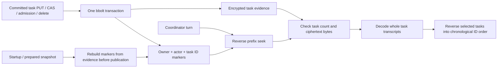

# Durable task approvals

Task approvals are independent of conversation approvals. A runner saves a
checkpoint before reporting that a task is waiting, and claims that checkpoint
before resuming it. The main integration points are the typed
`TaskApprovalService`, `compute.PauseTask`, `compute.TaskRunner` and
`compute.WithTaskExecution`.

The team registry's delegated and inbox runners use this mechanism. Their
queue linkage and specialist context rules are described below. Console task
decisions use the same owner-facing API rather than conversation prompt grants.

## Approved architecture

John approved these choices during the review of #348:

- A grant belongs to its owner, actor and task. Children need their own approval;
  a parent reference is attribution, not inherited authority.
- If a runner loses its execution claim, report an uncertain outcome. Do not
  automatically repeat actions which may have already happened. Recovery needs
  explicit acknowledgement of possible duplicate effects and fresh approval.
- Include explicit, bounded budget extensions. Retain prior consumption and
  never use the conversation path's unlimited `Budget.Relax()` for a task.
- Use typed gRPC operations. Specialist context remains deliberately supplied
  task context; resumption does not introduce owner-memory access.

## Interfaces and flow

`TaskApprovalService` exposes separate Create, Pause, Get, List, Decide, Claim,
Finish, Cancel, Recover and CheckGrant RPCs. See the protobuf definitions for
request fields and states. All RPCs are peer-only: a gateway asserts an
already-authenticated owner's canonical principal, while a runner asserts its
actor. An operator certificate is not a peer credential and cannot impersonate
these assertions. Owner-facing HTTP never accepts an owner from the body.

1. The trusted runner calls `CreateTaskApproval` with the owner, actor and optional
   parent. The service generates a new task ID and initial execution token.
2. The runner attaches `turn.TaskScope` through `compute.WithTaskExecution`,
   using an authoritative `CheckGrantTaskApproval` backend. It must do this for
   the initial leg as well as resumed legs. Every child gets a new task scope.
3. On `NeedsConfirmation`, call `compute.PauseTask` with the response and request.
   It saves the prepared invocation, transcript, supplied context, counters,
   limits and pending operation before returning waiting metadata.
4. An owner lists or retrieves waiting tasks, then makes a revision-checked
   decision. Operation/risk grants and the decision commit in the same record.
   A decision cannot substitute new command arguments.
5. A worker calls `TaskRunner.Resume`. The runner resolves **current** claims,
   tools and budget policy, claims the checkpoint, decodes it and resumes the
   saved turn. It preserves hook-rewritten parameters and rechecks policy.
6. Another confirmation checkpoints again. Success commits the result and
   clears grants, continuation and execution token.

The worker which integrates this feature must schedule ready tasks; the service
is not a second general-purpose task scheduler. It must release its worker or
HTTP stream while waiting. Waiting and ready metadata remain discoverable after
restart, so a notification is not the only route to completing the task.

`RemoteTaskApprovals` adapts a generated gRPC client for `TaskRunner`. Memory and
policy nodes register the service; followers forward to the leader. Gateway-only
nodes use discovered memory/policy peers or seed nodes. Reads which determine
execution authority verify leadership rather than trusting a stale follower.
Writes are not automatically retried after an ambiguous transport failure.

## State and lifetime

```text
running -> waiting -> ready -> resuming -> completed
              |                   |
              +-> denied          +-> waiting
              +-> expired

lost running/resuming claim -> outcome_unknown
outcome_unknown --explicit recovery--> waiting --fresh approval--> ready
outcome_unknown --owner cancel/close--> cancelled (never replayed)
```

Task authority lasts at most 24 hours. Each execution leg lasts at most 15
minutes; a long-running integration must arrange bounded legs. There is no
heartbeat or implicit lease renewal in this version. Expiry is checked on every
read/decision/grant check, independently of a sweeper. A live external process
cannot be rolled back by cancellation; cancellation stops further authorisation
and reports uncertainty if an action may already have started.

A waiting/ready cancellation becomes cancelled. Cancelling running work reports
an uncertain outcome and removes its replayable checkpoint. Explicit recovery
is available for a lost claim with a retained checkpoint and a live task
lifetime. Recovery clears reusable grants and old prepared approvals; retry may
repeat effects from the previous leg, which is why acknowledgement is required.

`recoverable` tells the owner whether an uncertain task actually has a live
checkpoint. An initial-leg failure, or a running cancellation that discarded its
checkpoint, cannot be recovered. These tasks release their inbox capacity;
reconciliation marks the inbox failed, preserving the uncertainty and its history.
Calling the existing revision-checked **Cancel** operation on an uncertain task
explicitly closes it as cancelled without executing anything. A recoverable
uncertain task retains its reservation until recovery, expiry or explicit closure.
Cancellation/completion frees capacity at the Raft admission check immediately,
even if the worker has not yet projected the final state onto the inbox.

## Budget extensions

For an exhausted dimension, the owner supplies a positive additional allowance.
The new limit is `max(previous limit, consumed amount) + extra`. Dimensions not
extended retain their existing limits. Negative values, NaN/infinity, overflow,
zero-only extensions and extensions leaving an exhausted dimension blocked are
rejected. A zero value in the **extra allowance** never removes a limit.

The response exposes the saved consumption, policy and approved limits so the
owner can see what they are extending. A newly tightened operator policy is
applied on resume and can require another approval; previous consumption never
resets. These are approval limits, not an exactly-once accounting protocol for
external providers.

## Grants and execution checks

Existing command normalisation remains strict. A variable command can use a
read/write-category grant for the task; unreadable, network, deletion and
privilege categories are not offered as one-tap reusable category approvals.
Every command is classified again. Explicit policy denials and hard safety
checks still take precedence.

Task execution never consults the conversation grant cache. Missing durable
state, cancelled/expired claims, changed actors or backend failure prevent
execution, including a call that ordinary policy would otherwise allow. Checks
run before tool preparation and again at the policy gate. Task grants do not
promise additional filesystem or network confinement: the existing sandbox
policy remains in force.

## Persistence and compatibility

`TaskApprovalRecord` lives in the encrypted `task_approvals` bucket. Mutations
use Raft `LOG_OP_CLAIM` with expected revision and execution token. Concurrent
approvals or resume attempts have one winner. A claim does not make an arbitrary
external side effect atomic with the result write, so an expired claim is never
recycled automatically.

The continuation codec in `internal/turn` is shared with ordinary gateway
prompts and the remote turn transport, preserving prepared-call metadata without
making the gateway import compute. Ordinary chat approval scope is unchanged.
Portable archives do not export task records, including their authority,
checkpoints and result history. Full cluster
snapshots retain them as operational state, with their original deadlines.
Records are retained; this version does not add background retention deletion.

The protobuf additions are backwards compatible at the wire level, but all
Raft voters must understand the new log payload before tasks are created.
Old binaries deliberately reject unsupported replicated payloads. Do not route
task continuations through an older runner that drops task identity or prepared
metadata. The merge with #348 retains main's `share_batch = 37` and
`task_approval = 50` log payloads and assigns the branch's `bot` payload tag 51.
Pre-merge #348 Raft logs using tag 37 for bots are not wire-compatible with this
merged schema.

## Integration with #348

`node.teamTaskRunner` is the `ask_bot` runner. `startTask` is shared with
the inbox drain and direct bot-room chat. `CreateTaskApproval` with an inbox
performs capacity admission, bot ownership/classification checks, queue CAS and
task creation in one Raft `TaskAdmission` entry and one encrypted Bolt transaction
**before** calling the agent. Rejected admissions leave neither record behind.
The linked item uses `INBOX_STATUS_WAITING` while the task
is running, awaiting approval, ready, or recoverably uncertain. This status means that the
task service owns execution; consult its state for the precise progress.
Ordinary inbox claims and retries cannot execute linked work.

Named bot-room messages enter through `RESTConfig.StartBotTask`, wired on both
the public gateway and compute-only console backend. Each message is a fresh
task: previous room messages remain visible to the human but are not loaded as
specialist working memory. A pending task returns an `/approvals` link and closes
the chat stream. It never enters the conversation budget-relaxation loop. Final
results and uncertain outcomes remain available through the task API and the
linked inbox item. The main assistant's ordinary conversation path is separate.

Coordinator rooms are deliberately different from specialist assignments. The
stored bot's `is_coordinator` classification enables conversation mode, verified
again during atomic admission; no tool argument can select it. Coordinators keep
supplied conversation history/summary and their own previous task transcripts,
can select owner memory through the normal audience rules, and retain `ask_bot`.
Children and queued assignments get fresh isolated scopes and no second hop.
The classification is retained for resume while current bot restrictions still
apply. Specialists never receive prior tasks as execution context.

```mermaid
sequenceDiagram
    participant Caller as Bot room / coordinator / inbox drain
    participant Queue as Raft inbox
    participant Tasks as TaskApprovalService
    participant Agent as Coordinator or specialist
    participant Owner as Authenticated owner
    Caller->>Tasks: Create(owner, actor, inbox, trusted conversation mode)
    Tasks->>Queue: Atomic admission + task link (capacity, ownership, CAS)
    Caller->>Agent: Run with classified TaskScope
    Agent-->>Caller: NeedsConfirmation + prepared transcript
    Caller->>Tasks: Pause(checkpoint, counters, restrictions)
    Caller-->>Owner: task_id / owner-scoped notice
    Note over Caller,Owner: Release worker; owner list/get survives restart
    Owner->>Tasks: Decide(revision, choice, bounded extra budget)
    Caller->>Queue: Poll linked waiting items
    Caller->>Tasks: Claim ready checkpoint once
    Caller->>Agent: Resume under original AND current authority
    Agent-->>Tasks: Finish/Pause with transcript and per-attempt receipts
    Caller->>Queue: Reconcile terminal task result with CAS
```

The normal inbox tick (30 seconds) resumes ready tasks; no HTTP stream waits for
the human. `ask_bot` returns structured `status=waiting` and `task_id` to its
caller. Waiting/uncertain work also supplies an owner-scoped notice through the
existing opt-in notice subsystem. Notification delivery is not required to
find or approve the task. Immediate Telegram escalation remains separate.

The wire additions are deliberately metadata, not another grant format:

- `BotInboxItem.task_id = 23` links the queue and shared approval record;
  `task_claims = 24` retains authenticated enqueue authority, including expiry.
- `INBOX_STATUS_WAITING = 6` prevents ordinary queue replay.
- `Continuation.bot_tools = 16` and `bot_denied = 17` preserve the original
  restrictions without persisting stale tool definitions.
- `SessionMessage.budget_pending = 10` records that a call was stopped before
  dispatch. It is trusted runner metadata, not model/tool text. On extension the
  pending invocation and untouched batch suffix run through current guards;
  already completed calls are never replayed.
- `ConsoleInboxItem.task_id = 20` carries the link through typed console RPCs.
  Typed enqueue stamps `task_claims` from verified peer-asserted browser identity,
  never from a browser-supplied claims field.
- REST inbox JSON exposes `task_id`, and its status filter accepts `waiting`.
  The task endpoints remain `/v1/task-approvals`, `/{id}`, `/{id}/decide`,
  `/{id}/cancel`, and `/{id}/recover`; no execution token is exposed.

The audit corrections use high additive tags to avoid console schema collisions:
`LogEntry.task_admission=101`; Create request `inbox=101`,
`inbox_max_pending=102`, `coordinator_conversation=103`; Create response
`inbox=101`. Task records add `transcript=101`, `receipts=102`,
`coordinator_conversation=103`, `recoverable=104`, `session_id=105`,
`transcript_start=106`. Pause/Finish carry evidence in tags 101 and above.
`TurnToolInvocation.execution_status=101` and `ConsoleBotReply.transcript=101`,
`receipts=102` preserve that evidence over typed transport. All voters and task
backends must be upgraded before atomic admission is enabled.

On resume the resolver checks that the bot is enabled and still belongs to the
same human, and that the human still exists when an explicit user roster is
configured. Original subject, scope and expiry survive; roles are intersected
with current operator-declared roles. New roles cannot expand a waiting task.
Original and current tool restrictions are intersected, and the one-hop
`ask_bot` denial survives restart. Tool execution rechecks live policy and the
task claim. Binding a child scope masks inherited one-shot/prepared approvals.

The task runner computes approved budget limits against the current bot/node
policy once. The agent must not tighten those limits back to the unchanged bot
cap during resume; doing so caused approval to immediately reprompt. Consumption
is retained, and newly tighter policy still wins. Initial inline delegation also
charges its caller's budget; an explicit subsequent task extension authorises
only that task's continued work, not additional parent work.

The queue and task are admitted atomically. A crash before admission
has performed no agent work. A crash after admission never causes a fresh queue
attempt: durable task expiry reports uncertainty. A completed task whose inbox
result was not committed is reconciled without re-executing the agent. A lost
initial execution with no checkpoint requires a fresh human assignment; recovery
cannot reconstruct an unsaved transcript. Legacy/imported queue records lacking
authenticated `task_claims` fail closed instead of manufacturing caller rights.
Portable export strips those claims; imported waiting work is cancelled, and
linked tasks cannot be retried from a portable archive because task authority is
not portable. Full Raft snapshots retain task records and their original leases.

### Result history and receipts

Pause and finish commit the complete current-turn transcript and append the leg's
receipts in the task record. Completion clears replayable authority, not evidence.
Runtime errors retain the observed partial transcript and fence the task uncertain.
Receipts distinguish `executed` (the handler/process ran, not necessarily that its
business operation succeeded), `refused`, `approval_required`, `budget_required`
and `outcome_unknown` (not enough execution evidence). Refusals are never inferred
to have run merely because they appeared in an assistant tool-call list.

Task history is a read-only projection of this same durable record under
`bot:<bot>.task.<task-id>`, including resumed legs and separate receipt rows. No
second session write can be lost after task completion. Inbox reconciliation sets
that session link and records only proven executions in `tools_used`. Bot-chat SSE
returns the transcript, receipts, truthful tool counts and history link; the
gateway no longer replaces this with a user/final-text-only session. Coordinator
context uses transcripts, never the UI's receipt projection. Specialist context
uses neither. Evidence is bounded by the task record size limit; a process crash
can still lose observations not yet checkpointed, which remains an uncertain
outcome rather than an invented success or automatic replay.

#### Bounded coordinator context index

A 100-message prompt target alone does not bound work: scanning task approvals
decrypts every owner's checkpoints and receipts before selecting that window.
`task_history_v1` is a derived bbolt index of empty markers keyed by
`hex(owner)/hex(actor)/task-id`. Only tasks admitted as coordinator conversations
with nonempty transcripts qualify. Hex encoding prevents delimiter collisions;
keys expose routing metadata, but no transcript or receipt bytes. Evidence stays
encrypted in `task_approvals` and is never pruned by context selection.



The read uses one consistent transaction and seeks only the exact owner/actor
range. Named limits are 100 tasks, 8 MiB of ciphertext decrypted per read, and
65,536 returned messages. Selection stops after reaching the soft 100-message
target, retaining the entire last selected task, including tool-call/result
batches. Byte or hard-message limits stop at whole-task boundaries. If the newest
task alone exceeds a hard limit, retrieval fails explicitly rather than silently
answering from older context. Ordering remains task-ID chronology, including for
resumed tasks; each selected task always supplies its latest committed transcript.
Current bot classification and terminal task state do not erase historical
coordinator evidence. Specialist turns still do not consume this index.

The index is updated synchronously in the same transaction as every task write
or deletion, including atomic inbox/task admission. No cache or second proposal
can hide a just-committed pause/completion. Writable startup and snapshot restore
rebuild markers in a single transaction, streaming one task at a time, before
publishing the store. They rebuild even an existing index because a downgraded
binary may have left it stale. This is an O(total task evidence) startup/restore
cost, never a per-turn fallback. A corrupt task aborts rebuild; a failed candidate
snapshot leaves the previous store live. Read-only recovery inspection does not
migrate an image; indexed reads require a rebuilt index.

This adds only a derived database bucket: no protobuf change or operator migration
command is required. Existing task records and older snapshots are backfilled;
Raft replay maintains the index through the same task transactions. Rebuilding
changes no durable task evidence or audit history.

### Specialist task context and skills

Each delegated/queued task starts with only supplied task context; no conversation
history is loaded. Automatic recall and pinned memory are disabled for these
turns, as are explicit `memory_*`, `session_*`, `pinned_*` and `dream_recap` tools.
Task turns are not ingested into persistent episodic memory. Checkpoint transcripts
remain durable operational state for the same task, not working memory for the
next task. The coordinator selects and passes any relevant owner memories.

Skills use one exposure/execution rule: operator/signed installed skills are
shared capabilities, while active self-taught skills are private to their
authoring principal. Bot tool allowlists apply to skill names as well as builtin
names, including the index and `skill_view`; reading a skill requires both
`skill_view` and that skill to be permitted. The documentation handler checks
again after hooks rewrite its arguments. Execution still goes through policy,
approval, digest verification and sandbox enforcement.

Specialist review runs on procedural tool volume even when the turn has no
channel. It does not accumulate the human-memory review axis. Learned proposals
are owned by `bot:<id>`, not by the human whose claims paid for the work. Review
sees only that author's existing proposals and cannot refine another author's
skill. `mode=off/propose/auto` keeps its existing meaning; activation approval is
separate from task execution approval. Human review surfaces must include owned
bots' proposals under their existing operator-authorised learned-review path.

The existing learned-review adapter and notices now include proposals belonging
to the caller's non-deleted bots. Listing, reading and deciding still require the
`learned` command permission, and approval is revision/digest checked against the
bot-owned record. A different human cannot read or decide it. This does not turn
task approval into skill activation approval.

- Create a fresh scope for each delegated/inbox task, even for the same bot.
- Supply current owner authority and bot tool restrictions through the runner's
  authority resolver; do not restore historical claims as current authority.
- Replace the child-error/terminal-inbox-failure handling with `PauseTask` and a
  waiting state. Save the task ID alongside the existing inbox/delegation record.
- Schedule ready task IDs through the existing worker mechanism. Use the saved
  task revision; do not retry an uncertain claim as a fresh inbox attempt.
- Surface waiting, denied, expired and uncertain outcomes in the console. Use
  the owner API for decisions and explicit recovery; never expose claim tokens.
- Reconcile parent/child completion without lending grants between them. The
  parent can remain available for unrelated work while its child waits.

### Console owner interface

The team console's **Task approvals** page lists owner-visible task states,
pending operations, expiration, consumed budgets and current limits. It supports
revision-checked once/operation/risk-label decisions, denial, bounded additional
budget, cancellation and explicit duplicate-risk recovery. Approval means ready
for a worker, not execution complete. Pagination and polling keep waiting,
denied, expired and uncertain records discoverable independently of a chat stream.

The console offers recovery only when the owner API returns `recoverable=true`.
Every uncertain task also offers **Close without replay**, using the existing
revision-checked Cancel operation; this removes replay authority without claiming
to undo external effects. A missing/false recoverable field does not permit
recovery. Direct links at `/approvals/<task-id>` fetch the owner-visible record
independently of list pagination and retain completed results, transcripts and
per-attempt receipts across resumed legs.

Bot chat evidence replies use generated protobuf JSON on both local SSE and the
remote console's SSE translation: `sessionId`, `toolsUsed`, `toolsAttempted`,
`transcript[].toolCalls`, and `receipts[].executionStatus` retain their generated
names; uint64 sequence values remain decimal strings. The browser still accepts
legacy snake-case summary counters for non-durable replies. No receipt is inferred
to be executed from an empty error or a tool name. The compute/turn and remote
AgentService adapters preserve `execution_status` as well.

The room's **Conversation and task history** reads the stored session projections,
including coordinator and resumed task transcripts. The task detail and live reply
show requested tool calls separately from per-attempt receipts. These views do
not manufacture user/final-only replacements and are never passed back as agent
context; coordinator context remains the durable transcript path described above.

`/v1/task-approvals` accepts authenticated browser sessions with the same unsafe
method Origin check as chat, as well as bearer authentication. Anonymous access
is refused even when normal REST chat permits it. The owner comes from the
authenticated canonical identity, never JSON. Revisions remain decimal strings
in the SPA to avoid JavaScript's integer precision limit; HTTP accepts either
decimal strings or numbers and parses the complete uint64 value.

For a remote console the owner-facing protobuf request/response types are reused
inside `ConsoleService`'s typed oneofs. The backend sets the owner from its
verified peer assertion before calling `TaskApprovalAPI`. Create/Pause/Claim/
Finish/CheckGrant and private checkpoint access are not console operations.

```mermaid
sequenceDiagram
  participant Owner as Owner browser
  participant Web as ui-web gateway
  participant Backend as ConsoleService backend
  participant Approval as Shared TaskApprovalAPI
  participant Worker as Delegation/inbox worker
  Owner->>Web: GET task-approvals (login cookie)
  Web->>Backend: QueryConsole.task_approvals (verified identity)
  Backend->>Approval: ListTaskApproval (canonical owner)
  Approval-->>Owner: Owner-visible state, operation, revision and budgets
  Owner->>Web: POST decide (revision, choice, bounded extra budget)
  Web->>Web: Authenticate and check Origin
  Web->>Backend: MutateConsole.decide_task_approval
  Backend->>Approval: DecideTaskApproval (owner from assertion)
  Approval-->>Owner: Ready, denied, or revision conflict
  Worker->>Approval: Claim ready checkpoint through shared runner
  Worker->>Worker: Recheck current authority and resume saved operation
  Owner->>Web: Refresh task state independently of chat
  Approval-->>Owner: Result, transcript, receipts and recoverable flag
  alt outcome unknown with recoverable checkpoint
    Owner->>Web: Acknowledge duplicate risk and recover
    Web->>Approval: Typed Recover (revision checked)
  else owner chooses closure
    Owner->>Web: Close without replay
    Web->>Approval: Typed Cancel (revision checked)
    Approval-->>Owner: Cancelled; historical evidence retained
  end
```

## Verification

`npm run test:browser` in `web/` exercises the production build in Chromium
against deterministic API fixtures: bounded extension, revision-bearing decisions,
explicit uncertain-outcome recovery, and no automatic model-image requests.
It also checks closure with and without a checkpoint, completed resumed evidence,
direct task links, generated bot-reply JSON and coordinator room history.
Run `npm run build` first; `CHROME_BIN` overrides `/usr/bin/google-chrome`.
The Go integration tests separately exercise the real agent, Raft queue, task
service and typed console transport, including restart and interrupted batches.

Coverage includes real-Raft concurrent decisions and claims, lost-claim recovery,
expiry without sweep, child isolation, write failures, owner-only HTTP, peer-only
RPCs, the actual agent resuming a prepared call once, bounded extra tool calls,
and a live node shutdown/restart with mTLS RPC and saved continuation recovery.
The existing conversation/continuation and hook tests remain regression checks.
