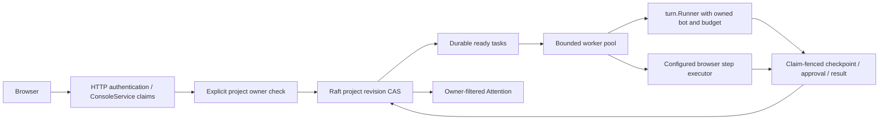

# Workforce

## Design

The opt-in `compute-teams` service owns projects, a shared conversation, task DAGs,
routine definitions and event receipts. HTTP and ConsoleService use the same
owner checks; a machine certificate never supplies a human owner.

Each project is one bounded, encrypted Raft record with a revision CAS. Keeping
event receipts and their tasks in this aggregate makes creation atomic. Workers
persist a random claim token before dispatch and complete only against that
original token. Expired running work becomes blocked for reconciliation rather
than automatically repeating a potentially irreversible external action.

Interfaces: `workforce.Service.AuthorizeProject(ctx, principal, projectID)`;
browser step execution is an injected function over the frozen RoutineStep JSON
shape. The browser implementation belongs to `internal/computer`.

Acceptance tests cover explicit ownership, revision and claim fencing, durable
event dedupe, dependencies, real runner dispatch, approval continuation, and
remote route forwarding. No new external dependencies are required.
