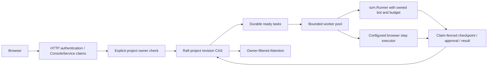
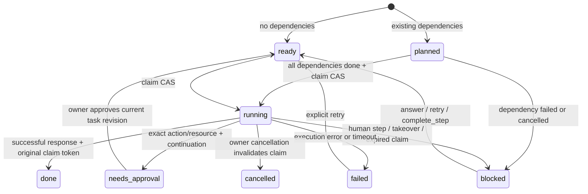
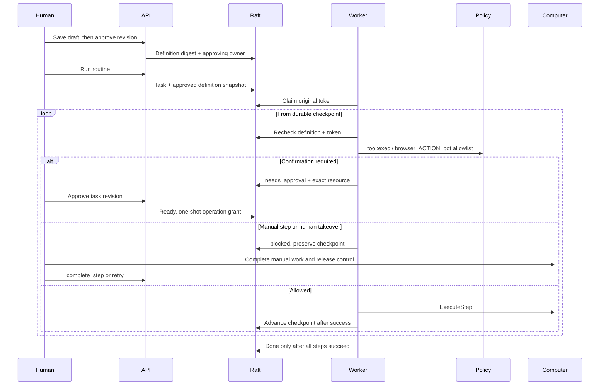

# Workforce

## Authority and execution

The opt-in `compute-teams` service owns projects, a shared conversation, task DAGs,
routine definitions and event receipts. HTTP and ConsoleService use the same
owner checks; a machine certificate never supplies a human owner.

Each project is one bounded, encrypted Raft record with a revision CAS. Keeping
event receipts and their tasks in this aggregate makes creation atomic. Workers
persist a random claim token before dispatch and complete only against that
original token. Expired running work becomes blocked for reconciliation rather
than automatically repeating a potentially irreversible external action.



Interfaces: `workforce.Service.AuthorizeProject(ctx, principal, projectID)`;
browser step execution is an injected function over the frozen RoutineStep JSON
shape. The browser implementation belongs to `internal/computer`.

## Persistence boundary

`WorkforceRecord` is a schema-versioned protobuf envelope in `BucketWorkforce`.
Its `state_json` contains typed Go `State` records: the project, tasks, execution
checkpoints, routine definitions, triggers, messages and event receipts. This is
an encrypted Raft record, not a filesystem database. `LOG_OP_CLAIM` requires an
explicit revision, and the FSM assigns the next revision. No service writes the
store directly.

The project aggregate is deliberately bounded: 4 MiB serialized, at most 256
tasks, routines, triggers and event receipts each. Event receipts are not evicted:
eviction would make an old delivery executable again. Content and routine steps
have additional limits defined in `internal/workforce/types.go`. This trades
large-project throughput for one atomic transaction covering receipt + task and
dependency/claim transitions. Raft snapshots include the bucket. Logical portable
archives do not currently export workforce projects.

Successful conversation tasks roll out of this hot aggregate after their full
transcript has been saved through the session service. Retention keeps the most
recent 32 eligible chat tasks and 64 display messages, plus active conversation
messages. Receipt targets, predecessors/parents of nonterminal tasks, and tasks
without a saved transcript are protected. Active, blocked, failed, approval and
non-chat work is not silently discarded. Retention and each triggering mutation
share the project CAS; it neither deletes session transcripts nor evicts delivery
receipts. This prevents ordinary conversation from exhausting the aggregate's
task/message count while retaining the existing safety cap for unfinished work.

Projects have their own editable revision; each task, routine and trigger also
has an item revision. Internal aggregate revisions fence concurrent workers
without making every task update invalidate an otherwise unchanged project form.
Pure mutations retry aggregate contention; external actions never run inside a
retry closure.

## Worker lifecycle

The `workforce` node wiring stage uses `gateComputeTeams`, after compute/auth and
before the gateway. A node without Raft/store has no local workforce backend.
The leader runs two workers, polling once per second. Ordinary compute and
restore mode do not enable workers.



Dependencies must refer to existing tasks in the same project, and cannot be
edited by task actions. A newly minted task cannot be an ancestor of an existing
one, so this creation rule makes cycles impossible. Ready tasks are rechecked
against their dependencies before every dispatch.

Each attempt has a two-minute context deadline and an independently enforced
budget of 24 tool calls, $1 of model spend and 16 MiB egress, subject to stricter
bot limits. One explicit budget approval may add a second budget tranche.
Continuations preserve spent counters; approval never resets spend. The lease
expires after the attempt deadline plus 30 seconds. Expiry becomes a visible
blocker rather than automatically repeating an external effect whose outcome is
unknown. Exactly-once external effects are not promised across a process crash.

The worker rechecks the bot's owner, enabled flag and project roster at dispatch.
`turn.Runner` receives the bot principal, the original human claims, task ID,
budget and context. `compute.Adapt` resolves the bot profile and enforces its tool
filter. A timeout, cancellation or `NeedsConfirmation` response cannot complete
a task. Cancellation closes the local context and invalidates the durable claim;
late results are rejected by the original claim token. Each active worker also
observes its replicated claim once per second, so cancellation through another
backend closes its context rather than waiting for the full attempt timeout.

Full agent/tool transcripts use `memory.SessionService` under
`workforce:<task-id>`. Project conversation tasks serialize against pending
conversation tasks and load the previous assistant task's full transcript.
`ProjectMessage` is the display view, not a replacement for the tool transcript.
Project context is delimited as untrusted context.

Dispatch also includes bounded actual dependency results and artifact references,
not just dependency IDs. Results have a 4 KiB per-predecessor / 32 KiB combined
preview budget; truncation is explicit and the agent can fetch the full task
result with `workforce_task_get`. The complete context is capped at 128 KiB.
Project/task IDs, roster, acceptance criteria and persisted progress accompany
those results in JSON under `untrusted:workforce-context`. Actual authority comes
from execution metadata, never from that JSON. ContextEngine recall augments the
caller-pinned context instead of replacing it, and the user question remains last.

## Agent-facing project work

`internal/tools/workforce.go` registers six tools through the ordinary tool
registry/executor and policy path:

- `workforce_project_get`: current project context and roster.
- `workforce_task_list`: bounded recent task summaries in this project.
- `workforce_task_get`: full same-project task result and artifact references.
- `workforce_task_create`: delegate durable work with existing dependencies.
- `workforce_task_checkpoint`: persist verified progress for the current task.
- `workforce_task_block`: ask the human a question and stop the current attempt.

There are no agent approval or force-completion tools. A task becomes done only
through its claim-fenced worker completion. Blocking persists the question before
cancelling the attempt; the worker records `blocked`, not success, even if an
agent's closing response arrives afterwards. A human answer starts a new bounded
attempt with the checkpoint and available prior conversation.

Each tool requires the worker's private original-claim capability as well as
`turn.Identity` with channel `workforce`, matching project/channel ID, task/turn
ID, bot principal and human `BotOwner`. Mutations recheck that capability against
the current Raft aggregate. A nested bot turn, stale worker, ordinary chat or
caller-supplied project/owner cannot gain access by choosing matching strings.
Children inherit the exact persisted parent claims; they do not acquire claims
or roles from a machine identity or from their bot owner. Delegation is bounded
to eight children per task and four levels, in addition to project capacity.
Explicit bot tool allowlists and policy still apply.

```mermaid
sequenceDiagram
  participant Human
  participant Coordinator as Real Agent / coordinator
  participant Tools as Policy-checked workforce tools
  participant Raft
  participant Worker
  Human->>Coordinator: Plan and delegate in project conversation
  Coordinator->>Tools: task_create A, then B depends_on A
  Tools->>Raft: Verify original claim; persist children with inherited claims
  Worker->>Coordinator: Run A with project context + memory recall
  Coordinator-->>Worker: Actual result and tool transcript
  Worker->>Raft: Complete A with original token
  Worker->>Coordinator: Run B with A's result/artifact references + pinned context
  Coordinator-->>Worker: Evidence-based successor result
  Worker->>Raft: Complete B
```

## Approval and routine execution

A routine is created as a draft. Approval records the human owner and a digest
of its name, description, instructions, schedule and ordered steps. Editing or
disabling clears approval. A run snapshots that approved definition; dispatch
and each browser step reject a revoked or changed definition. These records do
not install executable skills or grant additional tool privileges.

Task resource approvals persist the paused transcript, budget, action and
resource inside the same task aggregate. `PATCH /v1/tasks/{id}` with action
`approve` resumes using the existing one-shot `turn.WithTurnApproval` mechanism.
The callback cannot choose a different operation. The task's `prompt_id` is a
correlation identifier, not a `/v1/prompts` registry entry.



Recorded fills are manual sensitive steps by default. A sensitive fill can retain
only a value-free structural `tag:nth-of-type(n)` selector chain; no sensitive
step can carry a URL, value or input mode. The owner can explicitly edit a
non-sensitive fill to include a selector, value and
`input_mode: "reviewed_literal"`, then approve the changed definition. The exact
mode, selector and value are digest-bound. The browser runtime must independently
refuse credential/password/login targets; a reviewed literal is not a credential
grant. Automated navigation rejects URL userinfo,
queries and fragments, which may contain credentials; those navigations are
manual steps instead. Browser availability never falls back to a permissive
tool. A missing executor is an explicit failed task.

## Browser adapter contract

`SetStepExecutor(func(context.Context, string, string, RoutineStep) error)` is a
boot-time hook. The strings are the verified human owner and project ID. The
computer adapter converts the frozen JSON fields, executes through the configured
runtime, and maps takeover/manual errors to `workforce.ErrBlocked`.
`AuthorizeStep` remains separate and evaluates `tool:exec` on
`browser_<action>` before calling the adapter; routine approval is not policy
approval. The worker also enforces the bot's explicit tool allowlist here.

`SetAttentionSource` accepts owned computer takeover items. Workforce rechecks
each returned item's project owner before including it. The computer authorizer
adapts `AuthorizeProject`; its HTTP layer should translate `ErrNotFound` to 404,
while owner mismatch remains 403. See the computer workstream's
`internal/computer` service for runtime configuration and process isolation.

## Scheduling and event dedupe

An approved routine with `schedule` creates an existing `ScheduledTaskRecord`
with handler `workforce:routine`, captured user claims and the approved digest.
The scheduler's persisted `NextRun` identifies the occurrence. Its handler calls
`ScheduledRun`, atomically writing the occurrence receipt and workforce task.
Scheduler claim replay therefore returns the same occurrence without a second
task. Revoked/edited routines fail the digest check, including old schedule
entries that have not yet been reconciled.

Authenticated trigger delivery uses `(trigger_id, event_id)` in the same durable
receipt map. The event payload is delimited as untrusted data. A trigger's
explicit task template or approved routine determines the work; payload fields
cannot supply an owner, principal, bot permission or approval.

## HTTP and remote console

`internal/gateway/rest_workforce.go` hosts the routes documented in
[the operator guide](../user/WORKFORCE.md). Every data route authenticates and
checks unsafe cookie requests for same-origin CSRF. The same handlers are on
the ConsoleService forwarding allowlist, so a web-only node supplies validated
human claims to its backend. Node mTLS is transport authentication only.
Project chat emits `start`, `reply`, `needs_confirmation` or `error` SSE events;
the durable task survives a disconnected browser. Login revocation cancels its
stream subscription.

Task artifacts currently contain a text deliverable reference served by the
owner-authorized `/v1/tasks/{id}/result` route. The API never turns a caller's
filesystem path into an artifact. Attention is derived from owned task states;
it is not a separate mutable inbox that can drift from the work.

## Verification

Tests cover real Raft shutdown/reopen and stale CAS; durable event and schedule
dedupe; cross-owner reads/mutations; dependency resolution; real
`compute.Agent` dispatch through `turn.Runner`; cancellation fencing; manual
checkpoints; definition revocation; browser policy and bot filters; secret-free
routine definitions; actual scheduler dispatch; and remote ConsoleService SSE.
Real-Agent tests also execute workforce tools through policy to create dependent
work, prove that a successor sees its predecessor's evidence with recall enabled,
and exercise checkpoint/block/answer continuation. Retention tests run more than
256 conversation turns while preserving independent receipt/dependency targets.
Race tests cover workforce, gateway, node and memory packages. No new external
dependencies were added.
