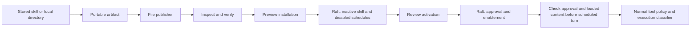

# Portable skill sharing

Share one stored skill, or a local skill directory, without exporting the rest
of a cluster. A release preserves the original manifest, manifest signature and
every bundled file. It can also contain explicitly selected recurring schedules.

The first publishing backend is `file:<path>`. The format is independent of the
backend: `Publisher.Publish` transports a complete immutable artifact and returns
its reference and digest; `Source.Fetch` retrieves it. A future HTTP or ClawHub
adapter can implement either interface without owning trust or installation.
Publisher **identity** names a signing key; the publishing **backend** hosts bytes.
Remote publishing and fetching are not implemented in this release.

## Publish and inspect

```bash
# Local directory; no running node needed.
lobslaw skills publish --dir ./weather --to file:./weather.share

# A skill in the running cluster. Omit version to select its active version.
lobslaw skills publish weather 1.0.0 --context home \
  --schedules daily-weather --source-timezone Europe/London \
  --to file:./weather-with-schedule.share

lobslaw skills inspect file:./weather-with-schedule.share
```

Schedule selection is explicit because existing prompts do not provide a reliable
skill dependency graph. Export is restricted to the caller's own schedules and
the `agent:turn` handler. Templates carry a name, cron expression, explicit
timezone, prompt and notification mode. Owners, chat addresses, claims, approval
state and run history are excluded. A schedule with other handler parameters is
refused rather than silently losing behavior. Review prompts and files for local
details before sharing: packages are **not encrypted**.

Use `--inputs city,topic` when selected prompts contain `{{city}}` or `{{topic}}`.
Installation requires exactly those input values, supplied with repeatable
`--input key=value`. Substitution applies only to prompts; signed files are never
rewritten. Inputs are plain text, not a secret store.

Publishing creates a mode-0600 file atomically and refuses to overwrite an existing
path. The canonical JSON envelope contains base64 file bytes, a SHA-256 content
digest and an optional Ed25519 signature. Limits are 1 MiB encoded, 128 files and
32 schedules. Unknown schemas, unsafe paths and content-digest mismatches fail
before installation. Inspection displays escaped text and does not establish
publisher trust; the original artifact retains binary files byte-for-byte.

## Sign a release

```bash
lobslaw skills sign file:./weather.share \
  --key ./publisher.key --publisher alice --to file:./weather-signed.share
```

The key file contains a base64-encoded 64-byte Ed25519 private key. The destination
uses its existing `skills.trusted_publishers` file (`name base64-public-key` per
line). A present package signature must verify against that trust store, including
when ordinary skill signing is off. `signing_policy = "require"` requires both
the package signature and the existing manifest signature.

`--sign-manifest` additionally signs the unchanged manifest before signing the
package. The manifest must already pin the handler, body and references as required
by the normal skill loader. Signing does not generate missing pins or grant
permissions. Existing manifest signatures are otherwise preserved exactly.

## Review, install, activate

```bash
# Preview only. Read the manifest, bound prompts and plan_digest.
lobslaw skills install file:./weather-signed.share --context home \
  --owner user:alice --input city=London

# Repeat with the exact digest from that preview.
lobslaw skills install file:./weather-signed.share --context home \
  --owner user:alice --input city=London \
  --apply --expected-plan sha256:<install-plan-digest>

# Use installation_id from the install result; activation has its own preview.
lobslaw skills activate-install share-<id> --context home --owner user:alice
lobslaw skills activate-install share-<id> --context home --owner user:alice \
  --apply --expected-plan sha256:<activation-plan-digest>
```

These RPCs require a verified operator certificate, a configured `operator` data
role, and an explicit policy grant for the destination owner. The distinct actions
are `skills:share:export`, `skills:share:install` and `skills:share:activate`.
For example, grant each action separately using a rule of this shape:

```toml
[[policy.rules]]
id = "alice-share-install"
subject = "user:alice"
action = "skills:share:install"
resource = "user:alice"
effect = "allow"
priority = 50
```

Installation creates an inactive skill and disabled schedules in one Raft
transaction. Identical content already installed is reused; conflicting content
under the same name/version is refused. An already-active identical skill stays
active because stored skills are cluster-wide. Installation IDs are stable for
the same package digest, owner and inputs, so retries do not duplicate schedules.

Activation verifies content and signatures again, checks for another active
version, and records the approving identity with a digest covering the complete
artifact, local owner, inputs and schedule IDs. It activates the stored skill
cluster-wide and enables the installation's schedules atomically. A change to the
destination skill, blob, schedule or installation state invalidates a preview;
preview again instead of reusing its digest.



Shared scheduled turns run as their destination owner, with current configured
roles and scheduler scope. They check approval and the loaded skill against the
release before starting. A changed skill override, removed approval or changed
schedule fails closed. Normal tool policy, credential ACLs and execution
classification still apply. If a tool requires interactive confirmation, the
scheduled run reports failure; this release does not add a web/Telegram approval
inbox or automatically approve unattended work.

Logical backup/export includes installation records. Import/restore maps owners,
keeps schedule references and clears activation approvals; schedules remain paused
until reviewed again. Direct export of self-taught records and automatic
self-learning publication are not included; publish an explicit skill directory
or stored skill release.

Upgrade every Raft member before using sharing. Older binaries cannot replay the
new sharing transaction and deliberately stop on unsupported log entries.
