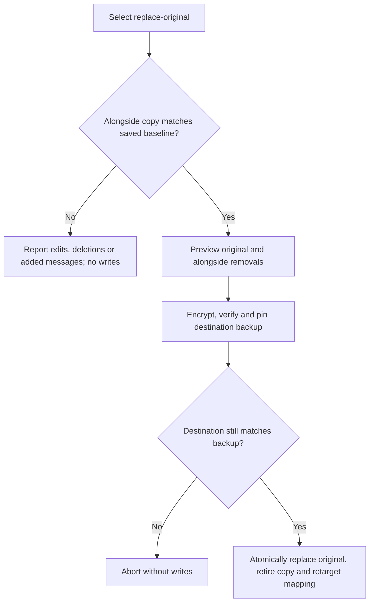

# Portable archives

`lobslaw archive` moves knowledge between deployments using versioned encrypted
files. Export works against a running node or an offline database. Import plans
changes first, then applies bounded batches through Raft with durable resume
receipts. `lobslaw backup` manages independent encrypted generations and retention.

## Export

Stop the source node or use a consistent snapshot of `state.db`. Export reads
the database without modifying it and fails if a running node holds its lock.

```sh
LOBSLAW_ENV=~/.local/share/lobslaw-local/.env \
lobslaw archive export --offline \
  --state-db ~/.local/share/lobslaw-local/data/state.db \
  --memory-key-ref env:LOBSLAW_MEMORY_KEY \
  --recipient age1... \
  --out local-2026-09-15.lobarchive.age
```

Use an age X25519 recipient from `age-keygen`; repeat `--recipient` to add a
recovery recipient. The corresponding identity decrypts the archive independently
of the source memory key. Keep it separately from the backup.

Existing output files are never overwritten. Each archive has its own snapshot
ID, schema version, timestamp, record counts and SHA-256 checksums. `--plaintext`
explicitly writes an unencrypted archive instead of accepting recipients.

Included: stored memories and summaries, skill records and exact signed bytes,
learned artefacts and their history, pinned/soul settings, sessions and messages,
preferences, cron schedules and commitments. Schedules retain their intended
enabled state as content; exporting does not execute or modify them.

Excluded: embedding vectors and model stamps, worker claims, credentials,
certificates, policy grants, Raft state, audit logs, model files, external
workspace attachments and learned usage counters. The manifest records omissions.
Archives currently hold up to 256 MiB of logical record payloads, 8 MiB per record,
and 100,000 records; export and verification use bounded in-memory assembly.

## Verify and inspect

```sh
lobslaw archive verify local-2026-09-15.lobarchive.age --identity ./backup-key.txt
lobslaw archive inspect local-2026-09-15.lobarchive.age --identity ./backup-key.txt
```

Both commands authenticate and verify the whole archive. `inspect` prints the
manifest rather than memory content. A truncated archive, checksum mismatch,
unsupported schema or incorrect identity fails verification.

Embeddings are rebuilt with the destination model. Original memory text and
consolidated summaries are retained without running a summarisation model. An
existing destination corpus using a different model must be migrated separately;
import does not re-embed or delete unrelated destination documents.

## Live access and import

Live operations require an operator mTLS certificate whose identity has the
configured `operator` role and an explicit policy rule for `archive:export` or
`archive:import` on `memory:*`. Neither the certificate alone nor an archive's
owner fields grant access. For example:

```toml
[[policy.rules]]
id = "operator-archive-import"
subject = "role:operator"
action = "archive:import"
resource = "memory:*"
effect = "allow"
priority = 50
```

```sh
lobslaw archive export --context local --out local.age --recipient age1...
lobslaw archive import local.age --context homelab --identity ./backup-key.txt \
  --owner user:alice=user:alice --owner alice=alice \
  --source-timezone Europe/London
```

The preview lists additions, duplicates, conflicts, paused records and embedding
work. Supply every nonempty source identity explicitly, even when retaining it;
`owner` and bare `user_id` spellings are distinct mappings. Empty ownership stays
empty and never becomes shared. Mapping user preferences or pinned memories also
updates their identity-based keys.

Add `--apply` to write. Identical records are skipped. Conflicting IDs stop the
whole pending import before writes unless `--keep-existing` explicitly selects
the destination's copy. Overwrite is not supported. Matching content under different
IDs is not deduplicated. Conflicting session indexes may need explicit resolution
before their messages can be imported; keeping an index does not permit messages
outside its sequence range.

### Importing alongside without multiplying copies

Use a unique, stable source label for each stack. Set `--source-id local-stack`
when exporting or creating backups, or set `LOBSLAW_ARCHIVE_SOURCE_ID` in the
backup process environment. Reuse the same label for every generation. The label
is provenance, not an owner or an access grant. Do not reuse it for unrelated stacks.

Older archives have no source label. Supply `--source-id` on each import of those
archives. An explicit source ID cannot override a different ID embedded in an archive.

```sh
lobslaw archive import local.age --context homelab --identity ./backup-key.txt \
  --source-id local-stack --owner user:alice=user:alice --source-timezone UTC \
  --alongside sessions/telegram:chat-id --alongside scheduled-tasks/morning
```

Preview first, then repeat with `--apply`. Each selection creates one separate
copy and a persistent source-to-destination mapping. Selecting a session also
remaps every message in its transcript. Later imports find that same copy even
when the archive generation changes or the alongside flag is omitted:

- Unchanged source and destination: skip.
- Changed source: report a conflict against the mapped copy.
- Edited or deleted destination: report it explicitly, including on same-archive
  retries. Neither `--alongside` nor `--keep-existing` silently creates another copy.

Mappings commit with their content, are encrypted in the destination store, and
are included as `import-mappings` in portable backups. Derived embeddings are not
part of their fingerprints. Restoring a backup preserves these mappings without
adopting the backup as an additional source. Deletion mappings remain present so
restoring and importing again cannot silently recreate deleted content.

Use `--skip kind/id` to omit a conflicting source record while retaining the
destination. A session selection skips its whole transcript. Alongside currently
supports sessions, documents, episodic records, consolidations, schedules and
commitments. It refuses signed skills and owner-keyed settings. Archives carrying
existing provenance cannot remap the records that provenance already describes;
restore those records with their existing IDs. Use `--interactive` to resolve each
conflict with replace, alongside, skip or cancel. Mapped sessions and schedules also
offer replace-original; alongside is unavailable for an already mapped record.
Scripts can pass the equivalent explicit selections. Unresolved conflicts stop apply
before pending writes.

### Replacing imported records

`--replace kind/id` replaces the selected destination group; an existing source
mapping directs it to the imported copy. Session replacement includes the whole
transcript. Replacement requires `--source-id`, `--backup-repository` and
`--backup-identity`: the CLI encrypts, verifies and pins a destination backup before
applying one atomic transaction. Changes after that backup abort the transaction.

`--replace-original sessions/ID` or `--replace-original scheduled-tasks/ID` changes
an earlier alongside choice. It replaces the original group, retires the alongside
copy and retargets the same source mapping, using the same backup requirements.
Before retirement, the planner checks the saved fingerprints of the entire copy,
including all previously imported transcript messages even if the new archive omits
them. Edited or deleted records and messages added without an import baseline are
explicit conflicts. A fresh backup or `--keep-existing` does not override them.
Choose skip to preserve both groups, use ordinary replace to update the mapped copy,
or reconcile the copy with its saved baseline before retrying replace-original.
The prompt does not offer the same blocked retirement again.

Preview without `--apply` first. The `removed` inventory lists every destination
record that will be overwritten or deleted, including both session transcripts and
retargeted mapping IDs; it contains no record content. `replaced` names the selected
source groups. Unchanged retries write nothing.



Writers emit schema 2; readers also accept schema 1. Schema 2 adds optional source
identity and portable import provenance. Older binaries cannot read schema 2.

### Interrupted imports

Repeat the same archive, mappings and options with `--apply`. Content and options
determine a stable import ID. A completed batch and its encrypted receipt commit
in the same transaction; an untracked retry skips it even if the record has since been edited
or deleted. Imports with a source identity always recheck their persistent mappings
and surface destination edits or deletions. The preview reports durable progress. Keep the original archive to
resume: the server does not retain an unfinished upload.

Imports are not globally atomic. Each completed batch is visible, and an error
reports its progress. A transcript and its index commit together. Batches are
limited to 8 MiB including their source receipts; an oversized dependency group
cannot be imported by this version. Rebuilding an embedding can fail without
losing completed work. Use `--timeout` to increase the per-call deadline for large imports;
`archive import --help` and `backup restore --help` show the current default.

### Restored execution state

Cron tasks are disabled, pending commitments become `paused`, skills are inactive,
and active learned artefacts become proposed. Completed commitments stay completed.
No worker claims are restored. Original requested activation and channel bindings
remain in encrypted import receipts, while imported user preferences have no live
channel subscriptions.

For cron expressions without `CRON_TZ=` or `TZ=`, specify the actual source
scheduler timezone with `--source-timezone`; it is embedded into the restored
expression. Do not guess from the operator laptop's timezone. Next-run values are
cleared. Activation is a separate operator action after checking handlers, channel
bindings and overdue reminders. There is no automatic catch-up or bulk activation
command in this version.

Signed manifest/signature bytes are preserved exactly. Imports validate skills
against destination signing policy, and a claimed signed tier always requires
successful verification by a destination-trusted key.

## Backup generations

```sh
lobslaw backup create --context homelab --repository ./backups --recipient age1...
lobslaw backup list --repository ./backups
lobslaw backup pin SNAPSHOT_ID --repository ./backups
lobslaw backup restore SNAPSHOT_ID --repository ./backups \
  --identity ./backup-key.txt --context recovered \
  --owner user:alice=user:alice --source-timezone Europe/London
lobslaw backup prune --repository ./backups --keep-last 10 --keep-within 30d
```

Create also supports `--offline` with archive export's source database/key flags.
Every generation is independent and immutable. Creating a backup always writes a
full new generation, even when the content is unchanged; there is no cross-generation
deduplication. Backups always require encryption.
List checks ciphertext integrity; restore also decrypts and verifies the full
logical archive. Before restoring, start the destination with `[memory] restore_mode = true`.
This stops gateways and scheduling and suppresses knowledge seeds, while keeping
authenticated archive access and the embedder available. In Kubernetes, temporarily
use probes against the node's gRPC TCP port: gateway HTTP health endpoints are
unavailable in restore mode. Restore the original probes when leaving maintenance.
Restore requires an
empty knowledge destination (or its own partial restore); use archive import when
merging. After verifying the result, remove restore mode and restart. Imported
schedules, skills and pending reminders still remain paused. Restore and prune preview by default; `--apply` writes or
deletes. `backup unpin` removes a pin.

Retention keeps pinned backups and the union of the newest count and age window.
Pruning rechecks integrity and pins under the repository lock before deletion.
Failed generations without a completion manifest are ignored. After a crash,
check that no backup process remains before removing a stale `.lock` directory.
Keep backup identities separately, and retain deployment configuration and secret
backups: knowledge archives exclude them and cannot replace them.
